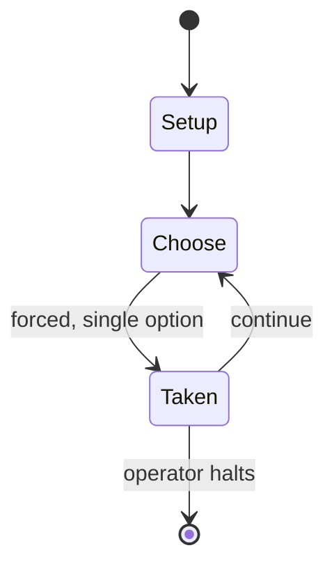

# Tokyo Express: The Guadalcanal Naval Campaign – 1942

*1988 WWII naval wargame*

`tokyo_express_the_guadalcanal_naval_campaign_1942` &nbsp; state: **DEEPENED** &nbsp; method: **heuristic**

## Found layer (recorded, not trusted)

| field | value |
| --- | --- |
| wikidata | Q108760016 |
| wikipedia | Tokyo Express: The Guadalcanal Naval Campaign – 1942 |
| genres (source) | -- |
| instance of (source) | board game, wargame |
| country of origin | -- |

## Declared layer (orders bench work)

| field | value |
| --- | --- |
| year created | 1988 |
| epoch | DIGITAL |
| region | -- |
| media | BOARD, SOLITAIRE, WARGAME |
| players | 1-2 |
| age band | -- |
| exogenous process | -- |
| loss shape | -- |
| live axes | - |
| horizon | OPEN_ENDED |
| scoring shape | SET_COLLECTION_CONVEX |
| information | -- |
| interaction | SOLITAIRE |
| turn structure | -- |
| tractability | SAMPLING_ONLY |
| randomness | -- |
| luck factor | -- |
| rules complexity | 2.93 |
| strategic depth | 2.25 |
| novelty | 0.6463 |
| solved status | -- |
| strategies | set_collection |
| algorithms | -- |

## Object model

```
Episode
  players      : 1-2
  turn_structure: ?
  horizon       : OPEN_ENDED
  scoring       : SET_COLLECTION_CONVEX

Board          -- spatial substrate; cells carry position and occupancy
Piece          -- movable token owned by a player
```

## State transition diagram



## Research item -- turn trace

```
# Tokyo Express: The Guadalcanal Naval Campaign – 1942 -- simulated turn events
# generated from the DECLARED vector, not from a rulebook.
# structure: exo=None loss=None horizon=OPEN_ENDED scoring=SET_COLLECTION_CONVEX axes=-

t=0    SETUP        players=1  pot=0  capacity=5
t=1    FORCED       p1 single legal option taken (pot_gain=+0.9)
t=2    FORCED       p1 single legal option taken (pot_gain=+1.1)
t=3    ENDTURN      turn passes to p1
t=4    FORCED       p1 single legal option taken (pot_gain=+1.7)
t=5    FORCED       p1 single legal option taken (pot_gain=+0.7)
t=6    FORCED       p1 single legal option taken (pot_gain=+0.8)
t=7    FORCED       p1 single legal option taken (pot_gain=+1.4)
t=8    FORCED       p1 single legal option taken (pot_gain=+1.8)
t=9    FORCED       p1 single legal option taken (pot_gain=+1.3)
t=10   FORCED       p1 single legal option taken (pot_gain=+0.5)
t=11   FORCED       p1 single legal option taken (pot_gain=+1.2)
t=12   ENDTURN      turn passes to p1
t=13   FORCED       p1 single legal option taken (pot_gain=+1.8)
t=14   FORCED       p1 single legal option taken (pot_gain=+1.6)
t=15   FORCED       p1 single legal option taken (pot_gain=+1.8)
t=16   FORCED       p1 single legal option taken (pot_gain=+1.7)
t=17   FORCED       p1 single legal option taken (pot_gain=+1.5)
t=18   FORCED       p1 single legal option taken (pot_gain=+1.3)
t=19   FORCED       p1 single legal option taken (pot_gain=+1.3)
t=20   ENDTURN      turn passes to p1
t=21   FORCED       p1 single legal option taken (pot_gain=+1.1)
t=22   FORCED       p1 single legal option taken (pot_gain=+0.6)
t=23   ENDTURN      turn passes to p1
t=24   FORCED       p1 single legal option taken (pot_gain=+1.9)
t=25   ENDTURN      turn passes to p1
t=26   FORCED       p1 single legal option taken (pot_gain=+1.7)
t=27   ENDTURN      turn passes to p1

terminal: OPEN_ENDED
```

## Source extract

Tokyo Express: The Guadalcanal Naval Campaign – 1942 is a solitaire board wargame published
Victory Games in 1988.   == Background == During battles in New Guinea and the Solomon Islands
in 1942 and 1943, Japan used Imperial Japanese Navy ships to deliver personnel, supplies, and
equipment to Japanese forces. Due to American air superiority, the Japanese were forced to make
their supply runs at night. The Americans eventually nicknamed these nocturnal resupply missions
the "Tokyo Express," while the Japanese called them "Rat Transportation" (鼠輸送, nezumi yusō). The
U.S. Navy sought to intercept these task forces, while the Japanese used superior night-time
technology and their accurate Long Lance torpedoes to defend the convoys.   == Description ==
Tokyo Express is a solitaire game in which the player controls American forces off Guadalcanal,
while the Japanese convoys, made up of a varying number of ships, act via a predetermined set of
rules that use an element of randomness. The game also has rules for two players. The game box
includes 156 rectangular ship counters, 520 other counters and 120 artillery cards. The basic
game is explained in 24 pages of rules. Another 64 pages exp

<sub>Wikipedia, CC BY-SA. Retained as evidence for the structural
classification above. Every rule inferred from it is HYPOTHESIZED
until audited against a rulebook.</sub>
