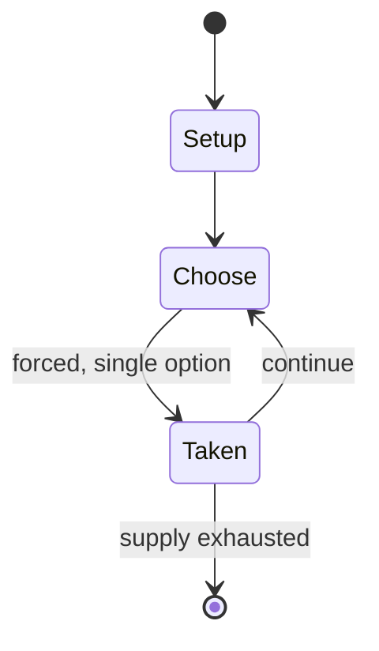

# Tong-its

`tong_its` &nbsp; state: **DEEPENED** &nbsp; method: **heuristic**

## Found layer (recorded, not trusted)

| field | value |
| --- | --- |
| wikidata | Q10699843 |
| wikipedia | Tong-its |
| genres (source) | -- |
| instance of (source) | -- |
| country of origin | -- |

## Declared layer (orders bench work)

| field | value |
| --- | --- |
| year created | -- |
| epoch | -- |
| region | -- |
| media | CARD |
| players | -- |
| age band | -- |
| exogenous process | -- |
| loss shape | -- |
| live axes | DISCARD |
| horizon | -- |
| scoring shape | SET_COLLECTION_CONVEX |
| information | -- |
| interaction | COMPETITIVE |
| turn structure | -- |
| tractability | SAMPLING_ONLY |
| randomness | -- |
| luck factor | 0.35 |
| rules complexity | 2.12 |
| strategic depth | 2.25 |
| novelty | 0.482 |
| solved status | -- |
| strategies | set_collection |
| algorithms | -- |

## Object model

```
Episode
  players      : ?
  turn_structure: ?
  horizon       : ?
  scoring       : SET_COLLECTION_CONVEX

Deck           -- ordered multiset, drawn without replacement
Hand           -- private multiset held by one player
DiscardPile    -- public accumulation of spent cards
DiscardChoice  -- what is given up to satisfy a limit
```

## State transition diagram



## Research item -- turn trace

```
# Tong-its -- simulated turn events
# generated from the DECLARED vector, not from a rulebook.
# structure: exo=None loss=None horizon=None scoring=SET_COLLECTION_CONVEX axes=DISCARD

t=0    SETUP        players=2  pot=0  capacity=8
t=1    FORCED       p1 single legal option taken (pot_gain=+0.8)
t=2    FORCED       p1 single legal option taken (pot_gain=+1.1)
t=3    DISCARD      p1 discards to hand limit
t=4    ENDTURN      turn passes to p2
t=5    FORCED       p2 single legal option taken (pot_gain=+1.8)
t=6    DISCARD      p2 discards to hand limit
t=7    FORCED       p2 single legal option taken (pot_gain=+1.5)
t=8    DISCARD      p2 discards to hand limit
t=9    ENDTURN      turn passes to p1
t=10   FORCED       p1 single legal option taken (pot_gain=+1.4)
t=11   FORCED       p1 single legal option taken (pot_gain=+1.5)
t=12   FORCED       p1 single legal option taken (pot_gain=+1.8)
t=13   FORCED       p1 single legal option taken (pot_gain=+2.0)
t=14   FORCED       p1 single legal option taken (pot_gain=+1.8)
t=15   FORCED       p1 single legal option taken (pot_gain=+1.3)
t=16   FORCED       p1 single legal option taken (pot_gain=+1.0)
t=17   DISCARD      p1 discards to hand limit
t=18   ENDTURN      turn passes to p2
t=19   FORCED       p2 single legal option taken (pot_gain=+1.9)
t=20   FORCED       p2 single legal option taken (pot_gain=+0.7)
t=21   FORCED       p2 single legal option taken (pot_gain=+0.8)
t=22   FORCED       p2 single legal option taken (pot_gain=+1.3)
t=23   DISCARD      p2 discards to hand limit
t=24   ENDTURN      turn passes to p1
t=25   FORCED       p1 single legal option taken (pot_gain=+1.2)
t=26   ENDTURN      turn passes to p2

terminal: VARIABLE
```

## Conditions

| kind | threshold | effect | trigger |
| --- | --- | --- | --- |
| BOUNDARY | 3 cards | -- | A meld consists of at least three cards (three-of-a-kind or straight flush) and a sapaw would be the fourth of those three, or the continuation of that straight flush. |
| WIN | -- | -- | The player who gets rid of all the cards or has the fewest total points at the end of the game (when the central stack is empty) wins the game. |
| WIN | -- | -- | Meld (Bahay) is a set of matching cards a player needs to collect in order to win the game. |
| TERMINATE | -- | -- | If a player fails to lay down a meld and does not have either special melds when the game ends, the player is considered “Burned” and will neither be able to challenge a draw (if one is called) nor eligible to win in the |
| TERMINATE | -- | -- | When the central stack runs out of cards, the game ends. |
| BOUNDARY | -- | -- | However, a player must expose at least one meld to call or challenge a draw unless the player has a "Secret" or "Sagasa" in which case they can challenge (but not call). |
| BOUNDARY | -- | -- | Straight Flush: at least three sequential cards of the same suit (3♠ - 4♠ - 5♠) (8♦ - 9♦ - 10♦ - J♦ - Q♦) |
| BOUNDARY | -- | -- | A player with at least one exposed meld and has low points can call a draw before their turn given that no other players connected to that player's exposed meld before that. |

## Source extract

Tong-its (also called Tongits or Thong) is a three-player rummy card game popular in the
Philippines. This game is played using the standard deck of 52 cards. The game rules are similar
to the American card game Tonk, and also has similarities with the Chinese tile game Mahjong.
== History == Tong-its gained popularity in the 1990s in Luzon, the largest island of the
Philippines. Its origin remains unknown  but it was believed to have been introduced by the US
Military presence in the 1940s, most likely adapted from the 1930s American card game Tonk. The
game was evolved and popularized in Ilocanos as Tong-its, along with the similar game of Pusoy
Dos. It spread to many parts of the Philippines, such as Pangasinan, into the mid 1980s, where
it is called Tung-it.   == Rules == Like many popular card games, there are variations to the
following rules.   === Objective of the game === The objective of the game is to empty your hand
of all cards or minimize the count and the scores of unmatched cards that are still on the
player's hand by forming card sets (melds, also called a "bahay"(pronounced ba-hai), "buo," or
"balay" in some languages), dumping cards and calling a draw. The play

<sub>Wikipedia, CC BY-SA. Retained as evidence for the structural
classification above. Every rule inferred from it is HYPOTHESIZED
until audited against a rulebook.</sub>
