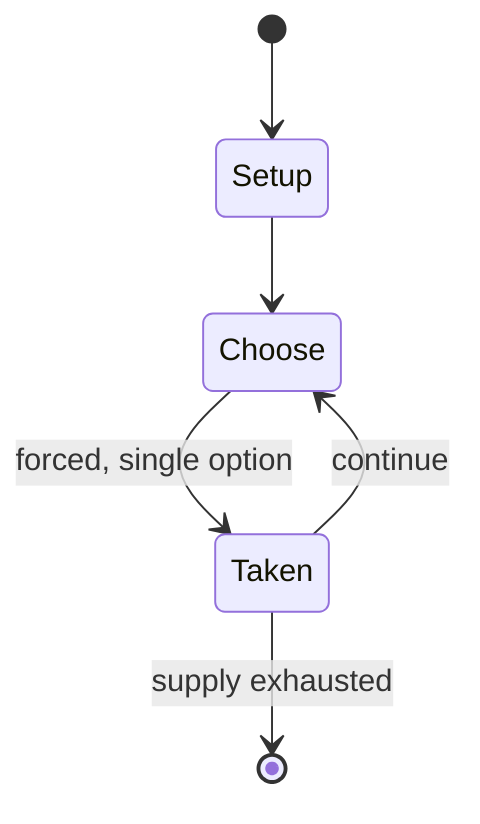

# Tontine

*French card game*

`tontine` &nbsp; state: **DEEPENED** &nbsp; method: **heuristic**

## Found layer (recorded, not trusted)

| field | value |
| --- | --- |
| wikidata | Q108392326 |
| wikipedia | Tontine (card game) |
| genres (source) | -- |
| instance of (source) | card game |
| country of origin | France |

## Declared layer (orders bench work)

| field | value |
| --- | --- |
| year created | -- |
| epoch | -- |
| region | EUROPE_WEST |
| media | CARD |
| players | -- |
| age band | -- |
| exogenous process | -- |
| loss shape | -- |
| live axes | - |
| horizon | -- |
| scoring shape | SURVIVAL |
| information | -- |
| interaction | SOLITAIRE |
| turn structure | STRICT_TURN |
| tractability | SAMPLING_ONLY |
| randomness | -- |
| luck factor | 0.95 |
| rules complexity | 1.76 |
| strategic depth | 1.53 |
| novelty | 0.6174 |
| solved status | -- |
| strategies | spatial_packing |
| algorithms | -- |

## Object model

```
Episode
  players      : ?
  turn_structure: STRICT_TURN
  horizon       : ?
  scoring       : SURVIVAL

Deck           -- ordered multiset, drawn without replacement
Hand           -- private multiset held by one player
DiscardPile    -- public accumulation of spent cards
```

## State transition diagram



## Research item -- turn trace

```
# Tontine -- simulated turn events
# generated from the DECLARED vector, not from a rulebook.
# structure: exo=None loss=None horizon=None scoring=SURVIVAL axes=-

t=0    SETUP        players=2  pot=0  capacity=5
t=1    FORCED       p1 single legal option taken (pot_gain=+1.0)
t=2    ENDTURN      turn passes to p2
t=3    FORCED       p2 single legal option taken (pot_gain=+1.5)
t=4    ENDTURN      turn passes to p1
t=5    FORCED       p1 single legal option taken (pot_gain=+2.0)
t=6    FORCED       p1 single legal option taken (pot_gain=+1.3)
t=7    FORCED       p1 single legal option taken (pot_gain=+1.7)
t=8    FORCED       p1 single legal option taken (pot_gain=+0.5)
t=9    FORCED       p1 single legal option taken (pot_gain=+0.7)
t=10   FORCED       p1 single legal option taken (pot_gain=+0.8)
t=11   FORCED       p1 single legal option taken (pot_gain=+1.4)
t=12   FORCED       p1 single legal option taken (pot_gain=+1.7)
t=13   FORCED       p1 single legal option taken (pot_gain=+1.0)
t=14   FORCED       p1 single legal option taken (pot_gain=+0.5)
t=15   FORCED       p1 single legal option taken (pot_gain=+1.0)
t=16   FORCED       p1 single legal option taken (pot_gain=+1.3)
t=17   FORCED       p1 single legal option taken (pot_gain=+1.8)
t=18   FORCED       p1 single legal option taken (pot_gain=+1.7)
t=19   FORCED       p1 single legal option taken (pot_gain=+1.2)
t=20   FORCED       p1 single legal option taken (pot_gain=+1.5)
t=21   FORCED       p1 single legal option taken (pot_gain=+1.5)
t=22   FORCED       p1 single legal option taken (pot_gain=+0.6)
t=23   FORCED       p1 single legal option taken (pot_gain=+0.6)
t=24   FORCED       p1 single legal option taken (pot_gain=+1.5)
t=25   FORCED       p1 single legal option taken (pot_gain=+2.0)
t=26   ENDTURN      turn passes to p2

terminal: VARIABLE
```

## Source extract

Tontine is an historical French gambling game for five to twelve players using playing cards. It
is a social game of pure chance in which the chips (jetons) circulate between the players and
the pool until one player wins all the chips in play.   == History == The rules of Tontine are
recorded as early as 1725 and continued to be published throughout the 18th and 19th centuries.
== Rules == Five to twelve play using a standard pack of 52 cards. Only the rank of the cards is
important; suits are irrelevant. Deal and play are anticlockwise.   === Preliminaries ===  At
the start of the game, each player receives a quantity of jetons, the amount being determined by
how long they want to play. This is called the mise. The higher the mise, the longer the game
will last. A typical amount might be 12 jetons per player. A small table basket (corbillon) is
placed in the middle of the table to which each player antes 3 jetons. The contents of the
basket constitute the pool. The game is played until only one player has any jetons left.   ===
Deal === Each player draws a card from the pack, face down, and whoever has the highest becomes
the first dealer. If two or more tie, they draw another

<sub>Wikipedia, CC BY-SA. Retained as evidence for the structural
classification above. Every rule inferred from it is HYPOTHESIZED
until audited against a rulebook.</sub>
