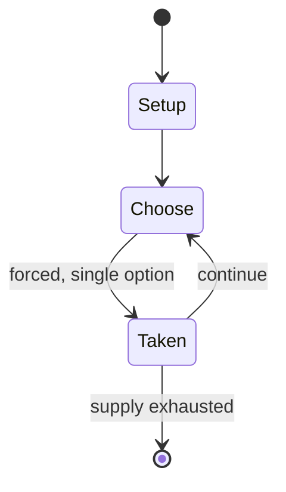

# Toy Commander

*1999 video game*

`toy_commander` &nbsp; state: **DEEPENED** &nbsp; method: **heuristic**

## Found layer (recorded, not trusted)

| field | value |
| --- | --- |
| wikidata | Q2722848 |
| wikipedia | Toy Commander |
| genres (source) | Christmas video game, action game, action-adventure game |
| instance of (source) | video game |
| country of origin | France |

## Declared layer (orders bench work)

| field | value |
| --- | --- |
| year created | 1999 |
| epoch | DIGITAL |
| region | EUROPE_WEST |
| media | VIDEO |
| players | -- |
| age band | -- |
| exogenous process | -- |
| loss shape | -- |
| live axes | - |
| horizon | -- |
| scoring shape | RACE_POSITION |
| information | -- |
| interaction | -- |
| turn structure | -- |
| tractability | SAMPLING_ONLY |
| randomness | -- |
| luck factor | 0.35 |
| rules complexity | 1.72 |
| strategic depth | 2.0 |
| novelty | 0.4815 |
| solved status | -- |
| strategies | -- |
| algorithms | -- |

## Object model

```
Episode
  players      : ?
  turn_structure: ?
  horizon       : ?
  scoring       : RACE_POSITION

WorldState     -- simulation state advanced by the engine
Avatar         -- player-controlled agent
Clock          -- frame or tick counter
```

## State transition diagram



## Research item -- turn trace

```
# Toy Commander -- simulated turn events
# generated from the DECLARED vector, not from a rulebook.
# structure: exo=None loss=None horizon=None scoring=RACE_POSITION axes=-

t=0    SETUP        players=2  pot=0  capacity=8
t=1    FORCED       p1 single legal option taken (pot_gain=+1.3)
t=2    ENDTURN      turn passes to p2
t=3    FORCED       p2 single legal option taken (pot_gain=+1.2)
t=4    FORCED       p2 single legal option taken (pot_gain=+1.8)
t=5    ENDTURN      turn passes to p1
t=6    FORCED       p1 single legal option taken (pot_gain=+0.5)
t=7    FORCED       p1 single legal option taken (pot_gain=+0.8)
t=8    FORCED       p1 single legal option taken (pot_gain=+1.0)
t=9    FORCED       p1 single legal option taken (pot_gain=+1.7)
t=10   ENDTURN      turn passes to p2
t=11   FORCED       p2 single legal option taken (pot_gain=+1.4)
t=12   FORCED       p2 single legal option taken (pot_gain=+0.5)
t=13   FORCED       p2 single legal option taken (pot_gain=+1.8)
t=14   FORCED       p2 single legal option taken (pot_gain=+0.9)
t=15   ENDTURN      turn passes to p1
t=16   FORCED       p1 single legal option taken (pot_gain=+1.9)
t=17   FORCED       p1 single legal option taken (pot_gain=+1.7)
t=18   FORCED       p1 single legal option taken (pot_gain=+1.1)
t=19   FORCED       p1 single legal option taken (pot_gain=+1.0)
t=20   FORCED       p1 single legal option taken (pot_gain=+0.7)
t=21   ENDTURN      turn passes to p2
t=22   FORCED       p2 single legal option taken (pot_gain=+1.8)
t=23   ENDTURN      turn passes to p1
t=24   FORCED       p1 single legal option taken (pot_gain=+0.6)
t=25   FORCED       p1 single legal option taken (pot_gain=+1.3)
t=26   FORCED       p1 single legal option taken (pot_gain=+0.6)

terminal: VARIABLE
```

## Source extract

Toy Commander is a 1999 action game developed by No Cliché and published by Sega for the
Dreamcast. A Microsoft Windows version was planned for release in 2001, but despite being almost
completed, it was ultimately cancelled, due to No Cliché shutting down the following year.   ==
Plot == The game's plot revolves around a child named Andy (Guthy in the European game, mostly
referred to on screen as "Toy Commander"), who gets new army-themed toys for Christmas, and
neglects his childhood favorites. The toys, led by Huggy Bear, Andy's childhood teddy bear,
rebel and try to destroy the new toys. Each boss in the game has taken over a specific area of
the house, serving as one of Huggy Bear's Generals.   == Gameplay == In the game, the player
must complete missions by controlling toys (usually in the form of vehicles). These missions
take place in rooms of a house. The game is known for its unique tasks themed around the various
household areas. For instance, the first mission, which takes place in the kitchen, is a basic
training level involving swapping vehicles and different types, including a helicopter, pick-up
and plane. Meanwhile, the second level involves using a toy car to rol

<sub>Wikipedia, CC BY-SA. Retained as evidence for the structural
classification above. Every rule inferred from it is HYPOTHESIZED
until audited against a rulebook.</sub>
