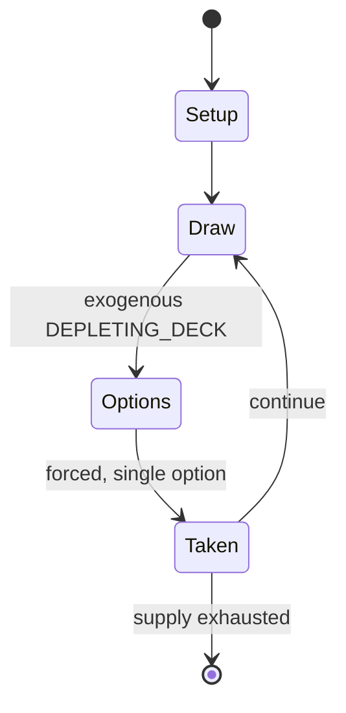

# Tri Peaks

*Card game - solitaire*

`tri_peaks` &nbsp; state: **DEEPENED** &nbsp; method: **heuristic**

## Found layer (recorded, not trusted)

| field | value |
| --- | --- |
| wikidata | Q7839847 |
| wikipedia | Tri Peaks (game) |
| genres (source) | solitaire |
| instance of (source) | card game, video game |
| country of origin | United States |

## Declared layer (orders bench work)

| field | value |
| --- | --- |
| year created | 1989 |
| epoch | DIGITAL |
| region | NORTH_AMERICA |
| media | CARD, SOLITAIRE |
| players | -- |
| age band | -- |
| exogenous process | DEPLETING_DECK |
| loss shape | -- |
| live axes | ORDER |
| horizon | -- |
| scoring shape | -- |
| information | -- |
| interaction | SOLITAIRE |
| turn structure | -- |
| tractability | EXACT_WITH_CUT |
| randomness | HIDDEN_INFO |
| luck factor | 0.35 |
| rules complexity | 2.15 |
| strategic depth | 2.25 |
| novelty | 0.6963 |
| solved status | -- |
| strategies | tableau_building |
| algorithms | -- |

## Object model

```
Episode
  players      : ?
  turn_structure: ?
  horizon       : ?
  scoring       : ?

Deck           -- ordered multiset, drawn without replacement
Hand           -- private multiset held by one player
DiscardPile    -- public accumulation of spent cards
Sequence       -- the permutation under the player's control
```

## State transition diagram



## Research item -- turn trace

```
# Tri Peaks -- simulated turn events
# generated from the DECLARED vector, not from a rulebook.
# structure: exo=DEPLETING_DECK loss=None horizon=None scoring=None axes=ORDER

t=0    SETUP        players=2  pot=0  capacity=7
t=1    DRAW         p1 draw from deck -> outcome #2  (p=0.180)
t=2    FORCED       p1 single legal option taken (pot_gain=+0.6)
t=3    DRAW         p1 draw from deck -> outcome #1  (p=0.227)
t=4    FORCED       p1 single legal option taken (pot_gain=+1.7)
t=5    DRAW         p1 draw from deck -> outcome #2  (p=0.050)
t=6    FORCED       p1 single legal option taken (pot_gain=+1.9)
t=7    ENDTURN      turn passes to p2
t=8    DRAW         p2 draw from deck -> outcome #3  (p=0.264)
t=9    FORCED       p2 single legal option taken (pot_gain=+0.7)
t=10   ENDTURN      turn passes to p1
t=11   DRAW         p1 draw from deck -> outcome #4  (p=0.248)
t=12   FORCED       p1 single legal option taken (pot_gain=+1.0)
t=13   DRAW         p1 draw from deck -> outcome #5  (p=0.033)
t=14   FORCED       p1 single legal option taken (pot_gain=+1.1)
t=15   DRAW         p1 draw from deck -> outcome #5  (p=0.209)
t=16   FORCED       p1 single legal option taken (pot_gain=+2.0)
t=17   DRAW         p1 draw from deck -> outcome #2  (p=0.030)
t=18   FORCED       p1 single legal option taken (pot_gain=+1.0)
t=19   DRAW         p1 draw from deck -> outcome #1  (p=0.041)
t=20   FORCED       p1 single legal option taken (pot_gain=+1.7)
t=21   DRAW         p1 draw from deck -> outcome #5  (p=0.203)
t=22   FORCED       p1 single legal option taken (pot_gain=+0.8)
t=23   DRAW         p1 draw from deck -> outcome #6  (p=0.036)
t=24   FORCED       p1 single legal option taken (pot_gain=+1.0)
t=25   ENDTURN      turn passes to p2
t=26   DRAW         p2 draw from deck -> outcome #4  (p=0.288)
t=27   FORCED       p2 single legal option taken (pot_gain=+1.0)

terminal: VARIABLE
```

## Source extract

Tri Peaks (also known as Three Peaks, Tri Towers or Triple Peaks) is a patience or solitaire
card game  that is akin to the solitaire games Golf and Black Hole. The game uses one deck and
the object is to clear three peaks made up of cards.  It was created by Robert Hogue in 1989,
and popularized as a result of being included in Microsoft Solitaire Collection.   == Gameplay
== The game starts with eighteen cards dealt face-down on the tableau to form three face-down
"pyramids" of six cards each, and a row of ten cards beneath. This is built by dealing out ten
cards face-up in a row; then nine cards face-down above them, offset by half a card to the
right; then six cards above those, offset by the same amount (and leaving a one-card gap after
the second and fourth cards); then three cards to cap the three pyramids. The twenty-four
remaining cards make up the stock. The first card from the stock is put in the waste pile
(sometimes known as the foundation/discard). For a card in the tableau to be moved to the waste
pile, it must be a rank higher or lower regardless of suit. This card becomes the new top card
and the process is repeated several times (e.g. 7-8-9-10-9-10-J-10-9-8, etc.)

<sub>Wikipedia, CC BY-SA. Retained as evidence for the structural
classification above. Every rule inferred from it is HYPOTHESIZED
until audited against a rulebook.</sub>
