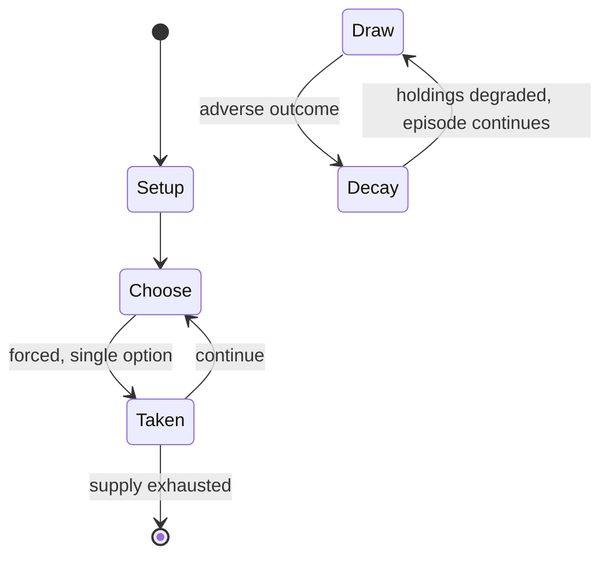

# Trioker

*corner-matching puzzle game*

`trioker` &nbsp; state: **DEEPENED** &nbsp; method: **heuristic**

## Found layer (recorded, not trusted)

| field | value |
| --- | --- |
| wikidata | Q123296005 |
| wikipedia | Trioker |
| genres (source) | -- |
| instance of (source) | parlour game, riddle, social game |
| country of origin | -- |

## Declared layer (orders bench work)

| field | value |
| --- | --- |
| year created | 1970 |
| epoch | DIGITAL |
| region | -- |
| media | PUZZLE, TILE |
| players | 2 |
| age band | -- |
| exogenous process | NONE |
| loss shape | PARTIAL_DECAY |
| live axes | SPATIAL |
| horizon | -- |
| scoring shape | NONLINEAR |
| information | PERFECT |
| interaction | SOLITAIRE |
| turn structure | STRICT_TURN |
| tractability | EXACT_WITH_CUT |
| randomness | NONE |
| luck factor | 0.02 |
| rules complexity | 2.48 |
| strategic depth | 2.4 |
| novelty | 0.8079 |
| solved status | -- |
| strategies | -- |
| algorithms | -- |

## Object model

```
Episode
  players      : 2
  turn_structure: STRICT_TURN
  horizon       : ?
  scoring       : NONLINEAR

Configuration  -- the arrangement to be resolved
Constraint     -- predicate a legal configuration must satisfy
TileBag        -- unordered draw source
Layout         -- placed tiles and their adjacencies
Placement      -- position subject to geometric legality
```

## State transition diagram



## Research item -- turn trace

```
# Trioker -- simulated turn events
# generated from the DECLARED vector, not from a rulebook.
# structure: exo=NONE loss=PARTIAL_DECAY horizon=None scoring=NONLINEAR axes=SPATIAL

t=0    SETUP        players=2  pot=0  capacity=7
t=1    FORCED       p1 single legal option taken (pot_gain=+1.7)
t=2    SPATIAL      p1 places at (4,1); adjacency legal
t=3    FORCED       p1 single legal option taken (pot_gain=+1.1)
t=4    SPATIAL      p1 places at (6,3); adjacency legal
t=5    FORCED       p1 single legal option taken (pot_gain=+1.8)
t=6    SPATIAL      p1 places at (2,3); adjacency legal
t=7    ENDTURN      turn passes to p2
t=8    FORCED       p2 single legal option taken (pot_gain=+0.8)
t=9    FORCED       p2 single legal option taken (pot_gain=+1.6)
t=10   SPATIAL      p2 places at (2,1); adjacency legal
t=11   FORCED       p2 single legal option taken (pot_gain=+2.0)
t=12   FORCED       p2 single legal option taken (pot_gain=+0.8)
t=13   SPATIAL      p2 places at (1,4); adjacency legal
t=14   ENDTURN      turn passes to p1
t=15   FORCED       p1 single legal option taken (pot_gain=+1.9)
t=16   SPATIAL      p1 places at (7,2); adjacency legal
t=17   FORCED       p1 single legal option taken (pot_gain=+0.6)
t=18   SPATIAL      p1 places at (4,4); adjacency legal
t=19   FORCED       p1 single legal option taken (pot_gain=+0.5)
t=20   SPATIAL      p1 places at (1,4); adjacency legal
t=21   FORCED       p1 single legal option taken (pot_gain=+1.2)
t=22   SPATIAL      p1 places at (2,5); adjacency legal
t=23   ENDTURN      turn passes to p2
t=24   FORCED       p2 single legal option taken (pot_gain=+1.6)
t=25   FORCED       p2 single legal option taken (pot_gain=+0.9)
t=26   SPATIAL      p2 places at (3,0); adjacency legal

terminal: VARIABLE
```

## Conditions

| kind | threshold | effect | trigger |
| --- | --- | --- | --- |
| BOUNDARY | -- | -- | There are many possible shapes, and at least one book has been published with additional shapes beyond those contained in the rulebook. |

## Source extract

Trioker is a corner-matching puzzle game played using 25 equilateral triangle-shaped tiles. Each
corner is marked with zero, one, two, or three dots and newly placed pieces must match the
values on pieces already placed on the game board, similar to the gameplay of the earlier
Triominoes.   == History ==  In the 1921 book New Mathematical Pastimes, Percy Alexander
MacMahon showed there were 24 possible combinations when each of the three edges of an
equilateral triangle are assigned one of four colors. In general, the number of unique pieces
that can be made in this way is                                                 n             3
⋅         (                    n                        2                             +
2         )                 {\displaystyle {\frac {n}{3}}\cdot (n^{2}+2)}     and so for
n         =         4                 {\displaystyle n=4}     there are 24 unique combinations
possible. MacMahon suggested an edge-matching puzzle game could be played with these pieces on a
regular hexagonal board, constraining colors to match on adjacent edges and on the borders of
the board itself. The similar squ

<sub>Wikipedia, CC BY-SA. Retained as evidence for the structural
classification above. Every rule inferred from it is HYPOTHESIZED
until audited against a rulebook.</sub>
