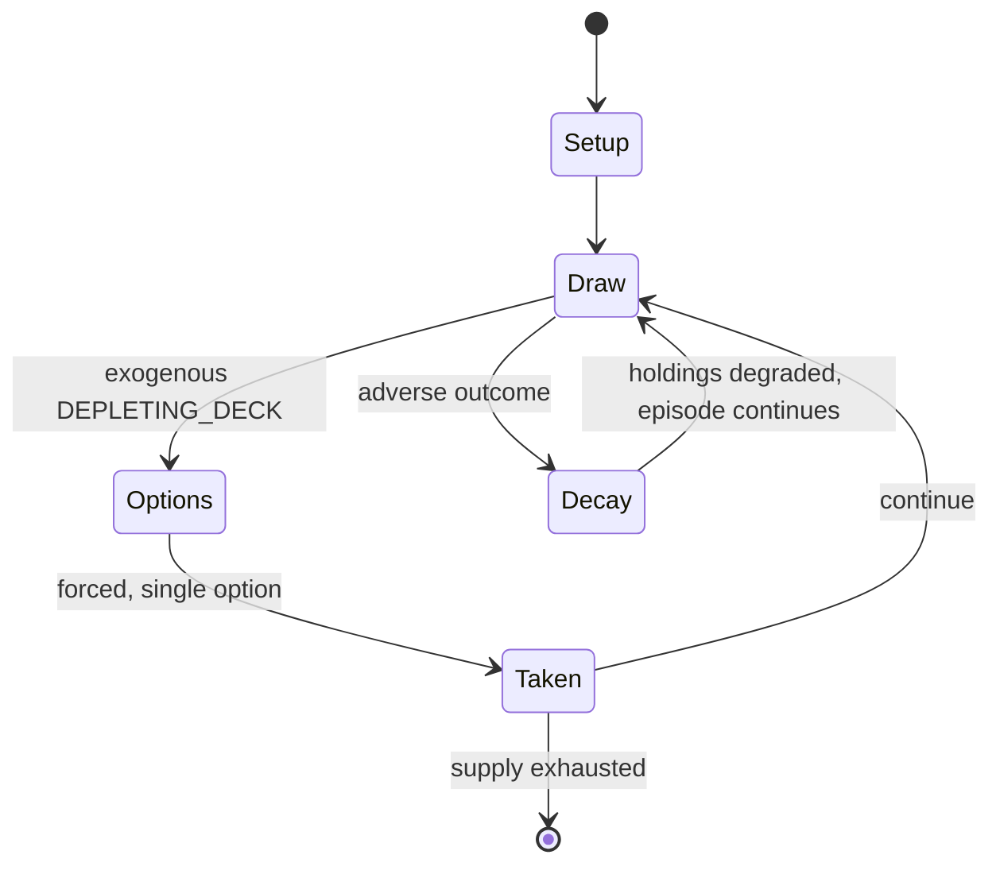

# Triominoes

*board game*

`triominoes` &nbsp; state: **DEEPENED** &nbsp; method: **heuristic**

## Found layer (recorded, not trusted)

| field | value |
| --- | --- |
| wikidata | Q1786673 |
| wikipedia | Triominoes |
| genres (source) | -- |
| instance of (source) | board game |
| country of origin | United States |

## Declared layer (orders bench work)

| field | value |
| --- | --- |
| year created | 1965 |
| epoch | MODERN |
| region | NORTH_AMERICA |
| media | BOARD, TILE |
| players | -- |
| age band | -- |
| exogenous process | DEPLETING_DECK |
| loss shape | PARTIAL_DECAY |
| live axes | - |
| horizon | -- |
| scoring shape | NONLINEAR |
| information | -- |
| interaction | SOLITAIRE |
| turn structure | -- |
| tractability | EXACT_WITH_CUT |
| randomness | DECK_SHUFFLE, HIDDEN_INFO |
| luck factor | 0.53 |
| rules complexity | 2.17 |
| strategic depth | 2.2 |
| novelty | 0.7871 |
| solved status | -- |
| strategies | signalling |
| algorithms | -- |

## Object model

```
Episode
  players      : ?
  turn_structure: ?
  horizon       : ?
  scoring       : NONLINEAR

Board          -- spatial substrate; cells carry position and occupancy
Piece          -- movable token owned by a player
TileBag        -- unordered draw source
Layout         -- placed tiles and their adjacencies
```

## State transition diagram



## Research item -- turn trace

```
# Triominoes -- simulated turn events
# generated from the DECLARED vector, not from a rulebook.
# structure: exo=DEPLETING_DECK loss=PARTIAL_DECAY horizon=None scoring=NONLINEAR axes=-

t=0    SETUP        players=2  pot=0  capacity=7
t=1    DRAW         p1 draw from deck -> outcome #6  (p=0.287)
t=2    FORCED       p1 single legal option taken (pot_gain=+0.7)
t=3    DRAW         p1 draw from deck -> outcome #6  (p=0.067)
t=4    FORCED       p1 single legal option taken (pot_gain=+1.5)
t=5    DRAW         p1 draw from deck -> outcome #5  (p=0.075)
t=6    FORCED       p1 single legal option taken (pot_gain=+1.7)
t=7    ENDTURN      turn passes to p2
t=8    DRAW         p2 draw from deck -> outcome #1  (p=0.274)
t=9    FORCED       p2 single legal option taken (pot_gain=+0.7)
t=10   DRAW         p2 draw from deck -> outcome #4  (p=0.013)
t=11   FORCED       p2 single legal option taken (pot_gain=+1.8)
t=12   DRAW         p2 draw from deck -> outcome #5  (p=0.111)
t=13   FORCED       p2 single legal option taken (pot_gain=+1.9)
t=14   ENDTURN      turn passes to p1
t=15   DRAW         p1 draw from deck -> outcome #5  (p=0.175)
t=16   FORCED       p1 single legal option taken (pot_gain=+0.9)
t=17   DRAW         p1 draw from deck -> outcome #1  (p=0.146)
t=18   FORCED       p1 single legal option taken (pot_gain=+1.7)
t=19   DRAW         p1 draw from deck -> outcome #2  (p=0.055)
t=20   FORCED       p1 single legal option taken (pot_gain=+0.8)
t=21   DRAW         p1 draw from deck -> outcome #3  (p=0.083)
t=22   FORCED       p1 single legal option taken (pot_gain=+1.5)
t=23   DRAW         p1 draw from deck -> outcome #3  (p=0.016)
t=24   FORCED       p1 single legal option taken (pot_gain=+0.6)
t=25   DRAW         p1 draw from deck -> outcome #4  (p=0.003)
t=26   FORCED       p1 single legal option taken (pot_gain=+0.9)

terminal: VARIABLE
```

## Conditions

| kind | threshold | effect | trigger |
| --- | --- | --- | --- |
| TERMINATE | 1 player | -- | The round ends when no player can place a tile, whether or not all the face-down tiles have been drawn, or when one player runs out of tiles. |
| PENALTY | 3 tiles | -- | If none of these three tiles can be placed the penalty is 25 points. |
| PENALTY | 2 tiles | -- | For example, if there are two tiles left, a player without a tile to be placed may draw them (receiving a penalty -10 in total for the two tiles drawn), and if that player still has no tile that can be played, the additi |
| PENALTY | 50 points | -- | When a player can place a tile that completes a closed hexagonal shape (i.e. the 6th piece & all 3 numbers match), that player receives a bonus of 50 points plus the regular score for a legally placed tile, less any pena |
| TERMINATE | -- | -- | When the round ends because no one can place a piece, then the player with the lowest total value hand gains the value in excess of their hand from each other player. |
| BOUNDARY | -- | -- | 15 with at least one 4 (and no 5) |
| BOUNDARY | -- | -- | 10 with at least one 3 (and no 4 or 5) |
| BOUNDARY | -- | -- | 6 with at least one 2 (and no 3, 4, or 5) |
| BOUNDARY | -- | -- | 3 with at least one 1 (and no 2, 3, 4, or 5) |
| BOUNDARY | -- | -- | 1 with at least one 0 (and no 1, 2, 3, 4, or 5) |
| PENALTY | -- | -- | If one of the three can be placed the score is the value of the tile placed less the penalty, which may be positive or negative, depending on the placed tile value and number of tiles drawn. |
| PENALTY | -- | -- | If a bridge is completed or a tile is added to a bridge, that player receives a 40-point bonus in addition to the tile's points, less any penalty if pieces have been drawn. |
| PENALTY | -- | -- | They are not yet the winner, and may not be: this only signals that this is the last round, even if penalties later reduce their total below 400. |

## Source extract

Triominoes is a variant of dominoes using triangular tiles published in 1965. A popular version
of this game is marketed as Tri-Ominos by the Pressman Toy Corp.   == Composition == A triomino
tile is in the shape of an equilateral triangle approximately 1 in (2.5 cm) on each side and
approximately 1⁄4 in (6.4 mm) thick. Each point of the triangle has a number (most often from 0
to 5, as in the Pressman version), and each triomino has a unique combination of numbers,
subject to the following restrictions:  Any number is allowed to repeat in the combination. For
example, 0-0-0 or 0-0-1 are possible combinations. When reading the numbers sequentially
clockwise, starting with the lowest value, the numbers are not allowed to decrease. For example,
0-1-2 and 0-2-3 are possible, but 0-2-1 is not allowed. Given these restrictions, with the six
potential values (0–5) commonly seen, there are 56 unique combinations, and thus the standard
triomino set has 56 tiles. Larger sets are possible; for example, including 6 as a possible end
number would result in 84 tiles. Tiles are most often made from plastic or resin that
approximates the feel of stone or ivory, similar to most modern commercial d

<sub>Wikipedia, CC BY-SA. Retained as evidence for the structural
classification above. Every rule inferred from it is HYPOTHESIZED
until audited against a rulebook.</sub>
