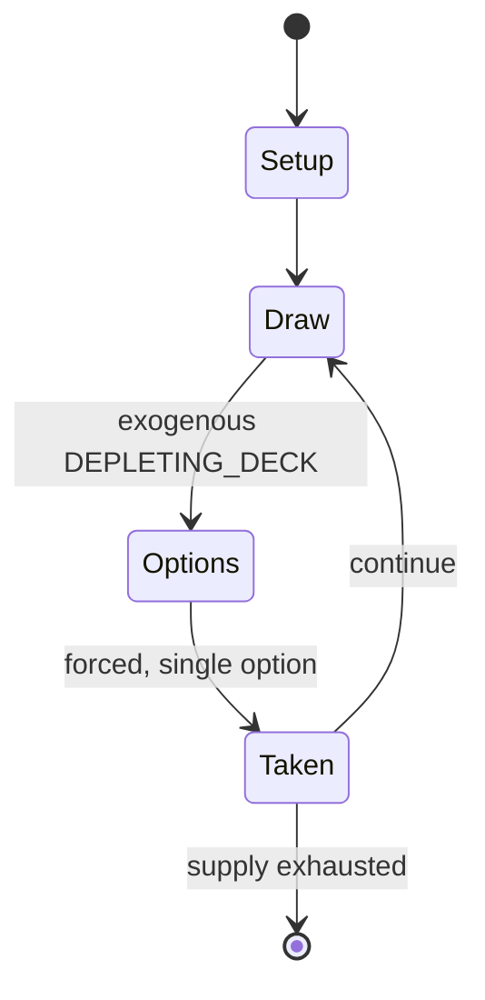

# Trischaken

`trischaken` &nbsp; state: **DEEPENED** &nbsp; method: **heuristic**

## Found layer (recorded, not trusted)

| field | value |
| --- | --- |
| wikidata | Q107645956 |
| wikipedia | Trischaken |
| genres (source) | -- |
| instance of (source) | -- |
| country of origin | -- |

## Declared layer (orders bench work)

| field | value |
| --- | --- |
| year created | -- |
| epoch | -- |
| region | -- |
| media | CARD, GAMBLING |
| players | 6-9 |
| age band | -- |
| exogenous process | DEPLETING_DECK |
| loss shape | -- |
| live axes | TRADE |
| horizon | -- |
| scoring shape | -- |
| information | -- |
| interaction | COMPETITIVE |
| turn structure | STRICT_TURN |
| tractability | EXACT_WITH_CUT |
| randomness | DECK_SHUFFLE |
| luck factor | 0.48 |
| rules complexity | 2.36 |
| strategic depth | 2.25 |
| novelty | 0.6951 |
| solved status | -- |
| strategies | spatial_packing |
| algorithms | -- |

## Object model

```
Episode
  players      : 6-9
  turn_structure: STRICT_TURN
  horizon       : ?
  scoring       : ?

Deck           -- ordered multiset, drawn without replacement
Hand           -- private multiset held by one player
DiscardPile    -- public accumulation of spent cards
Offer          -- proposed exchange between two agents
```

## State transition diagram



## Research item -- turn trace

```
# Trischaken -- simulated turn events
# generated from the DECLARED vector, not from a rulebook.
# structure: exo=DEPLETING_DECK loss=None horizon=None scoring=None axes=TRADE

t=0    SETUP        players=4  pot=0  capacity=8
t=1    DRAW         p1 draw from deck -> outcome #1  (p=0.283)
t=2    FORCED       p1 single legal option taken (pot_gain=+1.8)
t=3    DRAW         p1 draw from deck -> outcome #2  (p=0.163)
t=4    FORCED       p1 single legal option taken (pot_gain=+2.0)
t=5    DRAW         p1 draw from deck -> outcome #3  (p=0.297)
t=6    FORCED       p1 single legal option taken (pot_gain=+1.2)
t=7    DRAW         p1 draw from deck -> outcome #4  (p=0.114)
t=8    FORCED       p1 single legal option taken (pot_gain=+0.7)
t=9    DRAW         p1 draw from deck -> outcome #2  (p=0.024)
t=10   FORCED       p1 single legal option taken (pot_gain=+1.4)
t=11   DRAW         p1 draw from deck -> outcome #2  (p=0.017)
t=12   FORCED       p1 single legal option taken (pot_gain=+1.2)
t=13   DRAW         p1 draw from deck -> outcome #1  (p=0.200)
t=14   FORCED       p1 single legal option taken (pot_gain=+1.1)
t=15   DRAW         p1 draw from deck -> outcome #5  (p=0.072)
t=16   FORCED       p1 single legal option taken (pot_gain=+0.8)
t=17   TRADE        p1 offers 2:1 exchange to p2
t=18   DRAW         p1 draw from deck -> outcome #6  (p=0.130)
t=19   FORCED       p1 single legal option taken (pot_gain=+1.2)
t=20   DRAW         p1 draw from deck -> outcome #2  (p=0.136)
t=21   FORCED       p1 single legal option taken (pot_gain=+1.4)
t=22   ENDTURN      turn passes to p2
t=23   DRAW         p2 draw from deck -> outcome #2  (p=0.050)
t=24   FORCED       p2 single legal option taken (pot_gain=+2.0)
t=25   DRAW         p2 draw from deck -> outcome #5  (p=0.187)
t=26   FORCED       p2 single legal option taken (pot_gain=+1.6)
t=27   TRADE        p2 offers 2:1 exchange to p3
t=28   ENDTURN      turn passes to p3

terminal: VARIABLE
```

## Conditions

| kind | threshold | effect | trigger |
| --- | --- | --- | --- |
| BOUNDARY | -- | -- | An indication of its distribution is given by its inclusion in a 1771 Bremen-Lower Saxon dictionary and its description as "popular" in Bavaria from at least the late 18th to mid-19th century. |

## Source extract

Trischaken is an historical Austrian, German and Polish gambling card game for three to five
players. It appears related to French Brelan and German Scherwenzel.   == History == The game
dates back to the 16th century when it was played at court in the Kingdom of Poland. It is also
mentioned as a card game in a 1706 German poem  and listed as a banned gambling game in a 1734
law book of Anhalt-Bernburg. An indication of its distribution is given by its inclusion in a
1771 Bremen-Lower Saxon dictionary and its description as "popular" in Bavaria from at least the
late 18th  to mid-19th century. The word was also spelt dreschaken, meaning "to beat, thrash,
cudgel", and may have been derived from dreschen, to thresh, recalling the game of Karnöffel
whose name also means "to thrash". In 1871 it was described as a game of chance, popular with
peasants "in the provinces" and played with the "large old German cards", which presumably meant
36- or even 48-card, German-suited packs. Treschaken was equated with French Brelan and the game
of Krimp, Krimpen or Krimpenspiel.   == Description ==   === German Drischaken or Trischaken ===
The Brothers Grimm give a brief description of Drischaken a

<sub>Wikipedia, CC BY-SA. Retained as evidence for the structural
classification above. Every rule inferred from it is HYPOTHESIZED
until audited against a rulebook.</sub>
