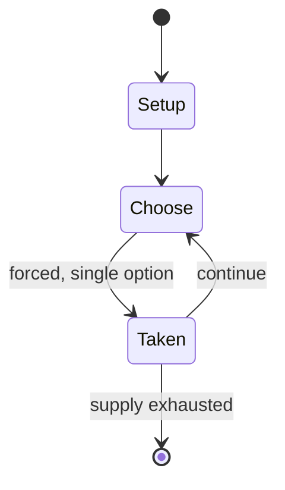

# Trishogi

*shogi variant with triangular cells*

`trishogi` &nbsp; state: **DEEPENED** &nbsp; method: **heuristic**

## Found layer (recorded, not trusted)

| field | value |
| --- | --- |
| wikidata | Q7844045 |
| wikipedia | Trishogi |
| genres (source) | -- |
| instance of (source) | shogi variant |
| country of origin | -- |

## Declared layer (orders bench work)

| field | value |
| --- | --- |
| year created | 1987 |
| epoch | DIGITAL |
| region | -- |
| media | BOARD |
| players | 2 |
| age band | -- |
| exogenous process | -- |
| loss shape | -- |
| live axes | - |
| horizon | -- |
| scoring shape | NONLINEAR |
| information | -- |
| interaction | -- |
| turn structure | -- |
| tractability | SAMPLING_ONLY |
| randomness | -- |
| luck factor | 0.35 |
| rules complexity | 1.68 |
| strategic depth | 2.0 |
| novelty | 0.5179 |
| solved status | -- |
| strategies | -- |
| algorithms | -- |

## Object model

```
Episode
  players      : 2
  turn_structure: ?
  horizon       : ?
  scoring       : NONLINEAR

Board          -- spatial substrate; cells carry position and occupancy
Piece          -- movable token owned by a player
```

## State transition diagram



## Research item -- turn trace

```
# Trishogi -- simulated turn events
# generated from the DECLARED vector, not from a rulebook.
# structure: exo=None loss=None horizon=None scoring=NONLINEAR axes=-

t=0    SETUP        players=2  pot=0  capacity=8
t=1    FORCED       p1 single legal option taken (pot_gain=+0.8)
t=2    FORCED       p1 single legal option taken (pot_gain=+0.7)
t=3    FORCED       p1 single legal option taken (pot_gain=+1.2)
t=4    FORCED       p1 single legal option taken (pot_gain=+1.7)
t=5    FORCED       p1 single legal option taken (pot_gain=+1.1)
t=6    FORCED       p1 single legal option taken (pot_gain=+1.0)
t=7    FORCED       p1 single legal option taken (pot_gain=+0.9)
t=8    FORCED       p1 single legal option taken (pot_gain=+0.8)
t=9    ENDTURN      turn passes to p2
t=10   FORCED       p2 single legal option taken (pot_gain=+1.3)
t=11   FORCED       p2 single legal option taken (pot_gain=+1.1)
t=12   FORCED       p2 single legal option taken (pot_gain=+1.9)
t=13   ENDTURN      turn passes to p1
t=14   FORCED       p1 single legal option taken (pot_gain=+1.8)
t=15   FORCED       p1 single legal option taken (pot_gain=+1.3)
t=16   FORCED       p1 single legal option taken (pot_gain=+1.8)
t=17   ENDTURN      turn passes to p2
t=18   FORCED       p2 single legal option taken (pot_gain=+1.8)
t=19   FORCED       p2 single legal option taken (pot_gain=+0.6)
t=20   FORCED       p2 single legal option taken (pot_gain=+1.9)
t=21   FORCED       p2 single legal option taken (pot_gain=+1.9)
t=22   ENDTURN      turn passes to p1
t=23   FORCED       p1 single legal option taken (pot_gain=+1.8)
t=24   FORCED       p1 single legal option taken (pot_gain=+0.7)
t=25   ENDTURN      turn passes to p2
t=26   FORCED       p2 single legal option taken (pot_gain=+1.1)

terminal: VARIABLE
```

## Source extract

Trishogi is a shogi variant for two players created by George R. Dekle Sr. in 1987. The
gameboard comprises 9×10 interlocking triangular cells. The game is in all respects the same as
shogi, except that piece moves have been transfigured for the triangular board-cell geometry.
Trishogi was included in World Game Review No. 10 edited by Michael Keller.   == Game rules ==
Trishogi has the same types and numbers of pieces as shogi, and all normal shogi rules apply,
including initial setup (see diagram), drops, promotion, check, and checkmate. As in shogi,
pieces capture the same as they move. But the triangular geometry creates special move patterns
for the pieces.   === Piece moves === The diagrams show how the unpromoted pieces move. As in
shogi, a dragon king (promoted rook) moves as a rook and as a king. A dragon horse (promoted
bishop) moves as a bishop and king.   == See also == Shogi variants Also by George Dekle:
Hexshogi – a variant with hexagonal cells Masonic shogi Space shogi – a 3D variant Triangular
Chess – a chess variant with triangular cells   == References ==  Bibliography  Pritchard, D. B.
(1994). The Encyclopedia of Chess Variants. Games & Puzzles Publications. ISB

<sub>Wikipedia, CC BY-SA. Retained as evidence for the structural
classification above. Every rule inferred from it is HYPOTHESIZED
until audited against a rulebook.</sub>
