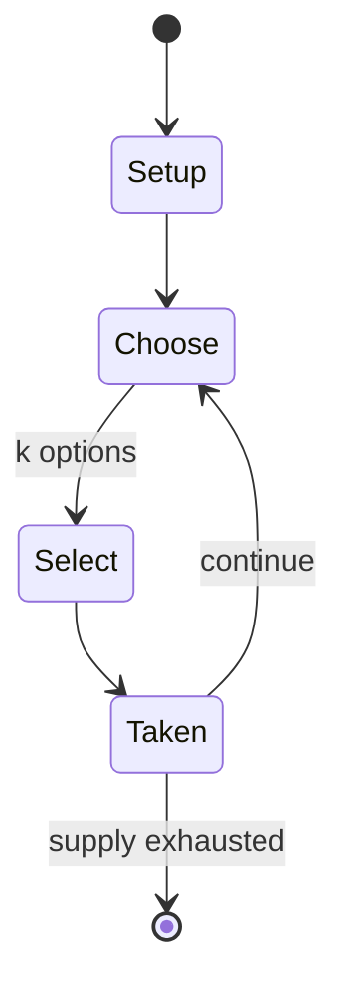

# Trivia Crack

*mobile app game*

`trivia_crack` &nbsp; state: **DEEPENED** &nbsp; method: **heuristic**

## Found layer (recorded, not trusted)

| field | value |
| --- | --- |
| wikidata | Q17625797 |
| wikipedia | Trivia Crack |
| genres (source) | quiz video game, trivia video game |
| instance of (source) | video game |
| country of origin | Argentina |

## Declared layer (orders bench work)

| field | value |
| --- | --- |
| year created | 2014 |
| epoch | CONTEMPORARY |
| region | SOUTH_AMERICA |
| media | VIDEO |
| players | -- |
| age band | -- |
| exogenous process | -- |
| loss shape | -- |
| live axes | SELECT |
| horizon | -- |
| scoring shape | -- |
| information | -- |
| interaction | -- |
| turn structure | -- |
| tractability | SAMPLING_ONLY |
| randomness | -- |
| luck factor | 0.35 |
| rules complexity | 2.02 |
| strategic depth | 2.25 |
| novelty | 0.0876 |
| solved status | -- |
| strategies | route_optimisation |
| algorithms | -- |

## Object model

```
Episode
  players      : ?
  turn_structure: ?
  horizon       : ?
  scoring       : ?

WorldState     -- simulation state advanced by the engine
Avatar         -- player-controlled agent
Clock          -- frame or tick counter
OptionSet      -- the choices available after an exogenous draw
```

## State transition diagram



## Research item -- turn trace

```
# Trivia Crack -- simulated turn events
# generated from the DECLARED vector, not from a rulebook.
# structure: exo=None loss=None horizon=None scoring=None axes=SELECT

t=0    SETUP        players=2  pot=0  capacity=7
t=1    SELECT       p1 2 options; take #2  (pot_gain=+2.5, capacity=-2)
t=2    SELECT       p1 4 options; take #4  (pot_gain=+0.8, capacity=-1)
t=3    ENDTURN      turn passes to p2
t=4    SELECT       p2 1 options; take #1  (pot_gain=+1.0, capacity=-0)
t=5    SELECT       p2 4 options; take #3  (pot_gain=+1.1, capacity=-0)
t=6    SELECT       p2 3 options; take #2  (pot_gain=+2.9, capacity=-1)
t=7    SELECT       p2 2 options; take #1  (pot_gain=+0.7, capacity=-1)
t=8    SELECT       p2 1 options; take #1  (pot_gain=+2.5, capacity=-1)
t=9    SELECT       p2 1 options; take #1  (pot_gain=+3.5, capacity=-2)
t=10   SELECT       p2 2 options; take #1  (pot_gain=+3.0, capacity=-0)
t=11   SELECT       p2 2 options; take #1  (pot_gain=+2.8, capacity=-2)
t=12   SELECT       p2 2 options; take #2  (pot_gain=+3.2, capacity=-0)
t=13   SELECT       p2 1 options; take #1  (pot_gain=+1.3, capacity=-2)
t=14   ENDTURN      turn passes to p1
t=15   SELECT       p1 2 options; take #1  (pot_gain=+3.3, capacity=-2)
t=16   SELECT       p1 3 options; take #2  (pot_gain=+1.4, capacity=-0)
t=17   SELECT       p1 4 options; take #2  (pot_gain=+1.2, capacity=-2)
t=18   SELECT       p1 1 options; take #1  (pot_gain=+3.3, capacity=-1)
t=19   SELECT       p1 1 options; take #1  (pot_gain=+1.8, capacity=-1)
t=20   ENDTURN      turn passes to p2
t=21   SELECT       p2 1 options; take #1  (pot_gain=+2.8, capacity=-2)
t=22   ENDTURN      turn passes to p1
t=23   SELECT       p1 3 options; take #2  (pot_gain=+0.8, capacity=-2)
t=24   SELECT       p1 3 options; take #3  (pot_gain=+3.1, capacity=-1)
t=25   SELECT       p1 2 options; take #2  (pot_gain=+2.6, capacity=-2)
t=26   ENDTURN      turn passes to p2

terminal: VARIABLE
```

## Source extract

Trivia Crack (original Spanish language name: Preguntados) is a trivia-based knowledge game
developed by Etermax. Initially release for Android and iOS in 2013, In addition to the original
game it contains sequels, such as: Trivia Crack 2 and Trivia Crack Adventure, among others,
available on Android and iOS. Trivia Crack has more than 600 million downloads worldwide and
more than 150 million active users annually, including those who are entertained and connect
with others through social networks, such as Facebook or Instagram, with the skill of Alexa of
Amazon and the Apple Watch version. Trivia Crack is available in more than 180 countries,
ranking #1 in trivia games in 125 of them. Board games, consumer products and experiences, as
well as the animated series Triviatopia, and the interactive game show Trivia Quest, inspired by
its characters, complete the experience. Etermax whose teams are located in the Americas and
Europe. In March 2023, Trivia Crack was introduced to instant browser gamers worldwide by
CrazyGames.   == Characters and Categories == Tito, a blue planet Earth representing the
category "Geography" Albert, a green laboratory flask representing the category "Scie

<sub>Wikipedia, CC BY-SA. Retained as evidence for the structural
classification above. Every rule inferred from it is HYPOTHESIZED
until audited against a rulebook.</sub>
