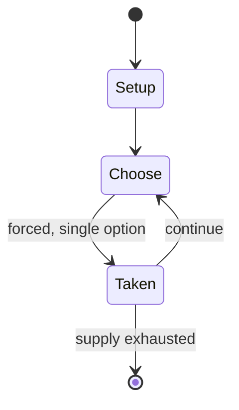

# Trumped Up Cards

*card game*

`trumped_up_cards` &nbsp; state: **DEEPENED** &nbsp; method: **heuristic**

## Found layer (recorded, not trusted)

| field | value |
| --- | --- |
| wikidata | Q28127199 |
| wikipedia | Trumped Up Cards |
| genres (source) | -- |
| instance of (source) | dedicated deck card game, party game |
| country of origin | -- |

## Declared layer (orders bench work)

| field | value |
| --- | --- |
| year created | -- |
| epoch | -- |
| region | -- |
| media | CARD, PARTY |
| players | 4-8 |
| age band | -- |
| exogenous process | -- |
| loss shape | -- |
| live axes | - |
| horizon | -- |
| scoring shape | -- |
| information | -- |
| interaction | -- |
| turn structure | -- |
| tractability | SAMPLING_ONLY |
| randomness | -- |
| luck factor | 0.35 |
| rules complexity | 1.65 |
| strategic depth | 2.0 |
| novelty | 0.0876 |
| solved status | -- |
| strategies | -- |
| algorithms | -- |

## Object model

```
Episode
  players      : 4-8
  turn_structure: ?
  horizon       : ?
  scoring       : ?

Deck           -- ordered multiset, drawn without replacement
Hand           -- private multiset held by one player
DiscardPile    -- public accumulation of spent cards
```

## State transition diagram



## Research item -- turn trace

```
# Trumped Up Cards -- simulated turn events
# generated from the DECLARED vector, not from a rulebook.
# structure: exo=None loss=None horizon=None scoring=None axes=-

t=0    SETUP        players=4  pot=0  capacity=3
t=1    FORCED       p1 single legal option taken (pot_gain=+1.6)
t=2    FORCED       p1 single legal option taken (pot_gain=+1.7)
t=3    FORCED       p1 single legal option taken (pot_gain=+1.1)
t=4    FORCED       p1 single legal option taken (pot_gain=+0.9)
t=5    FORCED       p1 single legal option taken (pot_gain=+1.7)
t=6    FORCED       p1 single legal option taken (pot_gain=+0.6)
t=7    FORCED       p1 single legal option taken (pot_gain=+1.8)
t=8    FORCED       p1 single legal option taken (pot_gain=+1.5)
t=9    ENDTURN      turn passes to p2
t=10   FORCED       p2 single legal option taken (pot_gain=+1.5)
t=11   FORCED       p2 single legal option taken (pot_gain=+1.4)
t=12   FORCED       p2 single legal option taken (pot_gain=+1.2)
t=13   FORCED       p2 single legal option taken (pot_gain=+1.3)
t=14   FORCED       p2 single legal option taken (pot_gain=+1.2)
t=15   FORCED       p2 single legal option taken (pot_gain=+1.5)
t=16   ENDTURN      turn passes to p3
t=17   FORCED       p3 single legal option taken (pot_gain=+0.6)
t=18   ENDTURN      turn passes to p4
t=19   FORCED       p4 single legal option taken (pot_gain=+1.8)
t=20   FORCED       p4 single legal option taken (pot_gain=+1.1)
t=21   FORCED       p4 single legal option taken (pot_gain=+1.6)
t=22   FORCED       p4 single legal option taken (pot_gain=+1.8)
t=23   FORCED       p4 single legal option taken (pot_gain=+1.3)
t=24   ENDTURN      turn passes to p1
t=25   FORCED       p1 single legal option taken (pot_gain=+0.8)
t=26   FORCED       p1 single legal option taken (pot_gain=+1.7)
t=27   ENDTURN      turn passes to p2

terminal: VARIABLE
```

## Source extract

Trumped Up Cards is a party game developed by Reid Hoffman to poke fun at then presidential
candidate Donald Trump. It was modeled after the popular Cards Against Humanity card game and
sold online. The game was featured on an episode of The Daily Show with Trevor Noah in which
Hoffman was a guest. The game has also been covered by a large number of mainstream media
outlets, including The New York Times and USA Today. The game is licensed under a Creative
Commons Attribution-NonCommercial-ShareAlike 4.0 International License.   == References ==   ==
External links == Official website

<sub>Wikipedia, CC BY-SA. Retained as evidence for the structural
classification above. Every rule inferred from it is HYPOTHESIZED
until audited against a rulebook.</sub>
