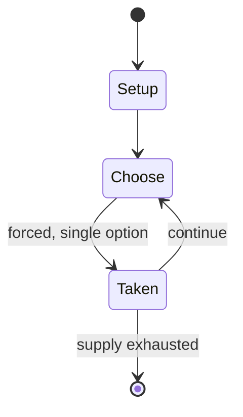

# Truth or dare?

*verbal party game*

`truth_or_dare` &nbsp; state: **DEEPENED** &nbsp; method: **heuristic**

## Found layer (recorded, not trusted)

| field | value |
| --- | --- |
| wikidata | Q629208 |
| wikipedia | Truth or dare? |
| genres (source) | -- |
| instance of (source) | conversation game, party game |
| country of origin | -- |

## Declared layer (orders bench work)

| field | value |
| --- | --- |
| year created | -- |
| epoch | -- |
| region | -- |
| media | PARTY |
| players | -- |
| age band | -- |
| exogenous process | -- |
| loss shape | -- |
| live axes | BID |
| horizon | -- |
| scoring shape | -- |
| information | -- |
| interaction | -- |
| turn structure | -- |
| tractability | SAMPLING_ONLY |
| randomness | -- |
| luck factor | 0.35 |
| rules complexity | 1.62 |
| strategic depth | 2.0 |
| novelty | 0.0876 |
| solved status | -- |
| strategies | -- |
| algorithms | -- |

## Object model

```
Episode
  players      : ?
  turn_structure: ?
  horizon       : ?
  scoring       : ?

Auction        -- priced competition resolving to one winner
```

## State transition diagram



## Research item -- turn trace

```
# Truth or dare? -- simulated turn events
# generated from the DECLARED vector, not from a rulebook.
# structure: exo=None loss=None horizon=None scoring=None axes=BID

t=0    SETUP        players=2  pot=0  capacity=6
t=1    FORCED       p1 single legal option taken (pot_gain=+1.6)
t=2    FORCED       p1 single legal option taken (pot_gain=+1.4)
t=3    ENDTURN      turn passes to p2
t=4    FORCED       p2 single legal option taken (pot_gain=+0.6)
t=5    BID          p2 sealed bid of 5 against 1 rivals
t=6    FORCED       p2 single legal option taken (pot_gain=+1.8)
t=7    BID          p2 sealed bid of 7 against 1 rivals
t=8    FORCED       p2 single legal option taken (pot_gain=+1.9)
t=9    FORCED       p2 single legal option taken (pot_gain=+1.1)
t=10   BID          p2 sealed bid of 3 against 1 rivals
t=11   ENDTURN      turn passes to p1
t=12   FORCED       p1 single legal option taken (pot_gain=+1.8)
t=13   BID          p1 sealed bid of 2 against 1 rivals
t=14   FORCED       p1 single legal option taken (pot_gain=+0.8)
t=15   FORCED       p1 single legal option taken (pot_gain=+1.2)
t=16   BID          p1 sealed bid of 5 against 1 rivals
t=17   FORCED       p1 single legal option taken (pot_gain=+1.0)
t=18   BID          p1 sealed bid of 2 against 1 rivals
t=19   FORCED       p1 single legal option taken (pot_gain=+1.9)
t=20   BID          p1 sealed bid of 9 against 1 rivals
t=21   FORCED       p1 single legal option taken (pot_gain=+0.9)
t=22   BID          p1 sealed bid of 7 against 1 rivals
t=23   FORCED       p1 single legal option taken (pot_gain=+0.5)
t=24   BID          p1 sealed bid of 8 against 1 rivals
t=25   FORCED       p1 single legal option taken (pot_gain=+0.5)
t=26   FORCED       p1 single legal option taken (pot_gain=+1.7)
t=27   BID          p1 sealed bid of 3 against 1 rivals

terminal: VARIABLE
```

## Conditions

| kind | threshold | effect | trigger |
| --- | --- | --- | --- |
| BOUNDARY | -- | -- | The game has existed for hundreds of years, with at least one variant, "questions and commands", being attested as early as 1712: |
| PENALTY | -- | -- | If the subject refuses or fails to satisfy the commander, they must pay a forfeit [follow a command] or have their face smutted [dirtied]. |

## Source extract

Truth or dare? is a mostly verbal party game requiring two or more players. Players are given
the choice between answering a question truthfully, or performing a "dare". The game is
particularly popular among adolescents and children.   == History ==  The game has existed for
hundreds of years, with at least one variant, "questions and commands", being attested as early
as 1712:  A Christmas game, in which the commander bids their subjects to answer a question
which is asked. If the subject refuses or fails to satisfy the commander, they must pay a
forfeit [follow a command] or have their face smutted [dirtied]. Truth or dare may ultimately
derive from command games such as the ancient Greek basilinda (in Greek: βασιλίνδα). This game
is described by Julius Pollux: "in which we are told a king, elected by lot, commanded his
comrades what they should perform". In some cases, pedophiles have used the Truth or Dare game
to groom their victims.   == See also == Game of dares Never have I ever   == References ==

<sub>Wikipedia, CC BY-SA. Retained as evidence for the structural
classification above. Every rule inferred from it is HYPOTHESIZED
until audited against a rulebook.</sub>
