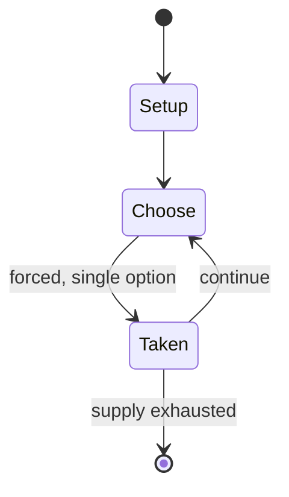

# Tsoro yematatu

`tsoro_yematatu` &nbsp; state: **DEEPENED** &nbsp; method: **heuristic**

## Found layer (recorded, not trusted)

| field | value |
| --- | --- |
| wikidata | Q17107960 |
| wikipedia | Tsoro yematatu |
| genres (source) | -- |
| instance of (source) | -- |
| country of origin | -- |

## Declared layer (orders bench work)

| field | value |
| --- | --- |
| year created | -- |
| epoch | -- |
| region | -- |
| media | ABSTRACT |
| players | -- |
| age band | -- |
| exogenous process | -- |
| loss shape | -- |
| live axes | SPATIAL |
| horizon | -- |
| scoring shape | -- |
| information | IMPERFECT |
| interaction | COMPETITIVE |
| turn structure | -- |
| tractability | SAMPLING_ONLY |
| randomness | -- |
| luck factor | 0.35 |
| rules complexity | 2.08 |
| strategic depth | 2.0 |
| novelty | 0.5324 |
| solved status | -- |
| strategies | -- |
| algorithms | -- |

## Object model

```
Episode
  players      : ?
  turn_structure: ?
  horizon       : ?
  scoring       : ?

Placement      -- position subject to geometric legality
```

## State transition diagram



## Research item -- turn trace

```
# Tsoro yematatu -- simulated turn events
# generated from the DECLARED vector, not from a rulebook.
# structure: exo=None loss=None horizon=None scoring=None axes=SPATIAL

t=0    SETUP        players=2  pot=0  capacity=3
t=1    FORCED       p1 single legal option taken (pot_gain=+1.8)
t=2    SPATIAL      p1 places at (3,0); adjacency legal
t=3    ENDTURN      turn passes to p2
t=4    FORCED       p2 single legal option taken (pot_gain=+1.7)
t=5    SPATIAL      p2 places at (7,5); adjacency legal
t=6    FORCED       p2 single legal option taken (pot_gain=+0.6)
t=7    FORCED       p2 single legal option taken (pot_gain=+1.3)
t=8    FORCED       p2 single legal option taken (pot_gain=+1.1)
t=9    ENDTURN      turn passes to p1
t=10   FORCED       p1 single legal option taken (pot_gain=+0.8)
t=11   ENDTURN      turn passes to p2
t=12   FORCED       p2 single legal option taken (pot_gain=+0.9)
t=13   FORCED       p2 single legal option taken (pot_gain=+1.9)
t=14   FORCED       p2 single legal option taken (pot_gain=+0.7)
t=15   FORCED       p2 single legal option taken (pot_gain=+0.6)
t=16   SPATIAL      p2 places at (0,2); adjacency legal
t=17   FORCED       p2 single legal option taken (pot_gain=+1.3)
t=18   FORCED       p2 single legal option taken (pot_gain=+0.6)
t=19   SPATIAL      p2 places at (5,3); adjacency legal
t=20   FORCED       p2 single legal option taken (pot_gain=+1.9)
t=21   FORCED       p2 single legal option taken (pot_gain=+1.8)
t=22   FORCED       p2 single legal option taken (pot_gain=+1.0)
t=23   SPATIAL      p2 places at (3,0); adjacency legal
t=24   FORCED       p2 single legal option taken (pot_gain=+1.4)
t=25   ENDTURN      turn passes to p1
t=26   FORCED       p1 single legal option taken (pot_gain=+1.1)

terminal: VARIABLE
```

## Conditions

| kind | threshold | effect | trigger |
| --- | --- | --- | --- |
| WIN | 3 pieces | -- | Players first drop their three pieces onto the board, and then move them to create a 3 in-a-row which wins the game. |

## Source extract

Tsoro yematatu is a two-player abstract strategy game from Zimbabwe.  Players first drop their
three pieces onto the board, and then move them to create a 3 in-a-row which wins the game.  It
is similar to games including Tapatan, Achi, Nine holes, Shisima, and Tant Fant.  Uniquely
pieces can jump over each other (without capture) which adds an extra dimension in the
manoeuvrability of the pieces. There is some uncertainty about the correct name as Tsoro
yemamutatu is also used; 'ma' or 'mai' being the chikaranga for 'mother'...hence 'mamutatu'
means 'mother mutatu'.   == Goal == To be first to create a three-in-a-row with one's pieces
== Equipment == The board is an isosceles triangle with one line across its breadth, and another
line running down the length of the board down its central axis.  This creates seven
intersection points where the pieces can be played.  Other variations of the board are also
used, such as a square board divided by 4 lines, creating an asterisk-style pattern with 8
triangle spaces for pieces to be placed on.  Each player has three pieces.  One plays the black
pieces, and the other player plays the white pieces.   == Game play and rules == The board is

<sub>Wikipedia, CC BY-SA. Retained as evidence for the structural
classification above. Every rule inferred from it is HYPOTHESIZED
until audited against a rulebook.</sub>
