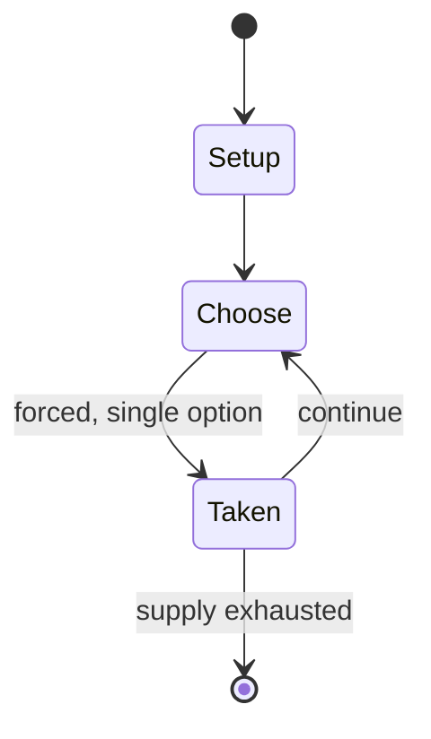

# Tugging rituals and games

*sitting tug of war in Cambodia, Philippines, Republic of Korea, and Viet Nam*

`tugging_rituals_and_games` &nbsp; state: **DEEPENED** &nbsp; method: **heuristic**

## Found layer (recorded, not trusted)

| field | value |
| --- | --- |
| wikidata | Q50922911 |
| wikipedia | Tugging rituals and games |
| genres (source) | -- |
| instance of (source) | traditional game |
| country of origin | Philippines |

## Declared layer (orders bench work)

| field | value |
| --- | --- |
| year created | -- |
| epoch | -- |
| region | SOUTHEAST_ASIA |
| media | - |
| players | -- |
| age band | -- |
| exogenous process | -- |
| loss shape | -- |
| live axes | - |
| horizon | -- |
| scoring shape | -- |
| information | -- |
| interaction | COMPETITIVE |
| turn structure | -- |
| tractability | SAMPLING_ONLY |
| randomness | -- |
| luck factor | 0.35 |
| rules complexity | 1.91 |
| strategic depth | 2.25 |
| novelty | 0.3479 |
| solved status | -- |
| strategies | signalling |
| algorithms | -- |

## Object model

```
Episode
  players      : ?
  turn_structure: ?
  horizon       : ?
  scoring       : ?

State          -- opaque; no medium or axis evidence was found
Player         -- an agent that selects among legal successors
```

## State transition diagram



## Research item -- turn trace

```
# Tugging rituals and games -- simulated turn events
# generated from the DECLARED vector, not from a rulebook.
# structure: exo=None loss=None horizon=None scoring=None axes=-

t=0    SETUP        players=2  pot=0  capacity=4
t=1    FORCED       p1 single legal option taken (pot_gain=+1.0)
t=2    FORCED       p1 single legal option taken (pot_gain=+1.5)
t=3    FORCED       p1 single legal option taken (pot_gain=+0.7)
t=4    FORCED       p1 single legal option taken (pot_gain=+1.7)
t=5    FORCED       p1 single legal option taken (pot_gain=+1.5)
t=6    FORCED       p1 single legal option taken (pot_gain=+1.7)
t=7    ENDTURN      turn passes to p2
t=8    FORCED       p2 single legal option taken (pot_gain=+1.5)
t=9    FORCED       p2 single legal option taken (pot_gain=+0.6)
t=10   FORCED       p2 single legal option taken (pot_gain=+0.9)
t=11   FORCED       p2 single legal option taken (pot_gain=+1.5)
t=12   FORCED       p2 single legal option taken (pot_gain=+1.6)
t=13   FORCED       p2 single legal option taken (pot_gain=+0.9)
t=14   FORCED       p2 single legal option taken (pot_gain=+0.7)
t=15   FORCED       p2 single legal option taken (pot_gain=+1.9)
t=16   FORCED       p2 single legal option taken (pot_gain=+1.3)
t=17   FORCED       p2 single legal option taken (pot_gain=+2.0)
t=18   FORCED       p2 single legal option taken (pot_gain=+0.7)
t=19   ENDTURN      turn passes to p1
t=20   FORCED       p1 single legal option taken (pot_gain=+1.7)
t=21   FORCED       p1 single legal option taken (pot_gain=+1.8)
t=22   ENDTURN      turn passes to p2
t=23   FORCED       p2 single legal option taken (pot_gain=+1.9)
t=24   ENDTURN      turn passes to p1
t=25   FORCED       p1 single legal option taken (pot_gain=+0.8)
t=26   FORCED       p1 single legal option taken (pot_gain=+1.2)

terminal: VARIABLE
```

## Source extract

Tugging rituals and games are four cultural practices in Cambodia, Philippines, South Korea, and
Vietnam, which were collectively included in UNESCO's Intangible Cultural Heritage of Humanity
List in 2015. The tugging rituals and games, namely lbaengteanhprot (Khmer: ល្បែងទាញព្រ័ត្រ),
punnuk, juldarigi (Korean: 줄다리기), and keo co (Vietnamese: kéo co), include two teams, with each
pulling one end of a rope, attempting to tug it from the other. The tugging rituals and games
promote social solidarity, provide entertainment and mark the start of a new agricultural cycle.
While these traditional practices often emphasize competition, the game is intended to show the
importance of cooperation. They are often organized in front of a village's communal house or
shrine, preceded by commemorative rites to local protective deities. Village elders play active
roles in leading and organizing younger people in playing the game and holding accompanying
rituals.   == Rituals and games ==   === Lbaengteanhprot === Lbaengteanhprot is performed during
the Cambodian New Year and Chlong Chet, a rice farming festivity. It is performed by two
opposing teams, normally women against men, in an open space at

<sub>Wikipedia, CC BY-SA. Retained as evidence for the structural
classification above. Every rule inferred from it is HYPOTHESIZED
until audited against a rulebook.</sub>
