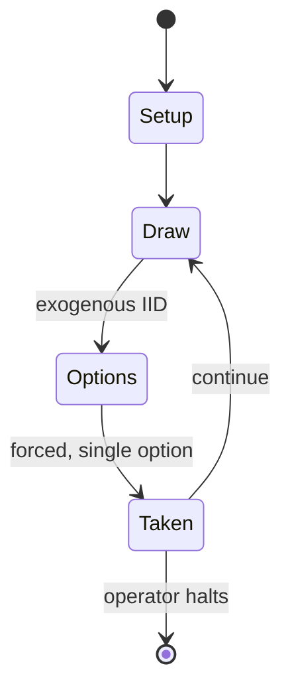

# Tunisia

*1995 board wargame published by The Gamers*

`tunisia` &nbsp; state: **DEEPENED** &nbsp; method: **heuristic**

## Found layer (recorded, not trusted)

| field | value |
| --- | --- |
| wikidata | Q111181040 |
| wikipedia | Tunisia (board game) |
| genres (source) | -- |
| instance of (source) | board wargame |
| country of origin | -- |

## Declared layer (orders bench work)

| field | value |
| --- | --- |
| year created | 1995 |
| epoch | DIGITAL |
| region | -- |
| media | DICE, WARGAME |
| players | -- |
| age band | -- |
| exogenous process | IID |
| loss shape | -- |
| live axes | ORDER, SPATIAL, TIMING |
| horizon | OPEN_ENDED |
| scoring shape | -- |
| information | -- |
| interaction | COMPETITIVE |
| turn structure | -- |
| tractability | SAMPLING_ONLY |
| randomness | DICE |
| luck factor | 0.58 |
| rules complexity | 3.84 |
| strategic depth | 2.12 |
| novelty | 0.5578 |
| solved status | -- |
| strategies | tempo |
| algorithms | -- |

## Object model

```
Episode
  players      : ?
  turn_structure: ?
  horizon       : OPEN_ENDED
  scoring       : ?

DicePool       -- n dice, each an iid categorical draw
Roll           -- realised outcome of a pool
Sequence       -- the permutation under the player's control
Placement      -- position subject to geometric legality
Initiative     -- who acts, and when, relative to others
```

## State transition diagram



## Research item -- turn trace

```
# Tunisia -- simulated turn events
# generated from the DECLARED vector, not from a rulebook.
# structure: exo=IID loss=None horizon=OPEN_ENDED scoring=None axes=ORDER,SPATIAL,TIMING

t=0    SETUP        players=2  pot=0  capacity=4
t=1    DRAW         p1 roll from d6 pool -> outcome #1  (p=0.189)
t=2    FORCED       p1 single legal option taken (pot_gain=+1.8)
t=3    SPATIAL      p1 places at (2,5); adjacency legal
t=4    DRAW         p1 roll from d6 pool -> outcome #5  (p=0.113)
t=5    FORCED       p1 single legal option taken (pot_gain=+1.6)
t=6    SPATIAL      p1 places at (3,5); adjacency legal
t=7    DRAW         p1 roll from d6 pool -> outcome #1  (p=0.030)
t=8    FORCED       p1 single legal option taken (pot_gain=+1.4)
t=9    ENDTURN      turn passes to p2
t=10   DRAW         p2 roll from d6 pool -> outcome #1  (p=0.237)
t=11   FORCED       p2 single legal option taken (pot_gain=+1.6)
t=12   DRAW         p2 roll from d6 pool -> outcome #4  (p=0.279)
t=13   FORCED       p2 single legal option taken (pot_gain=+1.4)
t=14   ENDTURN      turn passes to p1
t=15   DRAW         p1 roll from d6 pool -> outcome #1  (p=0.294)
t=16   FORCED       p1 single legal option taken (pot_gain=+1.0)
t=17   SPATIAL      p1 places at (4,1); adjacency legal
t=18   DRAW         p1 roll from d6 pool -> outcome #2  (p=0.099)
t=19   FORCED       p1 single legal option taken (pot_gain=+1.5)
t=20   ENDTURN      turn passes to p2
t=21   DRAW         p2 roll from d6 pool -> outcome #2  (p=0.147)
t=22   FORCED       p2 single legal option taken (pot_gain=+1.7)
t=23   ENDTURN      turn passes to p1
t=24   DRAW         p1 roll from d6 pool -> outcome #2  (p=0.285)
t=25   FORCED       p1 single legal option taken (pot_gain=+0.6)
t=26   ENDTURN      turn passes to p2

terminal: OPEN_ENDED
```

## Source extract

Tunisia, subtitled "The Tunisian Theater of Operations, November 1942 to May 1943", is a board
wargame published by The Gamers in 1995 that is a simulation of the Tunisian campaign during
World War II.    == Background == Following Operation Torch that landed Allied forces in
Tunisia, the forces made a run for Tunis but were met by Axis forces, leading to the Battle of
Sidi Bou Zid, the Battle of Kasserine Pass, and eventually the destruction the Afrika Korps.
== Description == Tunisia is a two-player wargame, the third in the "Operational Combat Series"
published by The Gamers. With each game in the series, the company published a set of rules
common to all the games. These were updated from game to game, but the revised rules were always
backwardly compatible with previous games in the series.    === Components === The game box
contains:   two 22" x 34" paper hex grid maps, scaled at 8 km (5 mi) per hex 780 die-cut
counters 40-page rule book with rules common to all games in this series 24-page rule book with
rules specific to this game 2 Charts & Tables booklet counter storage tray two 6-sided dice
=== Gameplay === The game begins with just a few counters on the board. As re

<sub>Wikipedia, CC BY-SA. Retained as evidence for the structural
classification above. Every rule inferred from it is HYPOTHESIZED
until audited against a rulebook.</sub>
