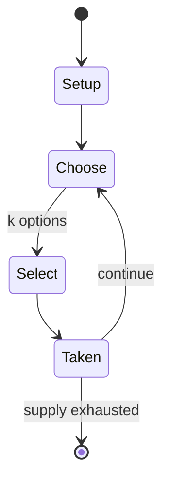

# TV no Tomo Channel

*Japan-exclusive downloadable Wii channel*

`tv_no_tomo_channel` &nbsp; state: **DEEPENED** &nbsp; method: **heuristic**

## Found layer (recorded, not trusted)

| field | value |
| --- | --- |
| wikidata | Q11319532 |
| wikipedia | TV no Tomo Channel |
| genres (source) | -- |
| instance of (source) | Wii channel, software, video game |
| country of origin | Japan |

## Declared layer (orders bench work)

| field | value |
| --- | --- |
| year created | 2008 |
| epoch | CONTEMPORARY |
| region | EAST_ASIA |
| media | VIDEO |
| players | -- |
| age band | -- |
| exogenous process | -- |
| loss shape | -- |
| live axes | SELECT |
| horizon | -- |
| scoring shape | -- |
| information | -- |
| interaction | -- |
| turn structure | -- |
| tractability | SAMPLING_ONLY |
| randomness | -- |
| luck factor | 0.35 |
| rules complexity | 2.21 |
| strategic depth | 2.25 |
| novelty | 0.0896 |
| solved status | -- |
| strategies | signalling |
| algorithms | -- |

## Object model

```
Episode
  players      : ?
  turn_structure: ?
  horizon       : ?
  scoring       : ?

WorldState     -- simulation state advanced by the engine
Avatar         -- player-controlled agent
Clock          -- frame or tick counter
OptionSet      -- the choices available after an exogenous draw
```

## State transition diagram



## Research item -- turn trace

```
# TV no Tomo Channel -- simulated turn events
# generated from the DECLARED vector, not from a rulebook.
# structure: exo=None loss=None horizon=None scoring=None axes=SELECT

t=0    SETUP        players=2  pot=0  capacity=5
t=1    SELECT       p1 3 options; take #2  (pot_gain=+1.8, capacity=-1)
t=2    SELECT       p1 4 options; take #3  (pot_gain=+2.1, capacity=-1)
t=3    ENDTURN      turn passes to p2
t=4    SELECT       p2 4 options; take #1  (pot_gain=+2.7, capacity=-0)
t=5    SELECT       p2 4 options; take #2  (pot_gain=+1.6, capacity=-1)
t=6    SELECT       p2 2 options; take #1  (pot_gain=+2.7, capacity=-0)
t=7    SELECT       p2 4 options; take #4  (pot_gain=+3.3, capacity=-2)
t=8    ENDTURN      turn passes to p1
t=9    SELECT       p1 1 options; take #1  (pot_gain=+1.0, capacity=-0)
t=10   SELECT       p1 2 options; take #1  (pot_gain=+3.4, capacity=-2)
t=11   SELECT       p1 2 options; take #2  (pot_gain=+3.0, capacity=-0)
t=12   SELECT       p1 3 options; take #2  (pot_gain=+1.9, capacity=-2)
t=13   ENDTURN      turn passes to p2
t=14   SELECT       p2 1 options; take #1  (pot_gain=+2.2, capacity=-1)
t=15   SELECT       p2 3 options; take #2  (pot_gain=+3.2, capacity=-0)
t=16   SELECT       p2 4 options; take #4  (pot_gain=+1.8, capacity=-0)
t=17   SELECT       p2 1 options; take #1  (pot_gain=+1.9, capacity=-1)
t=18   SELECT       p2 2 options; take #1  (pot_gain=+3.3, capacity=-1)
t=19   SELECT       p2 4 options; take #3  (pot_gain=+2.7, capacity=-2)
t=20   SELECT       p2 3 options; take #2  (pot_gain=+1.1, capacity=-1)
t=21   SELECT       p2 4 options; take #3  (pot_gain=+2.0, capacity=-0)
t=22   SELECT       p2 4 options; take #3  (pot_gain=+1.0, capacity=-2)
t=23   SELECT       p2 1 options; take #1  (pot_gain=+3.4, capacity=-0)
t=24   SELECT       p2 4 options; take #3  (pot_gain=+1.8, capacity=-0)
t=25   SELECT       p2 4 options; take #1  (pot_gain=+0.6, capacity=-1)
t=26   SELECT       p2 1 options; take #1  (pot_gain=+2.3, capacity=-1)
t=27   ENDTURN      turn passes to p1

terminal: VARIABLE
```

## Source extract

TV no Tomo Channel: G-Guide for Wii (テレビの友チャンネル Gガイド for Wii, Terebi no Tomo Chan'neru G Gaido
for Wii) was a Wii channel that featured an electronic program guide service developed by
Nintendo and HAL Laboratory and operated by G-Guide.  The channel was launched on March 4, 2008,
exclusively in Japan, and it was available as a free download on the Wii Shop Channel. The
service was discontinued on July 24, 2011, due to the end of analog broadcasting in Japan.  It
is the only Wii software to ever officially use the console's TV remote control function.    ==
Overview == The channel displayed an electronic programme guide, featuring ongoing and upcoming
programme information for all television channels for the selected prefecture and region. Users
could select from four categories of channels: terrestrial analogue, terrestrial digital,
satellite analogue and satellite digital. Guide data was retrieved from the G-Guide service,
allowing users to check up to a week ahead of television programming. The service also offered
detailed information for each programme, such as a description, a list of the cast, aspect ratio
and support for subtitles.   == Features ==   === Search === Users co

<sub>Wikipedia, CC BY-SA. Retained as evidence for the structural
classification above. Every rule inferred from it is HYPOTHESIZED
until audited against a rulebook.</sub>
