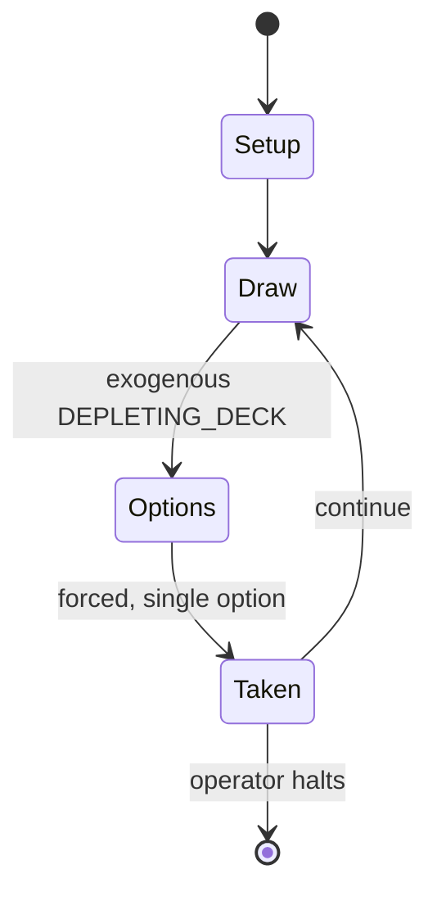

# Twilight Struggle

*2005 board game*

`twilight_struggle` &nbsp; state: **DEEPENED** &nbsp; method: **heuristic**

## Found layer (recorded, not trusted)

| field | value |
| --- | --- |
| wikidata | Q2697993 |
| wikipedia | Twilight Struggle |
| genres (source) | board wargame |
| instance of (source) | board game, strategy game, two-player game |
| country of origin | United States |

## Declared layer (orders bench work)

| field | value |
| --- | --- |
| year created | 2005 |
| epoch | CONTEMPORARY |
| region | NORTH_AMERICA |
| media | BOARD, WARGAME |
| players | 2 |
| age band | -- |
| exogenous process | DEPLETING_DECK |
| loss shape | -- |
| live axes | - |
| horizon | OPEN_ENDED |
| scoring shape | RACE_POSITION |
| information | -- |
| interaction | COMPETITIVE |
| turn structure | PHASE_STRUCTURED |
| tractability | EXACT_WITH_CUT |
| randomness | DECK_SHUFFLE |
| luck factor | 0.48 |
| rules complexity | 3.91 |
| strategic depth | 2.25 |
| novelty | 0.7903 |
| solved status | -- |
| strategies | area_control |
| algorithms | -- |

## Object model

```
Episode
  players      : 2
  turn_structure: PHASE_STRUCTURED
  horizon       : OPEN_ENDED
  scoring       : RACE_POSITION

Board          -- spatial substrate; cells carry position and occupancy
Piece          -- movable token owned by a player
```

## State transition diagram



## Research item -- turn trace

```
# Twilight Struggle -- simulated turn events
# generated from the DECLARED vector, not from a rulebook.
# structure: exo=DEPLETING_DECK loss=None horizon=OPEN_ENDED scoring=RACE_POSITION axes=-

t=0    SETUP        players=2  pot=0  capacity=4
t=1    DRAW         p1 draw from deck -> outcome #6  (p=0.207)
t=2    FORCED       p1 single legal option taken (pot_gain=+1.0)
t=3    ENDTURN      turn passes to p2
t=4    DRAW         p2 draw from deck -> outcome #1  (p=0.035)
t=5    FORCED       p2 single legal option taken (pot_gain=+1.9)
t=6    ENDTURN      turn passes to p1
t=7    DRAW         p1 draw from deck -> outcome #1  (p=0.080)
t=8    FORCED       p1 single legal option taken (pot_gain=+1.3)
t=9    DRAW         p1 draw from deck -> outcome #6  (p=0.109)
t=10   FORCED       p1 single legal option taken (pot_gain=+1.4)
t=11   DRAW         p1 draw from deck -> outcome #3  (p=0.229)
t=12   FORCED       p1 single legal option taken (pot_gain=+0.8)
t=13   DRAW         p1 draw from deck -> outcome #3  (p=0.124)
t=14   FORCED       p1 single legal option taken (pot_gain=+0.7)
t=15   DRAW         p1 draw from deck -> outcome #3  (p=0.099)
t=16   FORCED       p1 single legal option taken (pot_gain=+0.6)
t=17   DRAW         p1 draw from deck -> outcome #4  (p=0.208)
t=18   FORCED       p1 single legal option taken (pot_gain=+1.2)
t=19   DRAW         p1 draw from deck -> outcome #5  (p=0.207)
t=20   FORCED       p1 single legal option taken (pot_gain=+0.6)
t=21   ENDTURN      turn passes to p2
t=22   DRAW         p2 draw from deck -> outcome #5  (p=0.212)
t=23   FORCED       p2 single legal option taken (pot_gain=+1.5)
t=24   DRAW         p2 draw from deck -> outcome #2  (p=0.259)
t=25   FORCED       p2 single legal option taken (pot_gain=+0.8)
t=26   DRAW         p2 draw from deck -> outcome #3  (p=0.052)
t=27   FORCED       p2 single legal option taken (pot_gain=+1.0)

terminal: OPEN_ENDED
```

## Conditions

| kind | threshold | effect | trigger |
| --- | --- | --- | --- |
| BOUNDARY | 1 player | -- | Other alternatives, allowed by GMT games only if at least one player owns the board game are: |
| WIN | -- | -- | Victory points are gained or lost on a shared one-dimensional track, and a player who reaches 20 VP in his or her favor wins immediately. |
| WIN | -- | -- | The original rules allow for a tie, although in the Playdek application in case of a tie in Final Scoring the victory is given to the American player and in case of a tie through Wargames the victory is given to the play |

## Source extract

Twilight Struggle: The Cold War, 1945–1989 is a board game for two players, published by GMT
Games in 2005. Players are the United States and Soviet Union contesting each other's influence
on the world map by using cards that correspond to historical events. The first game designed by
Ananda Gupta and Jason Matthews, they intended it to be a quick-playing alternative to more
complex card-driven wargames. It achieved critical acclaim for its well-integrated theme,
accessibility and introduction of Eurogame elements. After being voted the number one game on
BoardGameGeek from December 2010 to January 2016 (eventually dethroned by Pandemic Legacy), it
has been called "the best board game on the planet". Twilight Struggle is played competitively
and was unofficially adapted for play-by-email and live online play. GMT released a Deluxe
Edition in 2009, as well as a Collector's Edition as part of the crowdfunding campaign for the
game's official adaptation into a video game; this Digital Edition was released in 2016. With
over 100,000 copies sold, the game is GMT's all-time best-seller.   == Gameplay overview ==
According to its designers, "Twilight Struggle basically accepts all of the

<sub>Wikipedia, CC BY-SA. Retained as evidence for the structural
classification above. Every rule inferred from it is HYPOTHESIZED
until audited against a rulebook.</sub>
