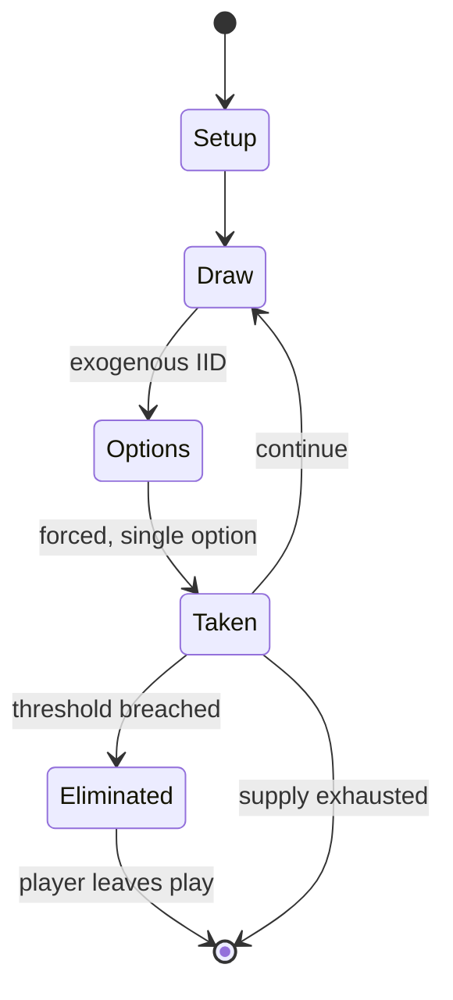

# Twister

*game of physical skill*

`twister` &nbsp; state: **DEEPENED** &nbsp; method: **heuristic**

## Found layer (recorded, not trusted)

| field | value |
| --- | --- |
| wikidata | Q611991 |
| wikipedia | Twister (game) |
| genres (source) | -- |
| instance of (source) | board game, party game |
| country of origin | -- |

## Declared layer (orders bench work)

| field | value |
| --- | --- |
| year created | 1966 |
| epoch | MODERN |
| region | -- |
| media | BOARD, DEXTERITY, PARTY, VIDEO |
| players | 2-99 |
| age band | -- |
| exogenous process | IID |
| loss shape | ELIMINATION |
| live axes | COMMIT_BLIND |
| horizon | -- |
| scoring shape | -- |
| information | -- |
| interaction | SOLITAIRE |
| turn structure | -- |
| tractability | SAMPLING_ONLY |
| randomness | SPINNER |
| luck factor | 0.42 |
| rules complexity | 2.58 |
| strategic depth | 2.25 |
| novelty | 0.9538 |
| solved status | -- |
| strategies | opponent_modelling |
| algorithms | -- |

## Object model

```
Episode
  players      : 2-99
  turn_structure: ?
  horizon       : ?
  scoring       : ?

Board          -- spatial substrate; cells carry position and occupancy
Piece          -- movable token owned by a player
WorldState     -- simulation state advanced by the engine
Avatar         -- player-controlled agent
Clock          -- frame or tick counter
SealedChoice   -- irrevocable choice made without observation
```

## State transition diagram



## Research item -- turn trace

```
# Twister -- simulated turn events
# generated from the DECLARED vector, not from a rulebook.
# structure: exo=IID loss=ELIMINATION horizon=None scoring=None axes=COMMIT_BLIND

t=0    SETUP        players=2  pot=0  capacity=5
t=1    DRAW         p1 roll from d6 pool -> outcome #1  (p=0.293)
t=2    FORCED       p1 single legal option taken (pot_gain=+0.7)
t=3    DRAW         p1 roll from d6 pool -> outcome #4  (p=0.171)
t=4    FORCED       p1 single legal option taken (pot_gain=+0.7)
t=5    DRAW         p1 roll from d6 pool -> outcome #1  (p=0.197)
t=6    FORCED       p1 single legal option taken (pot_gain=+1.1)
t=7    DRAW         p1 roll from d6 pool -> outcome #2  (p=0.137)
t=8    FORCED       p1 single legal option taken (pot_gain=+1.4)
t=9    DRAW         p1 roll from d6 pool -> outcome #3  (p=0.218)
t=10   FORCED       p1 single legal option taken (pot_gain=+0.8)
t=11   DRAW         p1 roll from d6 pool -> outcome #1  (p=0.222)
t=12   FORCED       p1 single legal option taken (pot_gain=+0.8)
t=13   DRAW         p1 roll from d6 pool -> outcome #2  (p=0.209)
t=14   FORCED       p1 single legal option taken (pot_gain=+2.0)
t=15   DRAW         p1 roll from d6 pool -> outcome #1  (p=0.266)
t=16   FORCED       p1 single legal option taken (pot_gain=+1.1)
t=17   DRAW         p1 roll from d6 pool -> outcome #4  (p=0.115)
t=18   FORCED       p1 single legal option taken (pot_gain=+1.2)
t=19   DRAW         p1 roll from d6 pool -> outcome #6  (p=0.010)
t=20   FORCED       p1 single legal option taken (pot_gain=+1.3)
t=21   DRAW         p1 roll from d6 pool -> outcome #1  (p=0.256)
t=22   FORCED       p1 single legal option taken (pot_gain=+0.9)
t=23   DRAW         p1 roll from d6 pool -> outcome #6  (p=0.113)
t=24   FORCED       p1 single legal option taken (pot_gain=+0.5)
t=25   DRAW         p1 roll from d6 pool -> outcome #6  (p=0.075)
t=26   FORCED       p1 single legal option taken (pot_gain=+0.9)

terminal: VARIABLE
```

## Conditions

| kind | threshold | effect | trigger |
| --- | --- | --- | --- |
| ELIMINATE | 1 player | -- | Any player whose, elbow, knee or butt touched the mat during game play was eliminated from the game, until one player remained victorious. |
| ELIMINATE | -- | eliminated | A person is eliminated when they fall or when their elbow or knee touches the mat. |

## Source extract

Twister is a game of physical skill produced by Milton Bradley Company and Winning Moves Games
USA. It is played on a large plastic mat that is spread on the floor or ground. The mat has four
rows of six large colored circles on it with a different color in each row: red, yellow, green
and blue. A spinner tells players where they have to place their hand or foot. The game promotes
itself as "the game that ties you up in knots".   == History ==  In 1964, Reyn Guyer Sr. owned
and managed a design company called Reynolds Guyer Inc. Agency of Design, which made in-store
displays for Fortune 500 companies. His son Reyn Guyer worked there too, and while devising a
shoe polish box top promotion for a client, Johnson Wax, created a mat game called King's
Footsie, in which players took off their shoes to play. The game was designed to be played on a
large floor mat, on which Reyn had drawn colored squares to look like a giant, multiplayer chess
game. Players were assigned colors and all played at the same time, trying to cross the board by
stepping only on their matching colored squares. The close proximity of the players, all leaning
on one another, created tension and laughter. Reyn and h

<sub>Wikipedia, CC BY-SA. Retained as evidence for the structural
classification above. Every rule inferred from it is HYPOTHESIZED
until audited against a rulebook.</sub>
