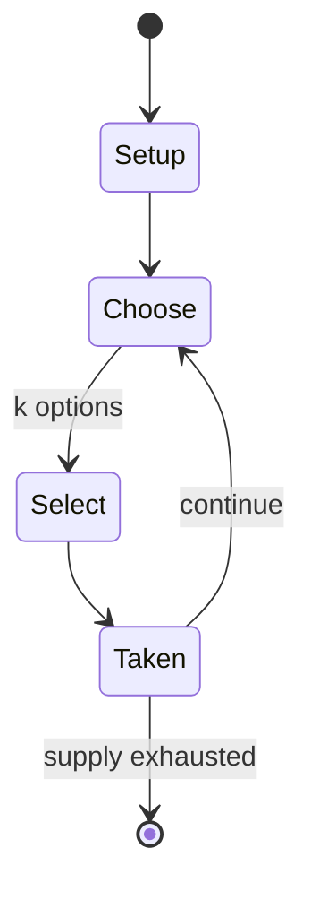

# TwixT

*One of the two-player strategy board games in the 3M bookshelf game series*

`twixt` &nbsp; state: **DEEPENED** &nbsp; method: **heuristic**

## Found layer (recorded, not trusted)

| field | value |
| --- | --- |
| wikidata | Q1362781 |
| wikipedia | TwixT |
| genres (source) | -- |
| instance of (source) | abstract strategy game, connection game |
| country of origin | -- |

## Declared layer (orders bench work)

| field | value |
| --- | --- |
| year created | -- |
| epoch | -- |
| region | -- |
| media | BOARD |
| players | 2-+ |
| age band | -- |
| exogenous process | NONE |
| loss shape | OPPORTUNITY_ONLY |
| live axes | ORDER, SELECT, SPATIAL |
| horizon | -- |
| scoring shape | SET_COLLECTION_CONVEX |
| information | PERFECT |
| interaction | COMPETITIVE |
| turn structure | STRICT_TURN |
| tractability | SAMPLING_ONLY |
| randomness | NONE |
| luck factor | 0.02 |
| rules complexity | 2.77 |
| strategic depth | 2.65 |
| novelty | 0.6754 |
| solved status | -- |
| strategies | set_collection |
| algorithms | -- |

## Object model

```
Episode
  players      : 2-+
  turn_structure: STRICT_TURN
  horizon       : ?
  scoring       : SET_COLLECTION_CONVEX

Board          -- spatial substrate; cells carry position and occupancy
Piece          -- movable token owned by a player
Sequence       -- the permutation under the player's control
OptionSet      -- the choices available after an exogenous draw
Placement      -- position subject to geometric legality
```

## State transition diagram



## Research item -- turn trace

```
# TwixT -- simulated turn events
# generated from the DECLARED vector, not from a rulebook.
# structure: exo=NONE loss=OPPORTUNITY_ONLY horizon=None scoring=SET_COLLECTION_CONVEX axes=ORDER,SELECT,SPATIAL

t=0    SETUP        players=2  pot=0  capacity=5
t=1    SELECT       p1 2 options; take #2  (pot_gain=+1.0, capacity=-2)
t=2    SPATIAL      p1 places at (2,1); adjacency legal
t=3    SELECT       p1 1 options; take #1  (pot_gain=+1.0, capacity=-0)
t=4    SPATIAL      p1 places at (7,6); adjacency legal
t=5    SELECT       p1 3 options; take #2  (pot_gain=+1.2, capacity=-2)
t=6    SPATIAL      p1 places at (0,5); adjacency legal
t=7    SELECT       p1 3 options; take #3  (pot_gain=+2.5, capacity=-1)
t=8    SELECT       p1 3 options; take #3  (pot_gain=+1.6, capacity=-0)
t=9    SELECT       p1 4 options; take #2  (pot_gain=+3.1, capacity=-2)
t=10   SPATIAL      p1 places at (1,2); adjacency legal
t=11   SELECT       p1 3 options; take #2  (pot_gain=+2.1, capacity=-0)
t=12   SELECT       p1 3 options; take #2  (pot_gain=+1.2, capacity=-0)
t=13   SELECT       p1 2 options; take #2  (pot_gain=+2.5, capacity=-0)
t=14   SELECT       p1 4 options; take #3  (pot_gain=+0.6, capacity=-0)
t=15   SELECT       p1 3 options; take #2  (pot_gain=+1.7, capacity=-1)
t=16   SPATIAL      p1 places at (4,1); adjacency legal
t=17   SELECT       p1 2 options; take #1  (pot_gain=+1.8, capacity=-0)
t=18   SPATIAL      p1 places at (2,6); adjacency legal
t=19   SELECT       p1 4 options; take #2  (pot_gain=+2.7, capacity=-0)
t=20   SELECT       p1 1 options; take #1  (pot_gain=+1.8, capacity=-1)
t=21   SPATIAL      p1 places at (7,0); adjacency legal
t=22   SELECT       p1 4 options; take #2  (pot_gain=+2.9, capacity=-0)
t=23   SPATIAL      p1 places at (0,7); adjacency legal
t=24   ENDTURN      turn passes to p2
t=25   SELECT       p2 4 options; take #3  (pot_gain=+3.0, capacity=-2)
t=26   SELECT       p2 4 options; take #3  (pot_gain=+1.6, capacity=-0)

terminal: VARIABLE
```

## Conditions

| kind | threshold | effect | trigger |
| --- | --- | --- | --- |
| ELIMINATE | -- | -- | The simplest handicap is to allow the weaker player to move first (i.e. eliminate the pie rule). |

## Source extract

TwixT is a two-player strategy board game, an early entrant in the 1960s 3M bookshelf game
series.  It became one of the most popular and enduring games in the series.  It is a connection
game where players alternate turns placing pegs and links on a pegboard in an attempt to link
their opposite sides.  While TwixT itself is simple, the game also requires strategy, so young
children can play it, but it also appeals to adults. The game has been discontinued except in
Germany and Japan.   == History ==  TwixT was invented as a paper and pencil game in 1957 by
Alex Randolph, a game designer.  When Alex was commissioned along with Sid Sackson by 3M in 1961
to start a games division, the game was issued as a boardgame, one of the first 3M bookshelf
games.  Avalon Hill took over publication in 1976 when 3M sold its game division. Avalon's
parent company was acquired by Hasbro in 1998, and the game was discontinued. The game is no
longer produced in the United States, but a succession of German companies has produced the game
since the 1970s under license from Avalon. TwixT was short-listed for the first Spiel des Jahres
in 1979, and was inducted into the Academy of Adventure Gaming Arts

<sub>Wikipedia, CC BY-SA. Retained as evidence for the structural
classification above. Every rule inferred from it is HYPOTHESIZED
until audited against a rulebook.</sub>
