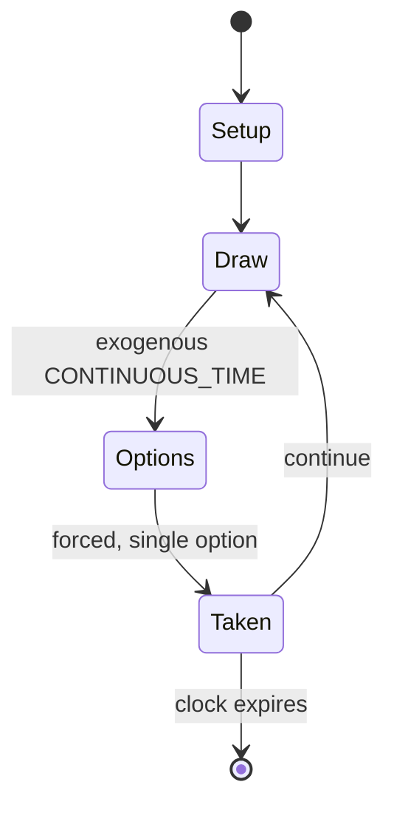

# Unlock!

*board game franchise*

`unlock` &nbsp; state: **DEEPENED** &nbsp; method: **heuristic**

## Found layer (recorded, not trusted)

| field | value |
| --- | --- |
| wikidata | Q30753708 |
| wikipedia | Unlock! |
| genres (source) | -- |
| instance of (source) | board game franchise |
| country of origin | -- |

## Declared layer (orders bench work)

| field | value |
| --- | --- |
| year created | 2017 |
| epoch | CONTEMPORARY |
| region | -- |
| media | BOARD, PUZZLE |
| players | -- |
| age band | -- |
| exogenous process | CONTINUOUS_TIME |
| loss shape | -- |
| live axes | - |
| horizon | CLOCK_LIMITED |
| scoring shape | -- |
| information | -- |
| interaction | COOPERATIVE |
| turn structure | -- |
| tractability | SAMPLING_ONLY |
| randomness | HIDDEN_INFO, REAL_TIME_PHYSICAL |
| luck factor | 0.35 |
| rules complexity | 1.78 |
| strategic depth | 2.0 |
| novelty | 0.7165 |
| solved status | -- |
| strategies | -- |
| algorithms | -- |

## Object model

```
Episode
  players      : ?
  turn_structure: ?
  horizon       : CLOCK_LIMITED
  scoring       : ?

Board          -- spatial substrate; cells carry position and occupancy
Piece          -- movable token owned by a player
Configuration  -- the arrangement to be resolved
Constraint     -- predicate a legal configuration must satisfy
```

## State transition diagram



## Research item -- turn trace

```
# Unlock! -- simulated turn events
# generated from the DECLARED vector, not from a rulebook.
# structure: exo=CONTINUOUS_TIME loss=None horizon=CLOCK_LIMITED scoring=None axes=-

t=0    SETUP        players=2  pot=0  capacity=5
t=1    DRAW         p1 tick from clock -> outcome #3  (p=0.294)
t=2    FORCED       p1 single legal option taken (pot_gain=+1.8)
t=3    DRAW         p1 tick from clock -> outcome #6  (p=0.021)
t=4    FORCED       p1 single legal option taken (pot_gain=+1.4)
t=5    DRAW         p1 tick from clock -> outcome #3  (p=0.123)
t=6    FORCED       p1 single legal option taken (pot_gain=+0.8)
t=7    DRAW         p1 tick from clock -> outcome #2  (p=0.234)
t=8    FORCED       p1 single legal option taken (pot_gain=+1.7)
t=9    DRAW         p1 tick from clock -> outcome #5  (p=0.100)
t=10   FORCED       p1 single legal option taken (pot_gain=+1.2)
t=11   DRAW         p1 tick from clock -> outcome #4  (p=0.158)
t=12   FORCED       p1 single legal option taken (pot_gain=+1.9)
t=13   DRAW         p1 tick from clock -> outcome #4  (p=0.115)
t=14   FORCED       p1 single legal option taken (pot_gain=+1.0)
t=15   DRAW         p1 tick from clock -> outcome #1  (p=0.267)
t=16   FORCED       p1 single legal option taken (pot_gain=+1.2)
t=17   DRAW         p1 tick from clock -> outcome #2  (p=0.210)
t=18   FORCED       p1 single legal option taken (pot_gain=+1.0)
t=19   DRAW         p1 tick from clock -> outcome #5  (p=0.149)
t=20   FORCED       p1 single legal option taken (pot_gain=+0.6)
t=21   DRAW         p1 tick from clock -> outcome #1  (p=0.294)
t=22   FORCED       p1 single legal option taken (pot_gain=+1.3)
t=23   DRAW         p1 tick from clock -> outcome #1  (p=0.268)
t=24   FORCED       p1 single legal option taken (pot_gain=+1.5)
t=25   DRAW         p1 tick from clock -> outcome #5  (p=0.275)
t=26   FORCED       p1 single legal option taken (pot_gain=+1.9)
t=27   ENDTURN      turn passes to p2

terminal: CLOCK_LIMITED
```

## Source extract

Unlock! is a series of cooperative board games inspired by escape rooms created by Cyril
Demaegd. published by Space Cowboys and distributed by Asmodee. The first title was released in
France in February 2017, and won the As d'Or – Game of the Year at the International Games
Festival in Cannes on 23 February 2017. The formula has since been adapted into numerous box
sets, each offering three different scenarios of increasing difficulty, designed to last from 60
to 90 minutes each.   == Gameplay == The players' objective is to solve a scenario proposed by
the game within a time limit (usually 60 minutes), typically requiring the resolution of riddles
and the exploration of an imaginary world. The scenario is represented by numbered cards
depicting locations, objects, or characters, which players must retrieve in a specific order;
riddles or combinations of multiple cards allow players to obtain the number of the next card.
Box sets may also contain specific accessories for each scenario. The game utilizes a mandatory
smartphone application, with which players must regularly interact to enter codes, operate
mechanisms, listen to audio clues, etc. It also serves as a timer and can be

<sub>Wikipedia, CC BY-SA. Retained as evidence for the structural
classification above. Every rule inferred from it is HYPOTHESIZED
until audited against a rulebook.</sub>
