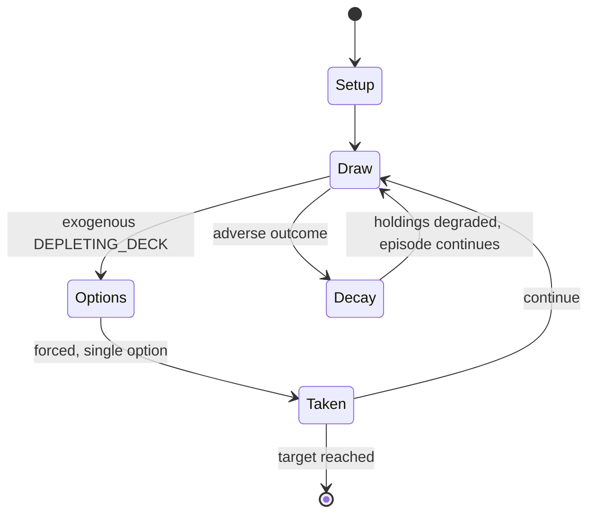

# Uno Flip!

*card game produced by Mattel*

`uno_flip` &nbsp; state: **DEEPENED** &nbsp; method: **heuristic**

## Found layer (recorded, not trusted)

| field | value |
| --- | --- |
| wikidata | Q104862696 |
| wikipedia | Uno Flip! |
| genres (source) | -- |
| instance of (source) | card game |
| country of origin | -- |

## Declared layer (orders bench work)

| field | value |
| --- | --- |
| year created | -- |
| epoch | -- |
| region | -- |
| media | CARD |
| players | 2-10 |
| age band | -- |
| exogenous process | DEPLETING_DECK |
| loss shape | PARTIAL_DECAY |
| live axes | DISCARD, ORDER |
| horizon | RACE_TO_TARGET |
| scoring shape | SET_COLLECTION_CONVEX |
| information | -- |
| interaction | COMPETITIVE |
| turn structure | -- |
| tractability | EXACT_WITH_CUT |
| randomness | -- |
| luck factor | -- |
| rules complexity | 2.42 |
| strategic depth | 2.25 |
| novelty | 0.7736 |
| solved status | -- |
| strategies | set_collection |
| algorithms | -- |

## Object model

```
Episode
  players      : 2-10
  turn_structure: ?
  horizon       : RACE_TO_TARGET
  scoring       : SET_COLLECTION_CONVEX

Deck           -- ordered multiset, drawn without replacement
Hand           -- private multiset held by one player
DiscardPile    -- public accumulation of spent cards
DiscardChoice  -- what is given up to satisfy a limit
Sequence       -- the permutation under the player's control
```

## State transition diagram



## Research item -- turn trace

```
# Uno Flip! -- simulated turn events
# generated from the DECLARED vector, not from a rulebook.
# structure: exo=DEPLETING_DECK loss=PARTIAL_DECAY horizon=RACE_TO_TARGET scoring=SET_COLLECTION_CONVEX axes=DISCARD,ORDER

t=0    SETUP        players=2  pot=0  capacity=3
t=1    DRAW         p1 draw from deck -> outcome #2  (p=0.258)
t=2    FORCED       p1 single legal option taken (pot_gain=+1.6)
t=3    DISCARD      p1 discards to hand limit
t=4    ENDTURN      turn passes to p2
t=5    DRAW         p2 draw from deck -> outcome #1  (p=0.251)
t=6    FORCED       p2 single legal option taken (pot_gain=+1.9)
t=7    DISCARD      p2 discards to hand limit
t=8    ENDTURN      turn passes to p1
t=9    DRAW         p1 draw from deck -> outcome #5  (p=0.120)
t=10   FORCED       p1 single legal option taken (pot_gain=+1.7)
t=11   DISCARD      p1 discards to hand limit
t=12   ENDTURN      turn passes to p2
t=13   DRAW         p2 draw from deck -> outcome #6  (p=0.239)
t=14   FORCED       p2 single legal option taken (pot_gain=+1.2)
t=15   DRAW         p2 draw from deck -> outcome #2  (p=0.113)
t=16   FORCED       p2 single legal option taken (pot_gain=+1.9)
t=17   DRAW         p2 draw from deck -> outcome #2  (p=0.299)
t=18   FORCED       p2 single legal option taken (pot_gain=+1.7)
t=19   DRAW         p2 draw from deck -> outcome #3  (p=0.296)
t=20   FORCED       p2 single legal option taken (pot_gain=+1.9)
t=21   DRAW         p2 draw from deck -> outcome #1  (p=0.090)
t=22   FORCED       p2 single legal option taken (pot_gain=+1.5)
t=23   ENDTURN      turn passes to p1
t=24   DRAW         p1 draw from deck -> outcome #1  (p=0.211)
t=25   FORCED       p1 single legal option taken (pot_gain=+1.7)
t=26   DISCARD      p1 discards to hand limit

terminal: RACE_TO_TARGET
```

## Conditions

| kind | threshold | effect | trigger |
| --- | --- | --- | --- |
| WIN | 500 points | -- | The first player to score 500 points wins the game. |
| PENALTY | 2 cards | -- | A player who fails to call "Uno" after playing their next-to-last card and is caught by another player before the next player in sequence ends their turn must draw two cards as a penalty. |
| PENALTY | -- | -- | If the challenge is valid, the challenged player must draw the cards, otherwise the challenger must draw them, plus two more as a penalty. |

## Source extract

Uno Flip! (; from Italian and Spanish for 'one') is an American shedding-type card game produced
by Mattel in 2019. The cards from the deck are specially printed for the game. This game is a
variation of Uno. Uno Flip! should not be confused with a dexterity-based game called Uno Flip.
== Gameplay == As in the original Uno, the goal of Uno Flip! is to be the first to play all the
cards in one's hand, scoring points for the cards still held by others. All cards are two-sided,
consisting of the Light side (also known as the “Mild” side) with white fonts and borders and
the Dark side (also known as the “Wild” side) with black fonts and borders. Only one side is in
play at any given time, starting with the Light side at the start of each new hand. Each side
has its own set of four colors, action and Wild cards, and number cards from 1 through 9. Both
sides contain two "Flip" cards in each of their respective colors. Whenever a Flip is played,
both the stockpile and the discard pile are immediately turned over and all players must turn
their hands around to play the other side of their cards.   === The Light Side === The colors
for this side are red, blue, yellow, and green. The actio

<sub>Wikipedia, CC BY-SA. Retained as evidence for the structural
classification above. Every rule inferred from it is HYPOTHESIZED
until audited against a rulebook.</sub>
