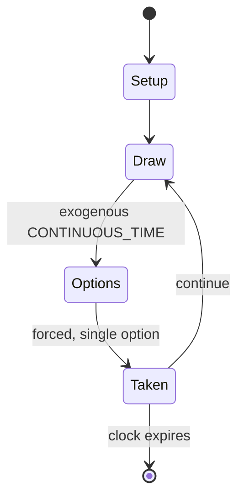

# Up Jenkins

*party game*

`up_jenkins` &nbsp; state: **DEEPENED** &nbsp; method: **heuristic**

## Found layer (recorded, not trusted)

| field | value |
| --- | --- |
| wikidata | Q7897975 |
| wikipedia | Up Jenkins |
| genres (source) | -- |
| instance of (source) | game, party game |
| country of origin | -- |

## Declared layer (orders bench work)

| field | value |
| --- | --- |
| year created | -- |
| epoch | -- |
| region | -- |
| media | PARTY |
| players | -- |
| age band | -- |
| exogenous process | CONTINUOUS_TIME |
| loss shape | -- |
| live axes | - |
| horizon | CLOCK_LIMITED |
| scoring shape | RACE_POSITION |
| information | -- |
| interaction | SOLITAIRE |
| turn structure | PHASE_STRUCTURED |
| tractability | SAMPLING_ONLY |
| randomness | HIDDEN_INFO |
| luck factor | 0.35 |
| rules complexity | 2.5 |
| strategic depth | 2.0 |
| novelty | 0.5659 |
| solved status | -- |
| strategies | -- |
| algorithms | -- |

## Object model

```
Episode
  players      : ?
  turn_structure: PHASE_STRUCTURED
  horizon       : CLOCK_LIMITED
  scoring       : RACE_POSITION

State          -- opaque; no medium or axis evidence was found
Player         -- an agent that selects among legal successors
```

## State transition diagram



## Research item -- turn trace

```
# Up Jenkins -- simulated turn events
# generated from the DECLARED vector, not from a rulebook.
# structure: exo=CONTINUOUS_TIME loss=None horizon=CLOCK_LIMITED scoring=RACE_POSITION axes=-

t=0    SETUP        players=2  pot=0  capacity=5
t=1    DRAW         p1 tick from clock -> outcome #1  (p=0.216)
t=2    FORCED       p1 single legal option taken (pot_gain=+0.5)
t=3    DRAW         p1 tick from clock -> outcome #5  (p=0.094)
t=4    FORCED       p1 single legal option taken (pot_gain=+0.7)
t=5    DRAW         p1 tick from clock -> outcome #4  (p=0.207)
t=6    FORCED       p1 single legal option taken (pot_gain=+0.7)
t=7    DRAW         p1 tick from clock -> outcome #4  (p=0.063)
t=8    FORCED       p1 single legal option taken (pot_gain=+2.0)
t=9    DRAW         p1 tick from clock -> outcome #6  (p=0.197)
t=10   FORCED       p1 single legal option taken (pot_gain=+0.7)
t=11   ENDTURN      turn passes to p2
t=12   DRAW         p2 tick from clock -> outcome #3  (p=0.022)
t=13   FORCED       p2 single legal option taken (pot_gain=+1.2)
t=14   DRAW         p2 tick from clock -> outcome #2  (p=0.213)
t=15   FORCED       p2 single legal option taken (pot_gain=+1.0)
t=16   DRAW         p2 tick from clock -> outcome #4  (p=0.033)
t=17   FORCED       p2 single legal option taken (pot_gain=+1.7)
t=18   ENDTURN      turn passes to p1
t=19   DRAW         p1 tick from clock -> outcome #6  (p=0.090)
t=20   FORCED       p1 single legal option taken (pot_gain=+1.8)
t=21   DRAW         p1 tick from clock -> outcome #6  (p=0.134)
t=22   FORCED       p1 single legal option taken (pot_gain=+0.7)
t=23   DRAW         p1 tick from clock -> outcome #3  (p=0.226)
t=24   FORCED       p1 single legal option taken (pot_gain=+0.9)
t=25   DRAW         p1 tick from clock -> outcome #4  (p=0.124)
t=26   FORCED       p1 single legal option taken (pot_gain=+1.2)

terminal: CLOCK_LIMITED
```

## Conditions

| kind | threshold | effect | trigger |
| --- | --- | --- | --- |
| PENALTY | -- | -- | The game is often played with alcoholic beverages with which to drink as a forfeit. |

## Source extract

Up Jenkins, also known by the shortened name Jenkins, is a party game in which players conceal a
coin (or ring, button, etc.) in their palm as they slap it on a table with their bare hands.
The goal of the game is for the players on the team without the coin to correctly identify which
hand the coin is under. The game typically consists of two- to four-player teams, one on each
side of a table.  There are no official rules, so rules may vary widely. The game is often
played with alcoholic beverages with which to drink as a forfeit.   == Gameplay == The captain
of one team takes a coin and passes it under the table to the second person of the team. The
players on that team pass the coin under the table back and forth from one player to another.
The object of the game is to do it so carefully that the opposing team cannot guess which player
has the coin. Once this selection is made, the opposing team's captain yells "Up Jenkins" at
which point all players on the team with the coin place their elbows on the table with their
hands, closed in a fist, pointing straight toward the ceiling.  The opposing team's captain then
yells "Down Jenkins" or "Bang Ems", at which point the "coin" tea

<sub>Wikipedia, CC BY-SA. Retained as evidence for the structural
classification above. Every rule inferred from it is HYPOTHESIZED
until audited against a rulebook.</sub>
