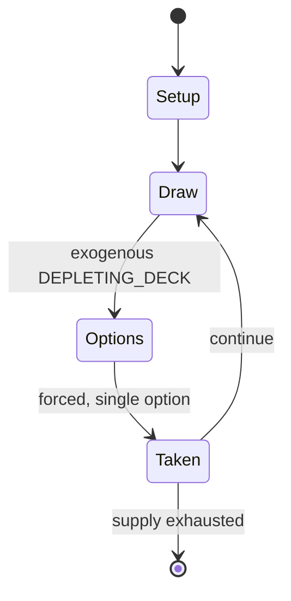

# Upwords

*board game*

`upwords` &nbsp; state: **DEEPENED** &nbsp; method: **heuristic**

## Found layer (recorded, not trusted)

| field | value |
| --- | --- |
| wikidata | Q7899503 |
| wikipedia | Upwords |
| genres (source) | -- |
| instance of (source) | board game |
| country of origin | -- |

## Declared layer (orders bench work)

| field | value |
| --- | --- |
| year created | 1982 |
| epoch | DIGITAL |
| region | -- |
| media | BOARD, TILE |
| players | -- |
| age band | -- |
| exogenous process | DEPLETING_DECK |
| loss shape | -- |
| live axes | DISCARD, ORDER, SPATIAL |
| horizon | VARIABLE |
| scoring shape | LINEAR_ACCUMULATION |
| information | -- |
| interaction | -- |
| turn structure | -- |
| tractability | SAMPLING_ONLY |
| randomness | DECK_SHUFFLE |
| luck factor | 0.48 |
| rules complexity | 2.83 |
| strategic depth | 2.0 |
| novelty | 0.6733 |
| solved status | -- |
| strategies | -- |
| algorithms | -- |

## Object model

```
Episode
  players      : ?
  turn_structure: ?
  horizon       : VARIABLE
  scoring       : LINEAR_ACCUMULATION

Board          -- spatial substrate; cells carry position and occupancy
Piece          -- movable token owned by a player
TileBag        -- unordered draw source
Layout         -- placed tiles and their adjacencies
DiscardChoice  -- what is given up to satisfy a limit
Sequence       -- the permutation under the player's control
Placement      -- position subject to geometric legality
```

## State transition diagram



## Research item -- turn trace

```
# Upwords -- simulated turn events
# generated from the DECLARED vector, not from a rulebook.
# structure: exo=DEPLETING_DECK loss=None horizon=VARIABLE scoring=LINEAR_ACCUMULATION axes=DISCARD,ORDER,SPATIAL

t=0    SETUP        players=2  pot=0  capacity=4
t=1    DRAW         p1 draw from deck -> outcome #1  (p=0.039)
t=2    FORCED       p1 single legal option taken (pot_gain=+0.8)
t=3    DISCARD      p1 discards to hand limit
t=4    SPATIAL      p1 places at (0,2); adjacency legal
t=5    DRAW         p1 draw from deck -> outcome #6  (p=0.289)
t=6    FORCED       p1 single legal option taken (pot_gain=+0.7)
t=7    DRAW         p1 draw from deck -> outcome #3  (p=0.100)
t=8    FORCED       p1 single legal option taken (pot_gain=+1.7)
t=9    DISCARD      p1 discards to hand limit
t=10   DRAW         p1 draw from deck -> outcome #3  (p=0.192)
t=11   FORCED       p1 single legal option taken (pot_gain=+1.9)
t=12   DRAW         p1 draw from deck -> outcome #3  (p=0.084)
t=13   FORCED       p1 single legal option taken (pot_gain=+1.2)
t=14   SPATIAL      p1 places at (2,1); adjacency legal
t=15   DRAW         p1 draw from deck -> outcome #6  (p=0.172)
t=16   FORCED       p1 single legal option taken (pot_gain=+0.6)
t=17   SPATIAL      p1 places at (6,1); adjacency legal
t=18   ENDTURN      turn passes to p2
t=19   DRAW         p2 draw from deck -> outcome #2  (p=0.022)
t=20   FORCED       p2 single legal option taken (pot_gain=+1.4)
t=21   ENDTURN      turn passes to p1
t=22   DRAW         p1 draw from deck -> outcome #5  (p=0.191)
t=23   FORCED       p1 single legal option taken (pot_gain=+0.9)
t=24   DISCARD      p1 discards to hand limit
t=25   SPATIAL      p1 places at (0,1); adjacency legal
t=26   DRAW         p1 draw from deck -> outcome #4  (p=0.184)
t=27   FORCED       p1 single legal option taken (pot_gain=+1.8)
t=28   DISCARD      p1 discards to hand limit

terminal: VARIABLE
```

## Conditions

| kind | threshold | effect | trigger |
| --- | --- | --- | --- |
| BOUNDARY | 1 tile | -- | At least one tile or stack must be left unchanged; a player may not cover every letter in a word on a single turn. |
| TERMINATE | -- | -- | Once the draw pile is exhausted, the game ends when any player runs out of tiles, or every player passes in a single round. |
| BOUNDARY | -- | -- | The first player forms a word with one or more of their tiles, and must place it so that the tiles cover at least one of the four central squares (e5, e6, f5, or f6). |

## Source extract

Upwords is a board game. It was originally manufactured and marketed by the Milton Bradley
Company, then a division of Hasbro. It has been marketed under its own name and also as Scrabble
Upwords in the United States and Canada, and Topwords, Crucimaster, Betutorony, Palabras Arriba
and Stapelwoord in other countries. It is currently available as a board game and a digital
gaming app. Upwords is a letter tile word game similar to Scrabble, with players building words
using letter tiles on a gridded game board. Unlike Scrabble, in Upwords letters can be stacked
on top of existing words to create new words. Scoring is determined by the number of letter
tiles, including tiles in a stack, in a new word.   == History == Upwords was originally played
on an 8×8 square board, with 64 letter tiles. Hasbro Europe later expanded the gameboard to a
10×10 matrix and 100 tiles, to accommodate the longer words frequently used in other languages
such as German and Dutch. The 10×10 matrix is currently employed in worldwide versions of the
game, with the "classic" 8×8 version also available.   == Gameplay == To determine play
sequence, each player draws a tile; the player with the letter nearest to

<sub>Wikipedia, CC BY-SA. Retained as evidence for the structural
classification above. Every rule inferred from it is HYPOTHESIZED
until audited against a rulebook.</sub>
