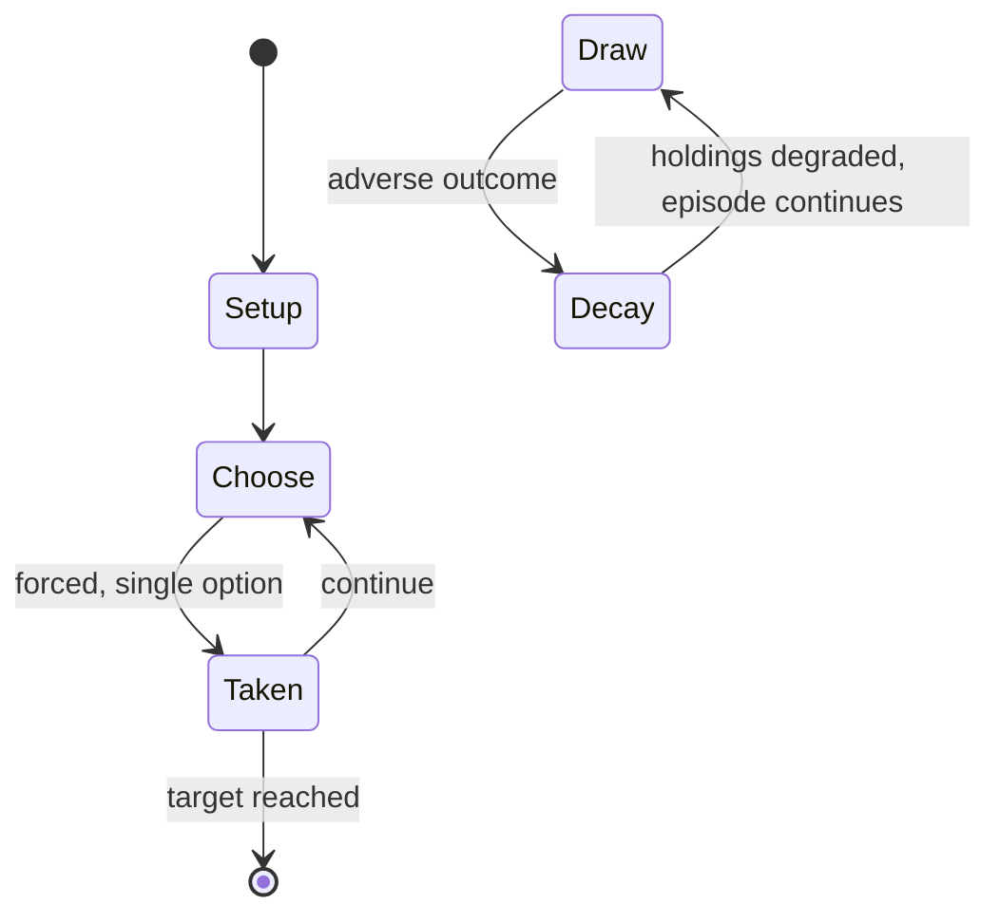

# uta-garuta

*a kind of karuta (Japanese traditional playing cards) with a waka poem written on each one*

`uta_garuta` &nbsp; state: **DEEPENED** &nbsp; method: **heuristic**

## Found layer (recorded, not trusted)

| field | value |
| --- | --- |
| wikidata | Q1430569 |
| wikipedia | Uta-garuta |
| genres (source) | -- |
| instance of (source) | card game, word game |
| country of origin | -- |

## Declared layer (orders bench work)

| field | value |
| --- | --- |
| year created | -- |
| epoch | -- |
| region | -- |
| media | CARD |
| players | -- |
| age band | -- |
| exogenous process | -- |
| loss shape | PARTIAL_DECAY |
| live axes | - |
| horizon | RACE_TO_TARGET |
| scoring shape | SET_COLLECTION_CONVEX |
| information | -- |
| interaction | COMPETITIVE |
| turn structure | -- |
| tractability | SAMPLING_ONLY |
| randomness | -- |
| luck factor | 0.35 |
| rules complexity | 1.75 |
| strategic depth | 2.5 |
| novelty | 0.4088 |
| solved status | -- |
| strategies | probability_estimation, set_collection |
| algorithms | -- |

## Object model

```
Episode
  players      : ?
  turn_structure: ?
  horizon       : RACE_TO_TARGET
  scoring       : SET_COLLECTION_CONVEX

Deck           -- ordered multiset, drawn without replacement
Hand           -- private multiset held by one player
DiscardPile    -- public accumulation of spent cards
```

## State transition diagram



## Research item -- turn trace

```
# uta-garuta -- simulated turn events
# generated from the DECLARED vector, not from a rulebook.
# structure: exo=None loss=PARTIAL_DECAY horizon=RACE_TO_TARGET scoring=SET_COLLECTION_CONVEX axes=-

t=0    SETUP        players=2  pot=0  capacity=6
t=1    FORCED       p1 single legal option taken (pot_gain=+0.6)
t=2    FORCED       p1 single legal option taken (pot_gain=+1.2)
t=3    FORCED       p1 single legal option taken (pot_gain=+0.7)
t=4    FORCED       p1 single legal option taken (pot_gain=+1.1)
t=5    FORCED       p1 single legal option taken (pot_gain=+1.0)
t=6    FORCED       p1 single legal option taken (pot_gain=+1.2)
t=7    FORCED       p1 single legal option taken (pot_gain=+1.8)
t=8    FORCED       p1 single legal option taken (pot_gain=+1.2)
t=9    FORCED       p1 single legal option taken (pot_gain=+1.1)
t=10   FORCED       p1 single legal option taken (pot_gain=+0.6)
t=11   FORCED       p1 single legal option taken (pot_gain=+1.3)
t=12   FORCED       p1 single legal option taken (pot_gain=+1.3)
t=13   FORCED       p1 single legal option taken (pot_gain=+1.5)
t=14   FORCED       p1 single legal option taken (pot_gain=+0.8)
t=15   FORCED       p1 single legal option taken (pot_gain=+1.3)
t=16   FORCED       p1 single legal option taken (pot_gain=+1.0)
t=17   FORCED       p1 single legal option taken (pot_gain=+1.7)
t=18   ENDTURN      turn passes to p2
t=19   FORCED       p2 single legal option taken (pot_gain=+1.2)
t=20   FORCED       p2 single legal option taken (pot_gain=+1.7)
t=21   FORCED       p2 single legal option taken (pot_gain=+1.3)
t=22   FORCED       p2 single legal option taken (pot_gain=+1.8)
t=23   ENDTURN      turn passes to p1
t=24   FORCED       p1 single legal option taken (pot_gain=+1.9)
t=25   FORCED       p1 single legal option taken (pot_gain=+1.1)
t=26   FORCED       p1 single legal option taken (pot_gain=+1.6)

terminal: RACE_TO_TARGET
```

## Conditions

| kind | threshold | effect | trigger |
| --- | --- | --- | --- |
| PENALTY | 1 card | -- | If a player takes a wrong card, the opponent can move one card to the player's side as a penalty. |
| WIN | -- | -- | When all the cards are taken, the player with the most cards wins the game. |
| WIN | -- | -- | The side that has no more torifuda on their side wins the game. |

## Source extract

Uta-garuta (歌ガルタ; lit. "Poetry Karuta") is a type of a deck of karuta, Japanese traditional
playing cards. A set of uta-garuta contains two sets of 100 cards, with a waka poem written on
each. Uta-garuta is also the name of the game in which the deck is used. The standard collection
of poems used is the Hyakunin Isshu, chosen by poet Fujiwara no Teika in the Kamakura period,
which is often also used as the name of the game. Since early 20th century the game is played
mostly on Japanese New Year holidays.   == How to play ==   === Basic rules === Source: The game
uses two types of cards.  Yomifuda (lit. "Reading Cards"): One hundred cards with a figure of a
person, their name, and a complete poem by them on each. Torifuda (lit. "Grabbing Cards"): One
hundred cards with only the finishing phrases of the poems on each. The game is played with the
players seated on the floor. At the start of a game, 100 torifuda are neatly arranged on the
floor face up between the players. When the reader starts reading out a poem on the yomifuda,
the players quickly search for the torifuda on which the corresponding final phrase is written.
There are two ways to play the game based on the rules above.

<sub>Wikipedia, CC BY-SA. Retained as evidence for the structural
classification above. Every rule inferred from it is HYPOTHESIZED
until audited against a rulebook.</sub>
