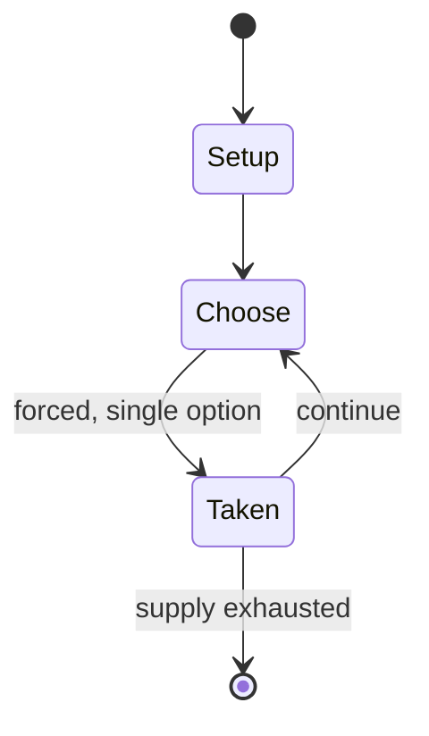

# Veronese Riddle

*late Latin riddle from Northern Italy*

`veronese_riddle` &nbsp; state: **DEEPENED** &nbsp; method: **heuristic**

## Found layer (recorded, not trusted)

| field | value |
| --- | --- |
| wikidata | Q2641504 |
| wikipedia | Veronese Riddle |
| genres (source) | -- |
| instance of (source) | riddle, writing-riddle |
| country of origin | -- |

## Declared layer (orders bench work)

| field | value |
| --- | --- |
| year created | -- |
| epoch | -- |
| region | -- |
| media | PUZZLE, WORD |
| players | -- |
| age band | -- |
| exogenous process | -- |
| loss shape | -- |
| live axes | - |
| horizon | -- |
| scoring shape | -- |
| information | -- |
| interaction | COMPETITIVE |
| turn structure | -- |
| tractability | SAMPLING_ONLY |
| randomness | REAL_TIME_PHYSICAL |
| luck factor | 0.3 |
| rules complexity | 2.11 |
| strategic depth | 2.25 |
| novelty | 0.3563 |
| solved status | -- |
| strategies | signalling |
| algorithms | -- |

## Object model

```
Episode
  players      : ?
  turn_structure: ?
  horizon       : ?
  scoring       : ?

Configuration  -- the arrangement to be resolved
Constraint     -- predicate a legal configuration must satisfy
```

## State transition diagram



## Research item -- turn trace

```
# Veronese Riddle -- simulated turn events
# generated from the DECLARED vector, not from a rulebook.
# structure: exo=None loss=None horizon=None scoring=None axes=-

t=0    SETUP        players=2  pot=0  capacity=4
t=1    FORCED       p1 single legal option taken (pot_gain=+1.3)
t=2    FORCED       p1 single legal option taken (pot_gain=+1.3)
t=3    ENDTURN      turn passes to p2
t=4    FORCED       p2 single legal option taken (pot_gain=+1.5)
t=5    FORCED       p2 single legal option taken (pot_gain=+2.0)
t=6    FORCED       p2 single legal option taken (pot_gain=+1.5)
t=7    FORCED       p2 single legal option taken (pot_gain=+1.6)
t=8    FORCED       p2 single legal option taken (pot_gain=+0.8)
t=9    FORCED       p2 single legal option taken (pot_gain=+1.9)
t=10   FORCED       p2 single legal option taken (pot_gain=+1.5)
t=11   ENDTURN      turn passes to p1
t=12   FORCED       p1 single legal option taken (pot_gain=+1.4)
t=13   FORCED       p1 single legal option taken (pot_gain=+1.4)
t=14   ENDTURN      turn passes to p2
t=15   FORCED       p2 single legal option taken (pot_gain=+0.8)
t=16   FORCED       p2 single legal option taken (pot_gain=+1.2)
t=17   FORCED       p2 single legal option taken (pot_gain=+1.3)
t=18   FORCED       p2 single legal option taken (pot_gain=+0.6)
t=19   ENDTURN      turn passes to p1
t=20   FORCED       p1 single legal option taken (pot_gain=+0.7)
t=21   ENDTURN      turn passes to p2
t=22   FORCED       p2 single legal option taken (pot_gain=+1.8)
t=23   FORCED       p2 single legal option taken (pot_gain=+1.4)
t=24   FORCED       p2 single legal option taken (pot_gain=+0.8)
t=25   FORCED       p2 single legal option taken (pot_gain=+1.4)
t=26   FORCED       p2 single legal option taken (pot_gain=+0.6)
t=27   ENDTURN      turn passes to p1

terminal: VARIABLE
```

## Source extract

The Veronese Riddle (Italian: Indovinello veronese) is a riddle written in either Medieval Latin
or early Romance on the Verona Orational, probably in the 8th or early 9th century, by a
Christian monk from Verona, in northern Italy. It is an example of a writing-riddle, a popular
genre in the Middle Ages and still in circulation in recent times. Discovered by Luigi
Schiaparelli in 1924, it may be the earliest extant example of Romance writing in Italy.   ==
Text, translation and interpretation == The riddle is written in two lines without word
divisions. A semi-diplomatic transcription (with line numbering added) is as follows:   1
✝separebabouesalbaprataliaaraba&albouersorioteneba&negrosemen 2 seminaba Monteverdi 1937 argues
that the riddle is structured as two poetic lines of rhythmic hexameter. A literal translation
reads:  The subject of the sentence, which is left implicit, is generally assumed to be a
ploughman. The solution of the riddle then consists of identifying this ploughman with the
writer or scribe himself: the oxen are a metaphor for his fingers, which draw a feather (the
white plow) across the page (the white field), leaving a trail of ink (the black seed). This in

<sub>Wikipedia, CC BY-SA. Retained as evidence for the structural
classification above. Every rule inferred from it is HYPOTHESIZED
until audited against a rulebook.</sub>
