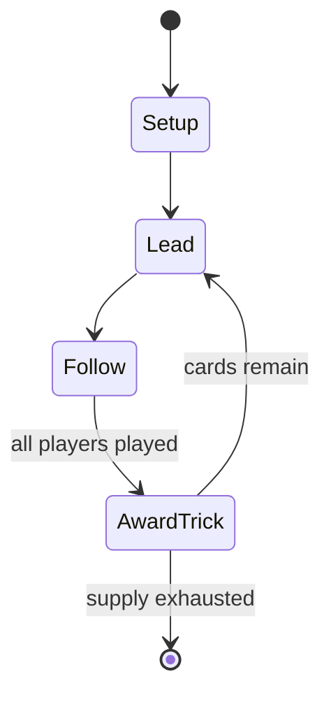

# Vira (card game)

*Swedish three-player card game*

`vira_card_game` &nbsp; state: **DEEPENED** &nbsp; method: **heuristic**

## Found layer (recorded, not trusted)

| field | value |
| --- | --- |
| wikidata | Q2292633 |
| wikipedia | Vira (card game) |
| genres (source) | -- |
| instance of (source) | card game, trick-taking game |
| country of origin | -- |

## Declared layer (orders bench work)

| field | value |
| --- | --- |
| year created | 1810 |
| epoch | INDUSTRIAL |
| region | -- |
| media | CARD, TRICK_TAKING |
| players | 3 |
| age band | -- |
| exogenous process | -- |
| loss shape | -- |
| live axes | BID |
| horizon | -- |
| scoring shape | -- |
| information | -- |
| interaction | COMPETITIVE |
| turn structure | TRICK_ROUND |
| tractability | SAMPLING_ONLY |
| randomness | -- |
| luck factor | 0.35 |
| rules complexity | 2.08 |
| strategic depth | 2.0 |
| novelty | 0.5194 |
| solved status | -- |
| strategies | -- |
| algorithms | -- |

## Object model

```
Episode
  players      : 3
  turn_structure: TRICK_ROUND
  horizon       : ?
  scoring       : ?

Deck           -- ordered multiset, drawn without replacement
Hand           -- private multiset held by one player
DiscardPile    -- public accumulation of spent cards
Trick          -- one card per player; a winner is determined
Trump          -- suit that dominates the ordering
Auction        -- priced competition resolving to one winner
```

## State transition diagram



## Research item -- turn trace

```
# Vira (card game) -- simulated turn events
# generated from the DECLARED vector, not from a rulebook.
# structure: exo=None loss=None horizon=None scoring=None axes=BID

t=0    SETUP        players=3  pot=0  capacity=7
t=1    FORCED       p1 single legal option taken (pot_gain=+1.5)
t=2    FORCED       p1 single legal option taken (pot_gain=+1.3)
t=3    BID          p1 sealed bid of 6 against 2 rivals
t=4    FORCED       p1 single legal option taken (pot_gain=+0.7)
t=5    BID          p1 sealed bid of 5 against 2 rivals
t=6    FORCED       p1 single legal option taken (pot_gain=+1.5)
t=7    BID          p1 sealed bid of 1 against 2 rivals
t=8    ENDTURN      turn passes to p2
t=9    FORCED       p2 single legal option taken (pot_gain=+1.2)
t=10   BID          p2 sealed bid of 4 against 2 rivals
t=11   FORCED       p2 single legal option taken (pot_gain=+1.0)
t=12   FORCED       p2 single legal option taken (pot_gain=+0.6)
t=13   FORCED       p2 single legal option taken (pot_gain=+1.4)
t=14   FORCED       p2 single legal option taken (pot_gain=+1.5)
t=15   BID          p2 sealed bid of 4 against 2 rivals
t=16   FORCED       p2 single legal option taken (pot_gain=+1.7)
t=17   BID          p2 sealed bid of 6 against 2 rivals
t=18   FORCED       p2 single legal option taken (pot_gain=+1.6)
t=19   BID          p2 sealed bid of 3 against 2 rivals
t=20   FORCED       p2 single legal option taken (pot_gain=+1.8)
t=21   ENDTURN      turn passes to p3
t=22   FORCED       p3 single legal option taken (pot_gain=+1.9)
t=23   FORCED       p3 single legal option taken (pot_gain=+0.5)
t=24   ENDTURN      turn passes to p1
t=25   FORCED       p1 single legal option taken (pot_gain=+2.0)
t=26   BID          p1 sealed bid of 7 against 2 rivals

terminal: VARIABLE
```

## Source extract

Vira, or Wira, is a traditional Swedish card game for three players that game designer Dan
Glimne has called "Sweden's national card game". It is the most elaborate game of the Solo
family that includes Solo Whist and Préférence and is "one of the most complex games ever
designed".   == History == Playing Vira was a popular social pastime during the 19th century and
there are still Vira parties in Sweden. It is unclear when the game arose. According to
tradition, the game was invented in Vira courthouse around 1810. It is said that a terrible
storm caused the court to become snowbound inside and they could not leave the mill. So they
played all the card games they knew and eventually invented a new one, which was named after the
place. Two gentlemen of Walloon extraction are supposed be the inventors of the game. But since
Vira is a game for three, a third party was probably involved.   == Description == Vira is a
trick-taking game. The actual trick play is preceded by an auction, as in Bridge. The player who
bids the highest contract plays against the other two players. Vira is a very complicated card
game and there are several variants of the rules. It is played with gaming chips

<sub>Wikipedia, CC BY-SA. Retained as evidence for the structural
classification above. Every rule inferred from it is HYPOTHESIZED
until audited against a rulebook.</sub>
