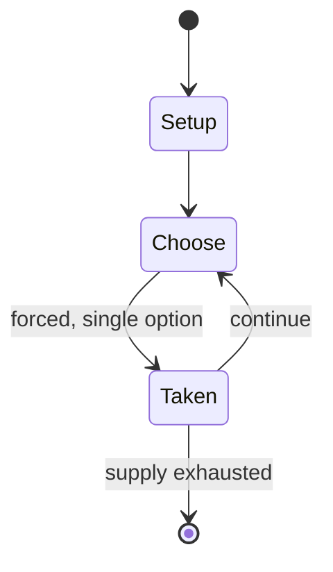

# Virtonomics

*2009 video game*

`virtonomics` &nbsp; state: **DEEPENED** &nbsp; method: **heuristic**

## Found layer (recorded, not trusted)

| field | value |
| --- | --- |
| wikidata | Q1569451 |
| wikipedia | Virtonomics |
| genres (source) | business simulation game, turn-based strategy video game |
| instance of (source) | video game |
| country of origin | -- |

## Declared layer (orders bench work)

| field | value |
| --- | --- |
| year created | 2006 |
| epoch | CONTEMPORARY |
| region | -- |
| media | VIDEO |
| players | -- |
| age band | -- |
| exogenous process | -- |
| loss shape | -- |
| live axes | TRADE |
| horizon | -- |
| scoring shape | -- |
| information | -- |
| interaction | COMPETITIVE |
| turn structure | -- |
| tractability | SAMPLING_ONLY |
| randomness | DICE |
| luck factor | 0.58 |
| rules complexity | 2.02 |
| strategic depth | 1.87 |
| novelty | 0.3541 |
| solved status | -- |
| strategies | -- |
| algorithms | -- |

## Object model

```
Episode
  players      : ?
  turn_structure: ?
  horizon       : ?
  scoring       : ?

WorldState     -- simulation state advanced by the engine
Avatar         -- player-controlled agent
Clock          -- frame or tick counter
Offer          -- proposed exchange between two agents
```

## State transition diagram



## Research item -- turn trace

```
# Virtonomics -- simulated turn events
# generated from the DECLARED vector, not from a rulebook.
# structure: exo=None loss=None horizon=None scoring=None axes=TRADE

t=0    SETUP        players=2  pot=0  capacity=5
t=1    FORCED       p1 single legal option taken (pot_gain=+1.4)
t=2    FORCED       p1 single legal option taken (pot_gain=+0.5)
t=3    TRADE        p1 offers 2:1 exchange to p2
t=4    FORCED       p1 single legal option taken (pot_gain=+1.4)
t=5    TRADE        p1 offers 2:1 exchange to p2
t=6    FORCED       p1 single legal option taken (pot_gain=+1.3)
t=7    FORCED       p1 single legal option taken (pot_gain=+0.7)
t=8    TRADE        p1 offers 2:1 exchange to p2
t=9    FORCED       p1 single legal option taken (pot_gain=+0.5)
t=10   FORCED       p1 single legal option taken (pot_gain=+1.3)
t=11   TRADE        p1 offers 2:1 exchange to p2
t=12   FORCED       p1 single legal option taken (pot_gain=+1.7)
t=13   ENDTURN      turn passes to p2
t=14   FORCED       p2 single legal option taken (pot_gain=+1.9)
t=15   TRADE        p2 offers 2:1 exchange to p1
t=16   FORCED       p2 single legal option taken (pot_gain=+1.0)
t=17   TRADE        p2 offers 2:1 exchange to p1
t=18   FORCED       p2 single legal option taken (pot_gain=+0.6)
t=19   FORCED       p2 single legal option taken (pot_gain=+1.7)
t=20   FORCED       p2 single legal option taken (pot_gain=+0.9)
t=21   FORCED       p2 single legal option taken (pot_gain=+1.9)
t=22   FORCED       p2 single legal option taken (pot_gain=+1.4)
t=23   TRADE        p2 offers 2:1 exchange to p1
t=24   ENDTURN      turn passes to p1
t=25   FORCED       p1 single legal option taken (pot_gain=+1.6)
t=26   FORCED       p1 single legal option taken (pot_gain=+1.3)

terminal: VARIABLE
```

## Source extract

Virtonomics is a massively multiplayer business simulation video game developed by Cyprus indie
developer Gamerflot. It allows the players to be in charge of fictional start-ups in several
industries. There are three different versions available: Entrepreneur, Business War and Tycoon.
== Gameplay == Virtonomics resembles Trevor Chan's business simulation game Capitalism 2. It
simulates the basic principles and processes of businesses in a competitive environment. There
are no predefined victory or failure conditions, and the game does not end. Players define their
own end goals for the game, and try achieve them using strategy and tactics. Typically, the main
goal is to build a successful business amidst competition. Virtonomics is a multiplayer game,
and players mainly interact with other players as well as with a computer-controlled opponent.
It is turn-based game, and each turn lasts a fixed length of time. Generally, turns are a day
long, and for a regular player, the game required 15 to 60 minutes a day. In 2014, the
developers released a "fast realm", a game server where turns were an hour long; this was
designed for players in short-term business training. Currently Virton

<sub>Wikipedia, CC BY-SA. Retained as evidence for the structural
classification above. Every rule inferred from it is HYPOTHESIZED
until audited against a rulebook.</sub>
