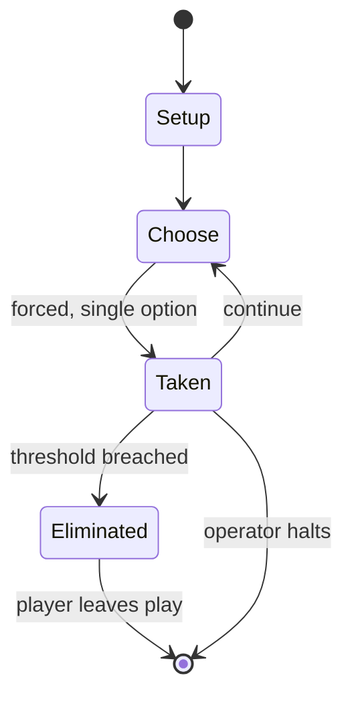

# Viticulture (board game)

`viticulture_board_game` &nbsp; state: **DEEPENED** &nbsp; method: **heuristic**

## Found layer (recorded, not trusted)

| field | value |
| --- | --- |
| wikidata | Q28836078 |
| wikipedia | Viticulture (board game) |
| genres (source) | -- |
| instance of (source) | -- |
| country of origin | -- |

## Declared layer (orders bench work)

| field | value |
| --- | --- |
| year created | 2013 |
| epoch | CONTEMPORARY |
| region | -- |
| media | BOARD |
| players | -- |
| age band | -- |
| exogenous process | -- |
| loss shape | ELIMINATION |
| live axes | ALLOCATE, ORDER |
| horizon | OPEN_ENDED |
| scoring shape | -- |
| information | ASYMMETRIC |
| interaction | SOLITAIRE |
| turn structure | PHASE_STRUCTURED |
| tractability | SAMPLING_ONLY |
| randomness | -- |
| luck factor | 0.35 |
| rules complexity | 2.76 |
| strategic depth | 2.0 |
| novelty | 0.4677 |
| solved status | -- |
| strategies | -- |
| algorithms | -- |

## Object model

```
Episode
  players      : ?
  turn_structure: PHASE_STRUCTURED
  horizon       : OPEN_ENDED
  scoring       : ?

Board          -- spatial substrate; cells carry position and occupancy
Piece          -- movable token owned by a player
ResourcePool   -- divisible capacity committed across slots
Sequence       -- the permutation under the player's control
```

## State transition diagram



## Research item -- turn trace

```
# Viticulture (board game) -- simulated turn events
# generated from the DECLARED vector, not from a rulebook.
# structure: exo=None loss=ELIMINATION horizon=OPEN_ENDED scoring=None axes=ALLOCATE,ORDER

t=0    SETUP        players=2  pot=0  capacity=4
t=1    FORCED       p1 single legal option taken (pot_gain=+1.6)
t=2    FORCED       p1 single legal option taken (pot_gain=+1.6)
t=3    ENDTURN      turn passes to p2
t=4    FORCED       p2 single legal option taken (pot_gain=+0.7)
t=5    ALLOCATE     p2 commits 1 of 5 capacity across 3 slots
t=6    FORCED       p2 single legal option taken (pot_gain=+1.5)
t=7    ALLOCATE     p2 commits 1 of 5 capacity across 4 slots
t=8    ENDTURN      turn passes to p1
t=9    FORCED       p1 single legal option taken (pot_gain=+0.6)
t=10   ALLOCATE     p1 commits 2 of 5 capacity across 4 slots
t=11   FORCED       p1 single legal option taken (pot_gain=+1.6)
t=12   ALLOCATE     p1 commits 3 of 5 capacity across 3 slots
t=13   FORCED       p1 single legal option taken (pot_gain=+0.6)
t=14   FORCED       p1 single legal option taken (pot_gain=+1.4)
t=15   ENDTURN      turn passes to p2
t=16   FORCED       p2 single legal option taken (pot_gain=+0.5)
t=17   ENDTURN      turn passes to p1
t=18   FORCED       p1 single legal option taken (pot_gain=+1.7)
t=19   FORCED       p1 single legal option taken (pot_gain=+1.2)
t=20   FORCED       p1 single legal option taken (pot_gain=+0.9)
t=21   FORCED       p1 single legal option taken (pot_gain=+1.8)
t=22   ENDTURN      turn passes to p2
t=23   FORCED       p2 single legal option taken (pot_gain=+1.2)
t=24   ALLOCATE     p2 commits 1 of 5 capacity across 4 slots
t=25   FORCED       p2 single legal option taken (pot_gain=+1.8)
t=26   FORCED       p2 single legal option taken (pot_gain=+0.9)

terminal: OPEN_ENDED
```

## Conditions

| kind | threshold | effect | trigger |
| --- | --- | --- | --- |
| TERMINATE | 20 points | -- | When a player reaches at least twenty points, the game ends after the year is completed. |
| ELIMINATE | -- | -- | The Grande Worker module allows a player to place a worker on any action even if that move is not available at the time, eliminating the possibility that players miss necessary actions. |
| WIN | -- | -- | The player with the most victory points is the winner. |

## Source extract

Viticulture is a worker placement board game published by Stonemaier Games in 2013. The game's
design was crowdfunded via a campaign on Kickstarter, with the concept of players building an
Italian vineyard. Upon its release, Viticulture received praise for its engagement, but its luck
was critiqued. Several expansions and reprints were later released.   == Gameplay == In
Viticulture, players operate a traditional Tuscan vineyard. Each round of the game represents
one year of operation divided into four seasons. Rounds begin with a spring season when the
player chooses a location in the wake-up track that provides various benefits and determines
turn order for the year. This is followed by summer, during which players place workers on the
summer action spaces on the shared board, which enables a player to plant vines, sell grapes,
gain money through tours, play a summer visitor card, draw a vine card, and erect structures.
In the autumn season, players draw either a summer visitor or a winter visitor card. These cards
have rule-breaking powers to help grow a player's vineyard and additional ways to earn victory
points. The winter season also allows each player to place unused worke

<sub>Wikipedia, CC BY-SA. Retained as evidence for the structural
classification above. Every rule inferred from it is HYPOTHESIZED
until audited against a rulebook.</sub>
