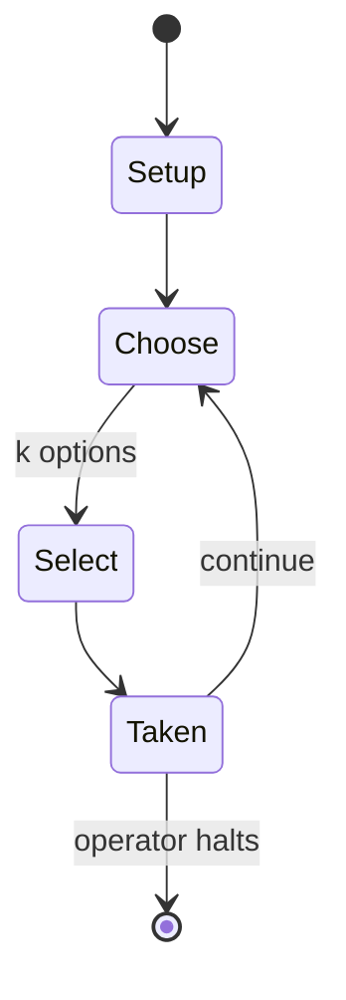

# Wacht am Rhein

*Grand tactical monster board wargame*

`wacht_am_rhein` &nbsp; state: **DEEPENED** &nbsp; method: **heuristic**

## Found layer (recorded, not trusted)

| field | value |
| --- | --- |
| wikidata | Q106771100 |
| wikipedia | Wacht am Rhein (game) |
| genres (source) | -- |
| instance of (source) | board game, board wargame |
| country of origin | -- |

## Declared layer (orders bench work)

| field | value |
| --- | --- |
| year created | 1977 |
| epoch | DIGITAL |
| region | -- |
| media | BOARD, PUZZLE, WARGAME |
| players | -- |
| age band | -- |
| exogenous process | -- |
| loss shape | -- |
| live axes | ALLOCATE, NEGOTIATE, SELECT, SPATIAL |
| horizon | OPEN_ENDED |
| scoring shape | RACE_POSITION |
| information | -- |
| interaction | SOLITAIRE |
| turn structure | PHASE_STRUCTURED |
| tractability | SAMPLING_ONLY |
| randomness | DICE |
| luck factor | 0.58 |
| rules complexity | 5.0 |
| strategic depth | 2.62 |
| novelty | 0.7452 |
| solved status | -- |
| strategies | memory_recall, set_collection, spatial_packing |
| algorithms | -- |

## Object model

```
Episode
  players      : ?
  turn_structure: PHASE_STRUCTURED
  horizon       : OPEN_ENDED
  scoring       : RACE_POSITION

Board          -- spatial substrate; cells carry position and occupancy
Piece          -- movable token owned by a player
Configuration  -- the arrangement to be resolved
Constraint     -- predicate a legal configuration must satisfy
ResourcePool   -- divisible capacity committed across slots
Agreement      -- non-binding or binding commitment between agents
OptionSet      -- the choices available after an exogenous draw
Placement      -- position subject to geometric legality
```

## State transition diagram



## Research item -- turn trace

```
# Wacht am Rhein -- simulated turn events
# generated from the DECLARED vector, not from a rulebook.
# structure: exo=None loss=None horizon=OPEN_ENDED scoring=RACE_POSITION axes=ALLOCATE,NEGOTIATE,SELECT,SPATIAL

t=0    SETUP        players=2  pot=0  capacity=3
t=1    SELECT       p1 1 options; take #1  (pot_gain=+2.5, capacity=-1)
t=2    SELECT       p1 3 options; take #3  (pot_gain=+0.8, capacity=-0)
t=3    ALLOCATE     p1 commits 1 of 5 capacity across 3 slots
t=4    SPATIAL      p1 places at (2,6); adjacency legal
t=5    SELECT       p1 1 options; take #1  (pot_gain=+1.1, capacity=-1)
t=6    SPATIAL      p1 places at (6,0); adjacency legal
t=7    SELECT       p1 2 options; take #2  (pot_gain=+2.9, capacity=-1)
t=8    ENDTURN      turn passes to p2
t=9    SELECT       p2 3 options; take #1  (pot_gain=+1.5, capacity=-0)
t=10   SELECT       p2 4 options; take #2  (pot_gain=+1.4, capacity=-2)
t=11   ENDTURN      turn passes to p1
t=12   SELECT       p1 1 options; take #1  (pot_gain=+2.5, capacity=-2)
t=13   SELECT       p1 4 options; take #2  (pot_gain=+2.1, capacity=-1)
t=14   SPATIAL      p1 places at (2,0); adjacency legal
t=15   SELECT       p1 1 options; take #1  (pot_gain=+2.8, capacity=-0)
t=16   ALLOCATE     p1 commits 3 of 5 capacity across 4 slots
t=17   SELECT       p1 2 options; take #2  (pot_gain=+1.0, capacity=-1)
t=18   SPATIAL      p1 places at (4,6); adjacency legal
t=19   SELECT       p1 4 options; take #4  (pot_gain=+3.0, capacity=-0)
t=20   ENDTURN      turn passes to p2
t=21   SELECT       p2 4 options; take #2  (pot_gain=+0.6, capacity=-0)
t=22   SELECT       p2 4 options; take #1  (pot_gain=+3.2, capacity=-1)
t=23   SELECT       p2 1 options; take #1  (pot_gain=+0.9, capacity=-2)
t=24   ALLOCATE     p2 commits 2 of 5 capacity across 2 slots
t=25   SPATIAL      p2 places at (7,1); adjacency legal
t=26   ENDTURN      turn passes to p1

terminal: OPEN_ENDED
```

## Source extract

Wacht am Rhein is a grand tactical monster board wargame published by Simulations Publications,
Inc. (SPI) in 1977 that simulates Germany's Battle of the Bulge offensive in late 1944 during
World War II.   == Description == In December 1944, in an operation codenamed "Wacht am Rhein"
("Watch on the Rhine"), the German army tried to repeat its triumph of 1940 by breaking through
the lightly guarded Ardennes Forest sector in an attempt to drive a wedge through the Allied
armies, take the port of Antwerp and force a separate negotiated peace with the British, French
and American allies. Wacht am Rhein is a simulation of that conflict, a grand tactical two-
player wargame set at the battalion and company level. With 1400 counters, it is considered a
"monster" wargame.   === Components === The game was packaged in either a clear plastic flat box
that incorporated counter trays, or a standard cardboard bookshelf game box. Both boxes
included:  Four 22 by 34 inches (560 mm × 860 mm) hex grid paper maps scaled to 1 mile (1.6 km)
per hex 1600 double-sided 1⁄2 inch (13 mm) die-cut counters Rulebook Two Game Charts and Tables
sheets Axis Turn Record/Reinforcement Track and an Allied Turn Recor

<sub>Wikipedia, CC BY-SA. Retained as evidence for the structural
classification above. Every rule inferred from it is HYPOTHESIZED
until audited against a rulebook.</sub>
