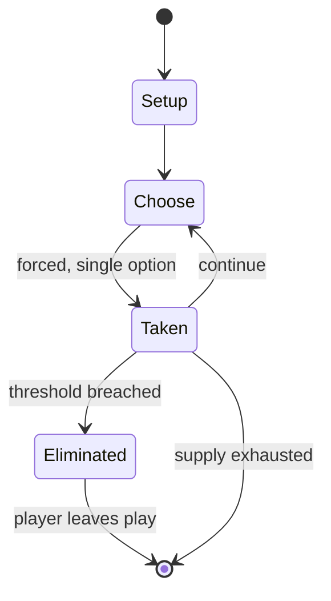

# Wallball (children's game)

`wallball_children_s_game` &nbsp; state: **DEEPENED** &nbsp; method: **heuristic**

## Found layer (recorded, not trusted)

| field | value |
| --- | --- |
| wikidata | Q7962999 |
| wikipedia | Wallball (children's game) |
| genres (source) | -- |
| instance of (source) | -- |
| country of origin | -- |

## Declared layer (orders bench work)

| field | value |
| --- | --- |
| year created | -- |
| epoch | -- |
| region | -- |
| media | PLAYGROUND, SPORT |
| players | -- |
| age band | CHILD |
| exogenous process | -- |
| loss shape | ELIMINATION |
| live axes | - |
| horizon | -- |
| scoring shape | WINNER_TAKE_ALL |
| information | -- |
| interaction | SOLITAIRE |
| turn structure | -- |
| tractability | SAMPLING_ONLY |
| randomness | -- |
| luck factor | 0.35 |
| rules complexity | 1.73 |
| strategic depth | 2.0 |
| novelty | 0.6375 |
| solved status | -- |
| strategies | -- |
| algorithms | -- |

## Object model

```
Episode
  players      : ?
  turn_structure: ?
  horizon       : ?
  scoring       : WINNER_TAKE_ALL

Pitch          -- bounded physical region
Player         -- embodied agent with a foul count
Clock          -- counts down; stoppages are rule events
Official       -- detects infractions and applies penalties
```

## State transition diagram



## Research item -- turn trace

```
# Wallball (children's game) -- simulated turn events
# generated from the DECLARED vector, not from a rulebook.
# structure: exo=None loss=ELIMINATION horizon=None scoring=WINNER_TAKE_ALL axes=-

t=0    SETUP        players=2  pot=0  capacity=8
t=1    FORCED       p1 single legal option taken (pot_gain=+0.9)
t=2    FORCED       p1 single legal option taken (pot_gain=+1.1)
t=3    FORCED       p1 single legal option taken (pot_gain=+1.2)
t=4    FORCED       p1 single legal option taken (pot_gain=+0.5)
t=5    FORCED       p1 single legal option taken (pot_gain=+1.8)
t=6    ENDTURN      turn passes to p2
t=7    FORCED       p2 single legal option taken (pot_gain=+0.5)
t=8    ENDTURN      turn passes to p1
t=9    FORCED       p1 single legal option taken (pot_gain=+0.7)
t=10   FORCED       p1 single legal option taken (pot_gain=+0.7)
t=11   ENDTURN      turn passes to p2
t=12   FORCED       p2 single legal option taken (pot_gain=+1.3)
t=13   FORCED       p2 single legal option taken (pot_gain=+1.9)
t=14   FORCED       p2 single legal option taken (pot_gain=+1.7)
t=15   FORCED       p2 single legal option taken (pot_gain=+1.3)
t=16   FORCED       p2 single legal option taken (pot_gain=+1.7)
t=17   FORCED       p2 single legal option taken (pot_gain=+2.0)
t=18   FORCED       p2 single legal option taken (pot_gain=+1.1)
t=19   FORCED       p2 single legal option taken (pot_gain=+0.6)
t=20   FORCED       p2 single legal option taken (pot_gain=+0.7)
t=21   FORCED       p2 single legal option taken (pot_gain=+0.8)
t=22   FORCED       p2 single legal option taken (pot_gain=+1.0)
t=23   FORCED       p2 single legal option taken (pot_gain=+1.6)
t=24   FORCED       p2 single legal option taken (pot_gain=+0.7)
t=25   FORCED       p2 single legal option taken (pot_gain=+0.8)
t=26   FORCED       p2 single legal option taken (pot_gain=+0.8)

terminal: VARIABLE
```

## Conditions

| kind | threshold | effect | trigger |
| --- | --- | --- | --- |
| BOUNDARY | 2 players | -- | The game consists of at least two players, goes for less than 10 minutes and only requires a bouncy ball. |
| ELIMINATE | -- | -- | The objective of wallball is to eliminate all other players in order to be the last player standing, or to be the starter of the game continuously (if the game is endless). |
| WIN | -- | -- | The last person to be holding the ball after everyone is out is the winner, and their team immediately wins the game. |

## Source extract

Wallball is a team sport played between a various number of players per team in which players
hit a bouncy ball against a wall, using their hands. The game requires the ball to be hit to the
floor before hitting the wall, but in other respects is similar to squash. One player on one
team may bounce the ball against the wall so a player only on the opposing team cannot bounce it
back to the wall. The last person to be holding the ball after everyone is out is the winner,
and their team immediately wins the game. The game requires lots of motion, and especially
benefits young athletes when playing mostly at schools. Wallball is derived from many New York
City street games played by young people, often involving the Spalding hi-bounce balls popular
in the 1950s. The game is similar to Gaelic handball, butts up, aces-kings-queens, Chinese
handball, Pêl-Law (Welsh handball), and American handball. Wallball is sometimes referred to as
downball.   == Objective ==  The objective of wallball is to eliminate all other players in
order to be the last player standing, or to be the starter of the game continuously (if the game
is endless). The game consists of at least two players, goes for les

<sub>Wikipedia, CC BY-SA. Retained as evidence for the structural
classification above. Every rule inferred from it is HYPOTHESIZED
until audited against a rulebook.</sub>
