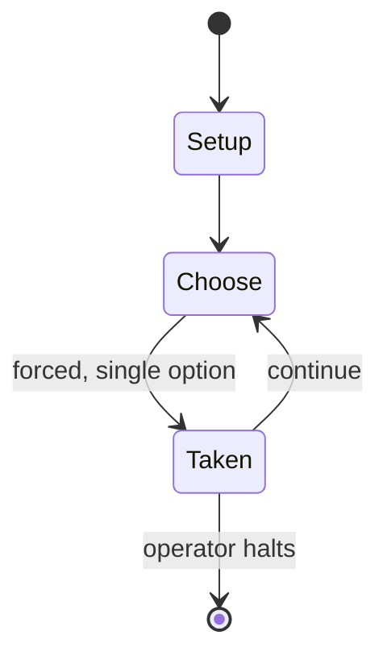

# Wargame Construction Set

*1986 video game*

`wargame_construction_set` &nbsp; state: **DEEPENED** &nbsp; method: **heuristic**

## Found layer (recorded, not trusted)

| field | value |
| --- | --- |
| wikidata | Q2458873 |
| wikipedia | Wargame Construction Set |
| genres (source) | computer wargame |
| instance of (source) | game creation system, video game |
| country of origin | United States |

## Declared layer (orders bench work)

| field | value |
| --- | --- |
| year created | 1986 |
| epoch | DIGITAL |
| region | NORTH_AMERICA |
| media | VIDEO, WARGAME |
| players | -- |
| age band | -- |
| exogenous process | -- |
| loss shape | -- |
| live axes | - |
| horizon | OPEN_ENDED |
| scoring shape | -- |
| information | -- |
| interaction | -- |
| turn structure | -- |
| tractability | SAMPLING_ONLY |
| randomness | -- |
| luck factor | 0.35 |
| rules complexity | 2.9 |
| strategic depth | 2.0 |
| novelty | 0.4787 |
| solved status | -- |
| strategies | -- |
| algorithms | -- |

## Object model

```
Episode
  players      : ?
  turn_structure: ?
  horizon       : OPEN_ENDED
  scoring       : ?

WorldState     -- simulation state advanced by the engine
Avatar         -- player-controlled agent
Clock          -- frame or tick counter
```

## State transition diagram



## Research item -- turn trace

```
# Wargame Construction Set -- simulated turn events
# generated from the DECLARED vector, not from a rulebook.
# structure: exo=None loss=None horizon=OPEN_ENDED scoring=None axes=-

t=0    SETUP        players=2  pot=0  capacity=3
t=1    FORCED       p1 single legal option taken (pot_gain=+1.6)
t=2    FORCED       p1 single legal option taken (pot_gain=+1.4)
t=3    FORCED       p1 single legal option taken (pot_gain=+1.8)
t=4    FORCED       p1 single legal option taken (pot_gain=+1.8)
t=5    FORCED       p1 single legal option taken (pot_gain=+1.6)
t=6    ENDTURN      turn passes to p2
t=7    FORCED       p2 single legal option taken (pot_gain=+0.8)
t=8    ENDTURN      turn passes to p1
t=9    FORCED       p1 single legal option taken (pot_gain=+1.0)
t=10   ENDTURN      turn passes to p2
t=11   FORCED       p2 single legal option taken (pot_gain=+1.9)
t=12   FORCED       p2 single legal option taken (pot_gain=+1.9)
t=13   ENDTURN      turn passes to p1
t=14   FORCED       p1 single legal option taken (pot_gain=+1.2)
t=15   ENDTURN      turn passes to p2
t=16   FORCED       p2 single legal option taken (pot_gain=+1.3)
t=17   ENDTURN      turn passes to p1
t=18   FORCED       p1 single legal option taken (pot_gain=+1.2)
t=19   FORCED       p1 single legal option taken (pot_gain=+0.8)
t=20   ENDTURN      turn passes to p2
t=21   FORCED       p2 single legal option taken (pot_gain=+1.0)
t=22   FORCED       p2 single legal option taken (pot_gain=+0.6)
t=23   ENDTURN      turn passes to p1
t=24   FORCED       p1 single legal option taken (pot_gain=+1.3)
t=25   FORCED       p1 single legal option taken (pot_gain=+1.5)
t=26   FORCED       p1 single legal option taken (pot_gain=+1.6)

terminal: OPEN_ENDED
```

## Source extract

Wargame Construction Set is a video game game creation system published in 1986 by Strategic
Simulations. Developed by Roger Damon, it allows the user to construct, edit and play
customizable wargame scenarios. It was released for the Amiga, Atari 8-bit computers, Atari ST,
Commodore 64, and MS-DOS. Several sequels followed.   == Overview ==  The application is based
on Roger Damon's source code for Operation Whirlwind, Field of Fire, and Panzer Grenadier. It
lets users design and play wargames from simple to complex.  Users start by drawing maps and
placing geographical features and buildings in any arrangement and scale desired.  There are
several levels of combat: from man-to-man engagements to large scale strategic campaigns.  Each
unit can be given different attributes such as unit type, weapon type and firepower, movement
and strength points. Users are able to create scenarios from many periods of military history,
ranging from spears and catapults to missiles and tanks. Users can create various genres of
wargames including sword-and-sorcery fantasies or science-fiction battles. The game comes with
eight pre-made ready-to-play scenarios which can be modified or played as-is.

<sub>Wikipedia, CC BY-SA. Retained as evidence for the structural
classification above. Every rule inferred from it is HYPOTHESIZED
until audited against a rulebook.</sub>
