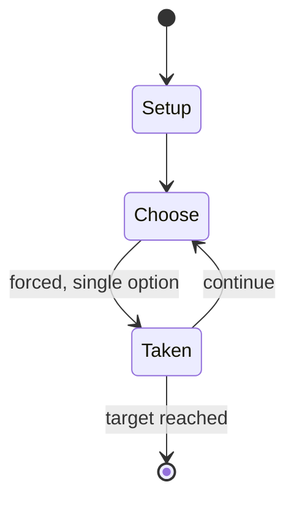

# Waterworks

*Card game based on Monopoly*

`waterworks` &nbsp; state: **DEEPENED** &nbsp; method: **heuristic**

## Found layer (recorded, not trusted)

| field | value |
| --- | --- |
| wikidata | Q7974583 |
| wikipedia | Waterworks (card game) |
| genres (source) | -- |
| instance of (source) | card game |
| country of origin | -- |

## Declared layer (orders bench work)

| field | value |
| --- | --- |
| year created | 1972 |
| epoch | DIGITAL |
| region | -- |
| media | CARD |
| players | -- |
| age band | -- |
| exogenous process | -- |
| loss shape | -- |
| live axes | DISCARD |
| horizon | RACE_TO_TARGET |
| scoring shape | RACE_POSITION |
| information | -- |
| interaction | -- |
| turn structure | -- |
| tractability | SAMPLING_ONLY |
| randomness | -- |
| luck factor | 0.35 |
| rules complexity | 2.14 |
| strategic depth | 2.0 |
| novelty | 0.6416 |
| solved status | -- |
| strategies | -- |
| algorithms | -- |

## Object model

```
Episode
  players      : ?
  turn_structure: ?
  horizon       : RACE_TO_TARGET
  scoring       : RACE_POSITION

Deck           -- ordered multiset, drawn without replacement
Hand           -- private multiset held by one player
DiscardPile    -- public accumulation of spent cards
DiscardChoice  -- what is given up to satisfy a limit
```

## State transition diagram



## Research item -- turn trace

```
# Waterworks -- simulated turn events
# generated from the DECLARED vector, not from a rulebook.
# structure: exo=None loss=None horizon=RACE_TO_TARGET scoring=RACE_POSITION axes=DISCARD

t=0    SETUP        players=2  pot=0  capacity=3
t=1    FORCED       p1 single legal option taken (pot_gain=+1.5)
t=2    DISCARD      p1 discards to hand limit
t=3    FORCED       p1 single legal option taken (pot_gain=+2.0)
t=4    FORCED       p1 single legal option taken (pot_gain=+0.7)
t=5    FORCED       p1 single legal option taken (pot_gain=+1.8)
t=6    FORCED       p1 single legal option taken (pot_gain=+1.2)
t=7    ENDTURN      turn passes to p2
t=8    FORCED       p2 single legal option taken (pot_gain=+1.2)
t=9    DISCARD      p2 discards to hand limit
t=10   FORCED       p2 single legal option taken (pot_gain=+1.2)
t=11   FORCED       p2 single legal option taken (pot_gain=+0.8)
t=12   DISCARD      p2 discards to hand limit
t=13   ENDTURN      turn passes to p1
t=14   FORCED       p1 single legal option taken (pot_gain=+0.6)
t=15   FORCED       p1 single legal option taken (pot_gain=+1.0)
t=16   ENDTURN      turn passes to p2
t=17   FORCED       p2 single legal option taken (pot_gain=+1.4)
t=18   FORCED       p2 single legal option taken (pot_gain=+1.2)
t=19   DISCARD      p2 discards to hand limit
t=20   ENDTURN      turn passes to p1
t=21   FORCED       p1 single legal option taken (pot_gain=+1.9)
t=22   FORCED       p1 single legal option taken (pot_gain=+1.4)
t=23   FORCED       p1 single legal option taken (pot_gain=+1.4)
t=24   DISCARD      p1 discards to hand limit
t=25   FORCED       p1 single legal option taken (pot_gain=+0.8)
t=26   DISCARD      p1 discards to hand limit

terminal: RACE_TO_TARGET
```

## Conditions

| kind | threshold | effect | trigger |
| --- | --- | --- | --- |
| WIN | -- | -- | Players race to be the first to complete a continuous, leak-free pipeline that connects their valve card to their spout card, while opposing players try to give them leaks that must be fixed. |

## Source extract

Waterworks is a card game created by Parker Brothers in 1972, named for the space Water Works in
the game Monopoly. The game pieces consist of: a deck of 110 pipe cards, a bathtub-shaped card
tray, and 10 small metal wrenches. The object is for each player to create a pipeline of a
designated length that begins with a valve and ends with a spout. Players race to be the first
to complete a continuous, leak-free pipeline that connects their valve card to their spout card,
while opposing players try to give them leaks that must be fixed.   == Gameplay == Players begin
with a hand of five pipe cards and two wrenches. Cards used in play are lead pipe cards, copper
pipe cards (invulnerable to leaks), and lead pipe cards that are already leaky. The valve card
is placed on the table to begin a player's pipeline.  The spout card is set aside until it is
used by a player who has completed their pipeline, and then immediately the player ends the game
by placing the spout aimed down toward the player. A number of different pipe shapes (L-bends,
T-pipes, straight, etc.) are represented in the game. Leaky pipes can only be added to the end
or over the last piece of another player's pipeline, and

<sub>Wikipedia, CC BY-SA. Retained as evidence for the structural
classification above. Every rule inferred from it is HYPOTHESIZED
until audited against a rulebook.</sub>
