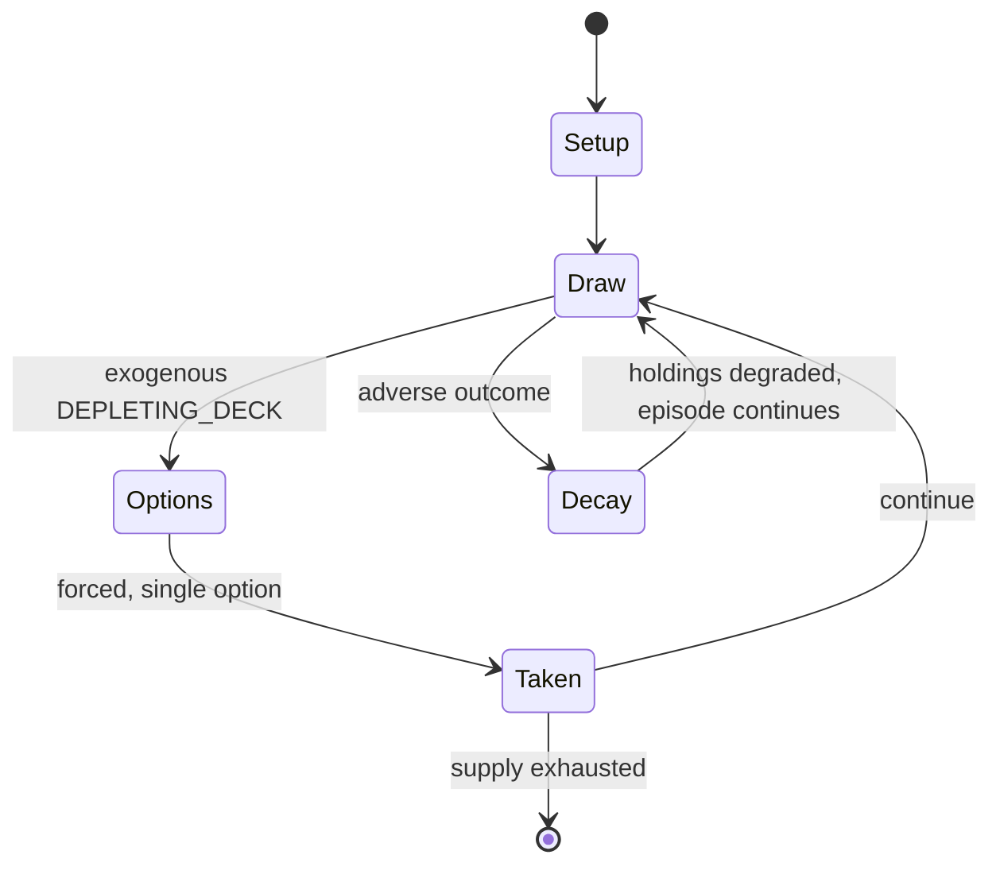

# Weiß Schwarz

*Japanese collectible card game*

`wei_schwarz` &nbsp; state: **DEEPENED** &nbsp; method: **heuristic**

## Found layer (recorded, not trusted)

| field | value |
| --- | --- |
| wikidata | Q1107109 |
| wikipedia | Weiß Schwarz |
| genres (source) | -- |
| instance of (source) | brand, collectible card game |
| country of origin | Japan |

## Declared layer (orders bench work)

| field | value |
| --- | --- |
| year created | -- |
| epoch | -- |
| region | EAST_ASIA |
| media | CARD, COLLECTIBLE |
| players | 2 |
| age band | -- |
| exogenous process | DEPLETING_DECK |
| loss shape | PARTIAL_DECAY |
| live axes | TRADE |
| horizon | -- |
| scoring shape | -- |
| information | -- |
| interaction | COMPETITIVE |
| turn structure | PHASE_STRUCTURED |
| tractability | EXACT_WITH_CUT |
| randomness | DECK_SHUFFLE |
| luck factor | 0.48 |
| rules complexity | 3.24 |
| strategic depth | 2.25 |
| novelty | 0.7184 |
| solved status | -- |
| strategies | route_optimisation |
| algorithms | -- |

## Object model

```
Episode
  players      : 2
  turn_structure: PHASE_STRUCTURED
  horizon       : ?
  scoring       : ?

Deck           -- ordered multiset, drawn without replacement
Hand           -- private multiset held by one player
DiscardPile    -- public accumulation of spent cards
Offer          -- proposed exchange between two agents
```

## State transition diagram



## Research item -- turn trace

```
# Weiß Schwarz -- simulated turn events
# generated from the DECLARED vector, not from a rulebook.
# structure: exo=DEPLETING_DECK loss=PARTIAL_DECAY horizon=None scoring=None axes=TRADE

t=0    SETUP        players=2  pot=0  capacity=8
t=1    DRAW         p1 draw from deck -> outcome #5  (p=0.099)
t=2    FORCED       p1 single legal option taken (pot_gain=+1.5)
t=3    TRADE        p1 offers 2:1 exchange to p2
t=4    DRAW         p1 draw from deck -> outcome #6  (p=0.061)
t=5    FORCED       p1 single legal option taken (pot_gain=+1.2)
t=6    TRADE        p1 offers 2:1 exchange to p2
t=7    DRAW         p1 draw from deck -> outcome #2  (p=0.083)
t=8    FORCED       p1 single legal option taken (pot_gain=+1.2)
t=9    DRAW         p1 draw from deck -> outcome #4  (p=0.052)
t=10   FORCED       p1 single legal option taken (pot_gain=+0.5)
t=11   DRAW         p1 draw from deck -> outcome #3  (p=0.258)
t=12   FORCED       p1 single legal option taken (pot_gain=+0.9)
t=13   DRAW         p1 draw from deck -> outcome #2  (p=0.007)
t=14   FORCED       p1 single legal option taken (pot_gain=+1.4)
t=15   DRAW         p1 draw from deck -> outcome #6  (p=0.214)
t=16   FORCED       p1 single legal option taken (pot_gain=+1.9)
t=17   TRADE        p1 offers 2:1 exchange to p2
t=18   DRAW         p1 draw from deck -> outcome #3  (p=0.269)
t=19   FORCED       p1 single legal option taken (pot_gain=+0.9)
t=20   ENDTURN      turn passes to p2
t=21   DRAW         p2 draw from deck -> outcome #6  (p=0.155)
t=22   FORCED       p2 single legal option taken (pot_gain=+1.8)
t=23   ENDTURN      turn passes to p1
t=24   DRAW         p1 draw from deck -> outcome #3  (p=0.060)
t=25   FORCED       p1 single legal option taken (pot_gain=+1.6)
t=26   DRAW         p1 draw from deck -> outcome #6  (p=0.291)
t=27   FORCED       p1 single legal option taken (pot_gain=+1.2)
t=28   TRADE        p1 offers 2:1 exchange to p2

terminal: VARIABLE
```

## Conditions

| kind | threshold | effect | trigger |
| --- | --- | --- | --- |
| ELIMINATE | -- | removed | The cards that are removed from the game are placed in this area. |
| WIN | -- | -- | The player that forces their opponent to Level 4 wins the game immediately. |
| BOUNDARY | -- | -- | A maximum of one face-up Climax card is allowed in this zone. |
| BOUNDARY | -- | -- | A deck can contain up to four copies of cards with the same name, and no more than 8 climax cards per deck. |
| BOUNDARY | -- | -- | Due to the usefulness of climax cards, a deck is capped at 8 climaxes. |
| PENALTY | -- | -- | The attacking character will suffer a Soul Damage penalty that is equivalent to the Level of the opposing character. |

## Source extract

Weiß Schwarz (ヴァイスシュヴァルツ, Vaisu Shuvarutsu) is a Japanese collectible card game created by
Bushiroad. The game is separated into Weiß-side and Schwarz-side. "Weiß" and "Schwarz" are
German for white and black, respectively. The game’s main attraction is the fact that its
different expansions contain cards from different licensed properties (manga and anime series
such as Bakemonogatari, Log Horizon, Madoka, Attack on Titan, The Melancholy of Haruhi Suzumiya
and Fate Stay Night, among others). The game was launched in March 2008. It received an English
release in 2013. In 2010 Animate Times called the game "hugely popular", and noted that the game
has produced 100 million cards within 21 months since its release, and 200 million after 31
months. The game was also called popular by Anime News Network in 2013 and 2021, and by GameRant
in 2021.   == Gameplay == The game focuses on two main aspects: character battle and clock/level
which regulate what cards can be played as well as acting as a player's life points.  The game
is designed for two players and an average game lasts about 10-15 minutes.   == Rules ==   ===
Victory conditions === The player that forces their opponent to Level

<sub>Wikipedia, CC BY-SA. Retained as evidence for the structural
classification above. Every rule inferred from it is HYPOTHESIZED
until audited against a rulebook.</sub>
