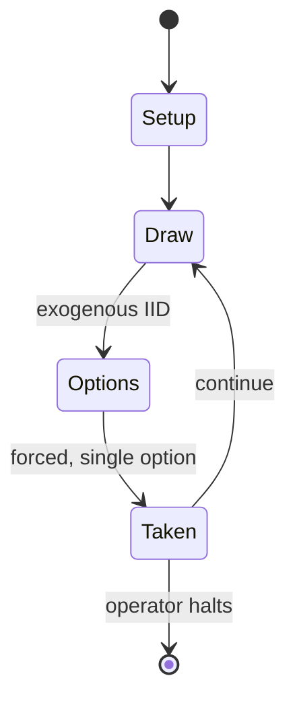

# Wellington's Victory: Battle of Waterloo Game – June 18th, 1815

*board game*

`wellington_s_victory_battle_of_waterloo_game_june_18th_1815` &nbsp; state: **DEEPENED** &nbsp; method: **heuristic**

## Found layer (recorded, not trusted)

| field | value |
| --- | --- |
| wikidata | Q105472511 |
| wikipedia | Wellington's Victory: Battle of Waterloo – 18 June 1815 |
| genres (source) | -- |
| instance of (source) | board wargame |
| country of origin | United States |

## Declared layer (orders bench work)

| field | value |
| --- | --- |
| year created | 1976 |
| epoch | DIGITAL |
| region | NORTH_AMERICA |
| media | BOARD, DICE, WARGAME |
| players | 2-+ |
| age band | -- |
| exogenous process | IID |
| loss shape | -- |
| live axes | ORDER, TIMING, TRADE |
| horizon | OPEN_ENDED |
| scoring shape | -- |
| information | -- |
| interaction | NEGOTIATION |
| turn structure | -- |
| tractability | INTRACTABLE |
| randomness | DICE |
| luck factor | 0.58 |
| rules complexity | 4.73 |
| strategic depth | 1.87 |
| novelty | 0.8586 |
| solved status | -- |
| strategies | -- |
| algorithms | -- |

## Object model

```
Episode
  players      : 2-+
  turn_structure: ?
  horizon       : OPEN_ENDED
  scoring       : ?

Board          -- spatial substrate; cells carry position and occupancy
Piece          -- movable token owned by a player
DicePool       -- n dice, each an iid categorical draw
Roll           -- realised outcome of a pool
Sequence       -- the permutation under the player's control
Initiative     -- who acts, and when, relative to others
Offer          -- proposed exchange between two agents
```

## State transition diagram



## Research item -- turn trace

```
# Wellington's Victory: Battle of Waterloo Game – June 18th, 1815 -- simulated turn events
# generated from the DECLARED vector, not from a rulebook.
# structure: exo=IID loss=None horizon=OPEN_ENDED scoring=None axes=ORDER,TIMING,TRADE

t=0    SETUP        players=2  pot=0  capacity=3
t=1    DRAW         p1 roll from d6 pool -> outcome #3  (p=0.134)
t=2    FORCED       p1 single legal option taken (pot_gain=+1.9)
t=3    TRADE        p1 offers 2:1 exchange to p2
t=4    DRAW         p1 roll from d6 pool -> outcome #3  (p=0.009)
t=5    FORCED       p1 single legal option taken (pot_gain=+1.5)
t=6    TRADE        p1 offers 2:1 exchange to p2
t=7    ENDTURN      turn passes to p2
t=8    DRAW         p2 roll from d6 pool -> outcome #1  (p=0.057)
t=9    FORCED       p2 single legal option taken (pot_gain=+1.3)
t=10   TRADE        p2 offers 2:1 exchange to p1
t=11   DRAW         p2 roll from d6 pool -> outcome #3  (p=0.073)
t=12   FORCED       p2 single legal option taken (pot_gain=+1.7)
t=13   DRAW         p2 roll from d6 pool -> outcome #2  (p=0.238)
t=14   FORCED       p2 single legal option taken (pot_gain=+0.9)
t=15   TRADE        p2 offers 2:1 exchange to p1
t=16   DRAW         p2 roll from d6 pool -> outcome #3  (p=0.201)
t=17   FORCED       p2 single legal option taken (pot_gain=+1.3)
t=18   ENDTURN      turn passes to p1
t=19   DRAW         p1 roll from d6 pool -> outcome #1  (p=0.047)
t=20   FORCED       p1 single legal option taken (pot_gain=+1.2)
t=21   ENDTURN      turn passes to p2
t=22   DRAW         p2 roll from d6 pool -> outcome #4  (p=0.272)
t=23   FORCED       p2 single legal option taken (pot_gain=+1.1)
t=24   DRAW         p2 roll from d6 pool -> outcome #3  (p=0.094)
t=25   FORCED       p2 single legal option taken (pot_gain=+0.8)
t=26   TRADE        p2 offers 2:1 exchange to p1
t=27   ENDTURN      turn passes to p1

terminal: OPEN_ENDED
```

## Source extract

Wellington's Victory: Battle of Waterloo – 18 June 1815 is a board wargame simulation of the
Battle of Waterloo, originally published by Simulations Publications, Inc. (SPI) in 1976.   ==
Description == This is two-person or three-person tabletop game — either one person can take on
the French while the other takes both the Anglo-Allied forces and the Prussians, or the Anglo-
Allied and Prussian forces can be divided between two players. Characterized as a "monster game"
because of its large number of counters, this  is a battalion-level simulation focusing on the
Battle of Waterloo, with a 68" x 44" map of the seven-mile battle front (100 yards per hex), and
2000 counters. Rules are included to allow for battle formation tactics, skirmishers, and
artillerists.   === Components === The components in the original SPI and TSR boxed sets are:
rulebook, which includes a pullout sheet with deployment charts 5 sheets of counters totalling
2000 die-cut counters representing French, Anglo-Allied and Prussian units 2 Combat Strength
Marker Sheets a 68" x 44" paper hex map in four sections 1 plastic six-sided die 2 plastic trays
for holding counters In Decision Games' redesigned 2014 edition

<sub>Wikipedia, CC BY-SA. Retained as evidence for the structural
classification above. Every rule inferred from it is HYPOTHESIZED
until audited against a rulebook.</sub>
