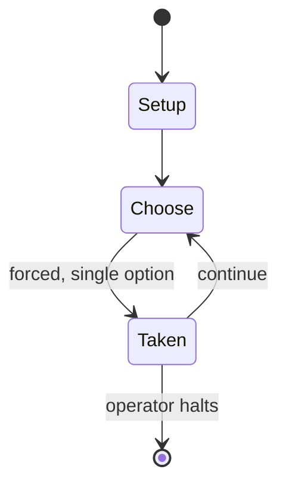

# Werewords

`werewords` &nbsp; state: **DEEPENED** &nbsp; method: **heuristic**

## Found layer (recorded, not trusted)

| field | value |
| --- | --- |
| wikidata | Q60744441 |
| wikipedia | Werewords |
| genres (source) | -- |
| instance of (source) | -- |
| country of origin | -- |

## Declared layer (orders bench work)

| field | value |
| --- | --- |
| year created | 2017 |
| epoch | CONTEMPORARY |
| region | -- |
| media | BOARD |
| players | 4-10 |
| age band | -- |
| exogenous process | -- |
| loss shape | -- |
| live axes | - |
| horizon | OPEN_ENDED |
| scoring shape | -- |
| information | ASYMMETRIC |
| interaction | TRAITOR |
| turn structure | -- |
| tractability | SAMPLING_ONLY |
| randomness | HIDDEN_INFO |
| luck factor | 0.35 |
| rules complexity | 2.21 |
| strategic depth | 2.0 |
| novelty | 0.6706 |
| solved status | -- |
| strategies | -- |
| algorithms | -- |

## Object model

```
Episode
  players      : 4-10
  turn_structure: ?
  horizon       : OPEN_ENDED
  scoring       : ?

Board          -- spatial substrate; cells carry position and occupancy
Piece          -- movable token owned by a player
```

## State transition diagram



## Research item -- turn trace

```
# Werewords -- simulated turn events
# generated from the DECLARED vector, not from a rulebook.
# structure: exo=None loss=None horizon=OPEN_ENDED scoring=None axes=-

t=0    SETUP        players=4  pot=0  capacity=6
t=1    FORCED       p1 single legal option taken (pot_gain=+1.6)
t=2    ENDTURN      turn passes to p2
t=3    FORCED       p2 single legal option taken (pot_gain=+0.6)
t=4    ENDTURN      turn passes to p3
t=5    FORCED       p3 single legal option taken (pot_gain=+0.9)
t=6    FORCED       p3 single legal option taken (pot_gain=+0.8)
t=7    FORCED       p3 single legal option taken (pot_gain=+1.7)
t=8    FORCED       p3 single legal option taken (pot_gain=+1.0)
t=9    FORCED       p3 single legal option taken (pot_gain=+0.5)
t=10   ENDTURN      turn passes to p4
t=11   FORCED       p4 single legal option taken (pot_gain=+0.9)
t=12   ENDTURN      turn passes to p1
t=13   FORCED       p1 single legal option taken (pot_gain=+1.7)
t=14   FORCED       p1 single legal option taken (pot_gain=+1.9)
t=15   ENDTURN      turn passes to p2
t=16   FORCED       p2 single legal option taken (pot_gain=+0.8)
t=17   FORCED       p2 single legal option taken (pot_gain=+0.8)
t=18   FORCED       p2 single legal option taken (pot_gain=+1.6)
t=19   FORCED       p2 single legal option taken (pot_gain=+1.3)
t=20   FORCED       p2 single legal option taken (pot_gain=+0.7)
t=21   ENDTURN      turn passes to p3
t=22   FORCED       p3 single legal option taken (pot_gain=+1.7)
t=23   FORCED       p3 single legal option taken (pot_gain=+0.6)
t=24   FORCED       p3 single legal option taken (pot_gain=+1.6)
t=25   ENDTURN      turn passes to p4
t=26   FORCED       p4 single legal option taken (pot_gain=+1.6)
t=27   ENDTURN      turn passes to p1

terminal: OPEN_ENDED
```

## Source extract

Werewords is a board game for 4 to 10 players designed by Ted Alspach and published by Bézier
Games in 2017. Players guess a secret word by asking questions. There are different roles
randomly assigned at the start of play. Villagers try to find out the magic word before the time
is up while the werewolves are trying to mislead them. The Deluxe edition was released via
Kickstarter. The German version of the game, Werwörter was nominated for the 2019 Spiel des
Jahres.   == Gameplay == In Werewords, players receive first their secret roles: villagers or
werewolves. Then the players ask questions to the mayor in order to guess the secret word before
the time is up. The werewolves try to misguide the other players in their quest for the magic
word. If the villagers don't guess the word in time, they can still win by identifying the
werewolf. To help the villagers out, one player is the Seer, who knows the word but must not be
too obvious when helping them figure it out; if the word is guessed, the werewolf can pull out a
win by identifying the Seer. The design and the ambiance of Werewords is taken from the original
game Werewolf, edited in an upgraded version by Ted Alspach known as U

<sub>Wikipedia, CC BY-SA. Retained as evidence for the structural
classification above. Every rule inferred from it is HYPOTHESIZED
until audited against a rulebook.</sub>
