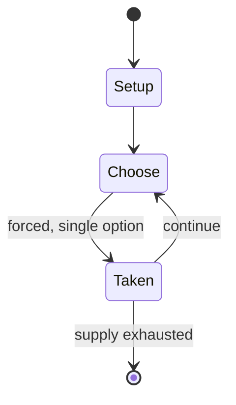

# West of Alamein

*1988 board game*

`west_of_alamein` &nbsp; state: **DEEPENED** &nbsp; method: **heuristic**

## Found layer (recorded, not trusted)

| field | value |
| --- | --- |
| wikidata | Q108569834 |
| wikipedia | West of Alamein |
| genres (source) | -- |
| instance of (source) | board wargame |
| country of origin | -- |

## Declared layer (orders bench work)

| field | value |
| --- | --- |
| year created | 1988 |
| epoch | DIGITAL |
| region | -- |
| media | BOARD, RPG, WARGAME |
| players | -- |
| age band | -- |
| exogenous process | -- |
| loss shape | -- |
| live axes | SPATIAL |
| horizon | -- |
| scoring shape | -- |
| information | -- |
| interaction | -- |
| turn structure | -- |
| tractability | SAMPLING_ONLY |
| randomness | DICE |
| luck factor | 0.58 |
| rules complexity | 3.63 |
| strategic depth | 1.87 |
| novelty | 0.0938 |
| solved status | -- |
| strategies | -- |
| algorithms | -- |

## Object model

```
Episode
  players      : ?
  turn_structure: ?
  horizon       : ?
  scoring       : ?

Board          -- spatial substrate; cells carry position and occupancy
Piece          -- movable token owned by a player
Character      -- persistent stat block owned by a player
GameMaster     -- adjudicating agent outside the scoring loop
Scenario       -- authored state the players traverse
Placement      -- position subject to geometric legality
```

## State transition diagram



## Research item -- turn trace

```
# West of Alamein -- simulated turn events
# generated from the DECLARED vector, not from a rulebook.
# structure: exo=None loss=None horizon=None scoring=None axes=SPATIAL

t=0    SETUP        players=2  pot=0  capacity=6
t=1    FORCED       p1 single legal option taken (pot_gain=+0.9)
t=2    SPATIAL      p1 places at (0,7); adjacency legal
t=3    FORCED       p1 single legal option taken (pot_gain=+0.6)
t=4    SPATIAL      p1 places at (1,4); adjacency legal
t=5    FORCED       p1 single legal option taken (pot_gain=+0.7)
t=6    FORCED       p1 single legal option taken (pot_gain=+1.4)
t=7    FORCED       p1 single legal option taken (pot_gain=+1.1)
t=8    FORCED       p1 single legal option taken (pot_gain=+1.3)
t=9    SPATIAL      p1 places at (7,2); adjacency legal
t=10   ENDTURN      turn passes to p2
t=11   FORCED       p2 single legal option taken (pot_gain=+1.0)
t=12   SPATIAL      p2 places at (4,1); adjacency legal
t=13   FORCED       p2 single legal option taken (pot_gain=+0.9)
t=14   SPATIAL      p2 places at (1,5); adjacency legal
t=15   FORCED       p2 single legal option taken (pot_gain=+1.8)
t=16   FORCED       p2 single legal option taken (pot_gain=+1.1)
t=17   FORCED       p2 single legal option taken (pot_gain=+0.8)
t=18   FORCED       p2 single legal option taken (pot_gain=+1.6)
t=19   SPATIAL      p2 places at (0,7); adjacency legal
t=20   FORCED       p2 single legal option taken (pot_gain=+1.7)
t=21   SPATIAL      p2 places at (6,6); adjacency legal
t=22   FORCED       p2 single legal option taken (pot_gain=+0.6)
t=23   FORCED       p2 single legal option taken (pot_gain=+2.0)
t=24   ENDTURN      turn passes to p1
t=25   FORCED       p1 single legal option taken (pot_gain=+0.7)
t=26   FORCED       p1 single legal option taken (pot_gain=+1.2)

terminal: VARIABLE
```

## Source extract

West of Alamein is a board wargame published by Avalon Hill in 1988 that simulates combat in
North Africa during World War II.   == Description == West of Alamein is an expansion for Avalon
Hill's Advanced Squad Leader wargame, the first to include counters for British forces. It is
not a complete game, requiring a copy of the original ASL rules and German counters; and for
four of the eight scenarios, maps from a previous expansion, Yanks.   === Components === The
game box contains:  five mounted 8" x 22" geomorphic hex grid maps 520 1/2" die-cut counters
(British platoons and leaders) 704 5/8" die-cut counters (British tanks and vehicles) Terrain
overlays Three 3-hole-punched chapters of rules (to be added to the original ASL rules binder):
Chapter F "North Africa" Chapter H: "Design Your Own Scenario" Chapter N: "Armory" (Equipment
for ASL expansions West of Alamein, The Last Hurrah, and Partisan!)   === Scenarios === Eight
scenarios, numbered 35–42, are included with the game: 35. "Blazin' Chariots" 36. "Rachi Ridge"
37. "Khamsin" 38. "Escape from Derna" 39. "Turning the Tables" 40. "Fort McGregor" 41. "A
Bridgehead Too Wet" 42. "Point of No Return"   === Gameplay === The West

<sub>Wikipedia, CC BY-SA. Retained as evidence for the structural
classification above. Every rule inferred from it is HYPOTHESIZED
until audited against a rulebook.</sub>
