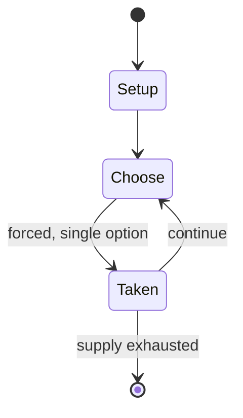

# whale shogi

*shogi variant invented by R. Wayne Schmittberger in 1981; the pieces are named after types of whale*

`whale_shogi` &nbsp; state: **DEEPENED** &nbsp; method: **heuristic**

## Found layer (recorded, not trusted)

| field | value |
| --- | --- |
| wikidata | Q7990519 |
| wikipedia | Whale Shogi |
| genres (source) | -- |
| instance of (source) | shogi variant |
| country of origin | -- |

## Declared layer (orders bench work)

| field | value |
| --- | --- |
| year created | 1981 |
| epoch | DIGITAL |
| region | -- |
| media | - |
| players | -- |
| age band | -- |
| exogenous process | NONE |
| loss shape | OPPORTUNITY_ONLY |
| live axes | SPATIAL |
| horizon | -- |
| scoring shape | SET_COLLECTION_CONVEX |
| information | PERFECT |
| interaction | COMPETITIVE |
| turn structure | STRICT_TURN |
| tractability | EXACT_WITH_CUT |
| randomness | NONE |
| luck factor | 0.02 |
| rules complexity | 2.29 |
| strategic depth | 2.9 |
| novelty | 0.7482 |
| solved status | -- |
| strategies | set_collection, signalling |
| algorithms | -- |

## Object model

```
Episode
  players      : ?
  turn_structure: STRICT_TURN
  horizon       : ?
  scoring       : SET_COLLECTION_CONVEX

Placement      -- position subject to geometric legality
```

## State transition diagram



## Research item -- turn trace

```
# whale shogi -- simulated turn events
# generated from the DECLARED vector, not from a rulebook.
# structure: exo=NONE loss=OPPORTUNITY_ONLY horizon=None scoring=SET_COLLECTION_CONVEX axes=SPATIAL

t=0    SETUP        players=2  pot=0  capacity=8
t=1    FORCED       p1 single legal option taken (pot_gain=+1.3)
t=2    FORCED       p1 single legal option taken (pot_gain=+0.8)
t=3    FORCED       p1 single legal option taken (pot_gain=+0.9)
t=4    FORCED       p1 single legal option taken (pot_gain=+1.6)
t=5    FORCED       p1 single legal option taken (pot_gain=+1.2)
t=6    FORCED       p1 single legal option taken (pot_gain=+1.2)
t=7    FORCED       p1 single legal option taken (pot_gain=+0.8)
t=8    SPATIAL      p1 places at (3,6); adjacency legal
t=9    FORCED       p1 single legal option taken (pot_gain=+2.0)
t=10   SPATIAL      p1 places at (4,3); adjacency legal
t=11   FORCED       p1 single legal option taken (pot_gain=+1.4)
t=12   FORCED       p1 single legal option taken (pot_gain=+0.7)
t=13   ENDTURN      turn passes to p2
t=14   FORCED       p2 single legal option taken (pot_gain=+0.9)
t=15   SPATIAL      p2 places at (0,2); adjacency legal
t=16   FORCED       p2 single legal option taken (pot_gain=+1.0)
t=17   SPATIAL      p2 places at (5,5); adjacency legal
t=18   FORCED       p2 single legal option taken (pot_gain=+1.2)
t=19   FORCED       p2 single legal option taken (pot_gain=+0.7)
t=20   ENDTURN      turn passes to p1
t=21   FORCED       p1 single legal option taken (pot_gain=+1.4)
t=22   SPATIAL      p1 places at (3,0); adjacency legal
t=23   FORCED       p1 single legal option taken (pot_gain=+1.2)
t=24   FORCED       p1 single legal option taken (pot_gain=+1.1)
t=25   ENDTURN      turn passes to p2
t=26   FORCED       p2 single legal option taken (pot_gain=+2.0)
t=27   SPATIAL      p2 places at (5,7); adjacency legal
t=28   ENDTURN      turn passes to p1

terminal: VARIABLE
```

## Conditions

| kind | threshold | effect | trigger |
| --- | --- | --- | --- |
| WIN | -- | -- | If a player is in check and no legal move by that player will get out of check, the checking move is also mate and effectively wins the game. |
| WIN | -- | -- | A player who captures the opponent's white whale wins the game. |

## Source extract

Whale Shogi (鯨将棋 kujira shōgi) is a modern variant of shogi (Japanese chess). It is not,
however, Japanese; it was invented by R. Wayne Schmittberger of the United States in 1981. The
game is similar to Judkins shogi but with more pieces, and the pieces are named after types of
whale.   == Game rules ==   === Objective === The objective of the game is to capture your
opponent's white whale.   === Game equipment === Two players, Black and White (or 先手 sente and
後手 gote), play on a board ruled into a grid of 6 ranks (rows) by 6 files (columns). The squares
are undifferentiated by marking or color. Each player has a set of 12 wedge-shaped pieces, of
slightly different sizes. From largest to smallest (most to least powerful) they are:  1 white
whale (W) 1 porpoise (P) 1 humpback (H) 1 grey whale (G) 1 narwhal (N) 1 blue whale (B) 6
dolphins (D) Each piece has its initial written on its face. On the reverse side of the porpoise
is another letter (K for 'killer whale'), often in a different color (commonly red instead of
black); this reverse side is turned up to indicate that the piece has been promoted during play.
The pieces of the two sides do not differ in color, but instead each pie

<sub>Wikipedia, CC BY-SA. Retained as evidence for the structural
classification above. Every rule inferred from it is HYPOTHESIZED
until audited against a rulebook.</sub>
