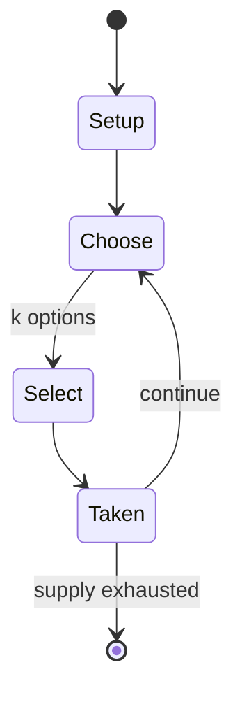

# What do you Meme?

*Card Game*

`what_do_you_meme` &nbsp; state: **DEEPENED** &nbsp; method: **heuristic**

## Found layer (recorded, not trusted)

| field | value |
| --- | --- |
| wikidata | Q75834547 |
| wikipedia | What Do You Meme? |
| genres (source) | -- |
| instance of (source) | card game, party game |
| country of origin | -- |

## Declared layer (orders bench work)

| field | value |
| --- | --- |
| year created | -- |
| epoch | -- |
| region | -- |
| media | CARD |
| players | -- |
| age band | -- |
| exogenous process | -- |
| loss shape | -- |
| live axes | SELECT |
| horizon | -- |
| scoring shape | -- |
| information | -- |
| interaction | -- |
| turn structure | -- |
| tractability | SAMPLING_ONLY |
| randomness | -- |
| luck factor | 0.35 |
| rules complexity | 2.42 |
| strategic depth | 2.25 |
| novelty | 0.0938 |
| solved status | -- |
| strategies | spatial_packing |
| algorithms | -- |

## Object model

```
Episode
  players      : ?
  turn_structure: ?
  horizon       : ?
  scoring       : ?

Deck           -- ordered multiset, drawn without replacement
Hand           -- private multiset held by one player
DiscardPile    -- public accumulation of spent cards
OptionSet      -- the choices available after an exogenous draw
```

## State transition diagram



## Research item -- turn trace

```
# What do you Meme? -- simulated turn events
# generated from the DECLARED vector, not from a rulebook.
# structure: exo=None loss=None horizon=None scoring=None axes=SELECT

t=0    SETUP        players=2  pot=0  capacity=6
t=1    SELECT       p1 3 options; take #3  (pot_gain=+3.2, capacity=-0)
t=2    ENDTURN      turn passes to p2
t=3    SELECT       p2 1 options; take #1  (pot_gain=+2.7, capacity=-0)
t=4    SELECT       p2 3 options; take #3  (pot_gain=+3.1, capacity=-2)
t=5    SELECT       p2 4 options; take #3  (pot_gain=+1.5, capacity=-2)
t=6    SELECT       p2 2 options; take #1  (pot_gain=+3.1, capacity=-2)
t=7    ENDTURN      turn passes to p1
t=8    SELECT       p1 4 options; take #3  (pot_gain=+1.7, capacity=-2)
t=9    SELECT       p1 1 options; take #1  (pot_gain=+2.2, capacity=-0)
t=10   ENDTURN      turn passes to p2
t=11   SELECT       p2 4 options; take #1  (pot_gain=+0.7, capacity=-0)
t=12   SELECT       p2 2 options; take #1  (pot_gain=+1.8, capacity=-0)
t=13   SELECT       p2 4 options; take #3  (pot_gain=+3.3, capacity=-1)
t=14   SELECT       p2 4 options; take #2  (pot_gain=+2.9, capacity=-1)
t=15   SELECT       p2 1 options; take #1  (pot_gain=+1.6, capacity=-2)
t=16   SELECT       p2 1 options; take #1  (pot_gain=+2.6, capacity=-2)
t=17   ENDTURN      turn passes to p1
t=18   SELECT       p1 3 options; take #3  (pot_gain=+2.2, capacity=-2)
t=19   ENDTURN      turn passes to p2
t=20   SELECT       p2 3 options; take #1  (pot_gain=+2.5, capacity=-2)
t=21   SELECT       p2 1 options; take #1  (pot_gain=+2.9, capacity=-1)
t=22   SELECT       p2 4 options; take #4  (pot_gain=+1.4, capacity=-0)
t=23   SELECT       p2 2 options; take #2  (pot_gain=+1.5, capacity=-2)
t=24   SELECT       p2 3 options; take #2  (pot_gain=+1.9, capacity=-2)
t=25   ENDTURN      turn passes to p1
t=26   SELECT       p1 4 options; take #1  (pot_gain=+2.8, capacity=-2)

terminal: VARIABLE
```

## Source extract

What Do You Meme? is a humorous party card game from Jerry Media in which players propose
caption cards as a match to a designated photo (or meme) card. The judge of the round chooses
the caption that they think is the best match to photo card, and whoever played that card gets a
point. The name of the game refers to internet memes and is a play on the phrase what do you
mean. The game has been compared to Cards Against Humanity. The game was created by Elliot
Tebele, Elie Ballas and Ben Kaplan in 2016. It was launched on Kickstarter on June 14, 2016, and
it exceeded its goal of $10,000. The following year, in 2017, it was the 9th best selling game
on Amazon.   == Gameplay == The game comes with 75 photo cards and 360 caption cards. Intended
for between three and twenty people at once, the game requires players to choose a caption card
to match a given photo card. A judge, called "The Jerry", chooses the funniest caption card out
of all those submitted during that round, and whoever had submitted it is the champion of the
round. What Do You Meme sells themed expansion packs. The game has partnered with various brands
to launch expansion packs such as the SpongeBob SquarePants Famil

<sub>Wikipedia, CC BY-SA. Retained as evidence for the structural
classification above. Every rule inferred from it is HYPOTHESIZED
until audited against a rulebook.</sub>
