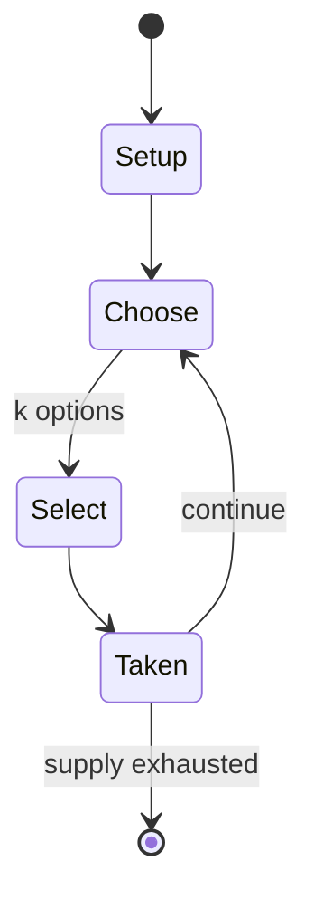

# white elephant gift exchange

*holiday party game*

`white_elephant_gift_exchange` &nbsp; state: **DEEPENED** &nbsp; method: **heuristic**

## Found layer (recorded, not trusted)

| field | value |
| --- | --- |
| wikidata | Q7995607 |
| wikipedia | White elephant gift exchange |
| genres (source) | -- |
| instance of (source) | party game |
| country of origin | -- |

## Declared layer (orders bench work)

| field | value |
| --- | --- |
| year created | -- |
| epoch | -- |
| region | -- |
| media | PARTY |
| players | -- |
| age band | -- |
| exogenous process | -- |
| loss shape | -- |
| live axes | SELECT, TRADE |
| horizon | -- |
| scoring shape | -- |
| information | -- |
| interaction | -- |
| turn structure | -- |
| tractability | SAMPLING_ONLY |
| randomness | HIDDEN_INFO |
| luck factor | 0.35 |
| rules complexity | 2.33 |
| strategic depth | 2.0 |
| novelty | 0.0938 |
| solved status | -- |
| strategies | -- |
| algorithms | -- |

## Object model

```
Episode
  players      : ?
  turn_structure: ?
  horizon       : ?
  scoring       : ?

OptionSet      -- the choices available after an exogenous draw
Offer          -- proposed exchange between two agents
```

## State transition diagram



## Research item -- turn trace

```
# white elephant gift exchange -- simulated turn events
# generated from the DECLARED vector, not from a rulebook.
# structure: exo=None loss=None horizon=None scoring=None axes=SELECT,TRADE

t=0    SETUP        players=2  pot=0  capacity=3
t=1    SELECT       p1 4 options; take #3  (pot_gain=+3.3, capacity=-2)
t=2    TRADE        p1 offers 2:1 exchange to p2
t=3    SELECT       p1 2 options; take #1  (pot_gain=+2.5, capacity=-1)
t=4    ENDTURN      turn passes to p2
t=5    SELECT       p2 4 options; take #4  (pot_gain=+1.1, capacity=-2)
t=6    TRADE        p2 offers 2:1 exchange to p1
t=7    SELECT       p2 3 options; take #3  (pot_gain=+3.2, capacity=-2)
t=8    SELECT       p2 3 options; take #2  (pot_gain=+3.1, capacity=-0)
t=9    SELECT       p2 3 options; take #3  (pot_gain=+1.1, capacity=-0)
t=10   SELECT       p2 1 options; take #1  (pot_gain=+2.6, capacity=-1)
t=11   TRADE        p2 offers 2:1 exchange to p1
t=12   SELECT       p2 4 options; take #3  (pot_gain=+2.3, capacity=-0)
t=13   SELECT       p2 1 options; take #1  (pot_gain=+2.7, capacity=-0)
t=14   SELECT       p2 2 options; take #1  (pot_gain=+2.7, capacity=-2)
t=15   SELECT       p2 1 options; take #1  (pot_gain=+2.3, capacity=-2)
t=16   SELECT       p2 3 options; take #1  (pot_gain=+0.7, capacity=-0)
t=17   TRADE        p2 offers 2:1 exchange to p1
t=18   SELECT       p2 4 options; take #4  (pot_gain=+3.0, capacity=-2)
t=19   TRADE        p2 offers 2:1 exchange to p1
t=20   SELECT       p2 3 options; take #1  (pot_gain=+1.4, capacity=-2)
t=21   SELECT       p2 1 options; take #1  (pot_gain=+1.2, capacity=-2)
t=22   TRADE        p2 offers 2:1 exchange to p1
t=23   SELECT       p2 2 options; take #2  (pot_gain=+1.4, capacity=-0)
t=24   SELECT       p2 3 options; take #3  (pot_gain=+1.0, capacity=-1)
t=25   TRADE        p2 offers 2:1 exchange to p1
t=26   ENDTURN      turn passes to p1

terminal: VARIABLE
```

## Conditions

| kind | threshold | effect | trigger |
| --- | --- | --- | --- |
| TERMINATE | -- | -- | The game is over when everyone has a present. |

## Source extract

A white elephant gift exchange, Yankee swap or Dirty Santa is a party game where amusing and
impractical gifts are exchanged during Christmas festivities. The goal of a white elephant gift
exchange is to entertain party-goers rather than to give or acquire a genuinely valuable or
highly sought-after item. In a Yankee swap, the gifts exchanged are more likely to be practical
or items that will be wanted by players. The game is played by opening gifts or "stealing" items
that other participants have opened.   == Etymology == The term white elephant refers to an
extravagant, impractical gift that cannot be easily disposed of. The phrase is said to come from
a perspective about the historic practice of the King of Siam (now Thailand) giving rare albino
elephants to courtiers who had displeased him, so that they might be ruined by the animals'
upkeep costs. However, there is no actual record of the King giving a white elephant
specifically to burden the recipients, and white elephants are considered to be highly valuable
and sacred in Thai culture, so much that any white elephant that is found must immediately be
brought to the King according to his legal ownership. The first use of thi

<sub>Wikipedia, CC BY-SA. Retained as evidence for the structural
classification above. Every rule inferred from it is HYPOTHESIZED
until audited against a rulebook.</sub>
