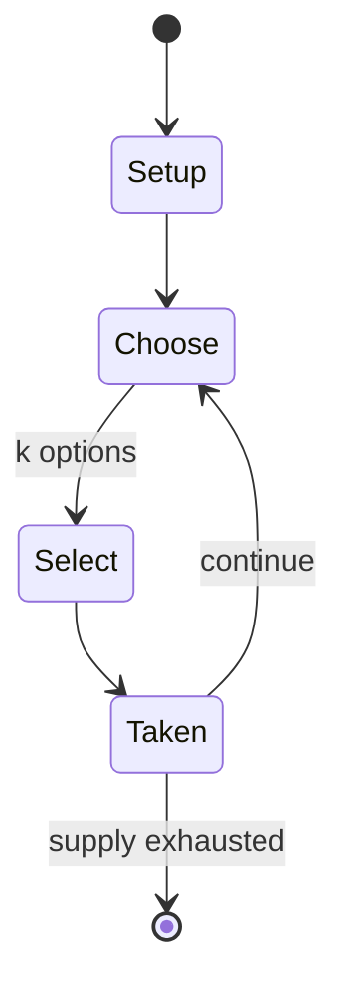

# Wii Message Board

`wii_message_board` &nbsp; state: **DEEPENED** &nbsp; method: **heuristic**

## Found layer (recorded, not trusted)

| field | value |
| --- | --- |
| wikidata | Q11254349 |
| wikipedia | Wii Message Board |
| genres (source) | -- |
| instance of (source) | bulletin board system, software, video game |
| country of origin | Japan |

## Declared layer (orders bench work)

| field | value |
| --- | --- |
| year created | 2010 |
| epoch | CONTEMPORARY |
| region | EAST_ASIA |
| media | PUZZLE, VIDEO |
| players | -- |
| age band | -- |
| exogenous process | -- |
| loss shape | -- |
| live axes | SELECT, SPATIAL |
| horizon | -- |
| scoring shape | SET_COLLECTION_CONVEX |
| information | -- |
| interaction | -- |
| turn structure | -- |
| tractability | SAMPLING_ONLY |
| randomness | HIDDEN_INFO |
| luck factor | 0.35 |
| rules complexity | 3.0 |
| strategic depth | 2.5 |
| novelty | 0.4137 |
| solved status | -- |
| strategies | route_optimisation, set_collection |
| algorithms | -- |

## Object model

```
Episode
  players      : ?
  turn_structure: ?
  horizon       : ?
  scoring       : SET_COLLECTION_CONVEX

Configuration  -- the arrangement to be resolved
Constraint     -- predicate a legal configuration must satisfy
WorldState     -- simulation state advanced by the engine
Avatar         -- player-controlled agent
Clock          -- frame or tick counter
OptionSet      -- the choices available after an exogenous draw
Placement      -- position subject to geometric legality
```

## State transition diagram



## Research item -- turn trace

```
# Wii Message Board -- simulated turn events
# generated from the DECLARED vector, not from a rulebook.
# structure: exo=None loss=None horizon=None scoring=SET_COLLECTION_CONVEX axes=SELECT,SPATIAL

t=0    SETUP        players=2  pot=0  capacity=8
t=1    SELECT       p1 1 options; take #1  (pot_gain=+0.8, capacity=-2)
t=2    SELECT       p1 1 options; take #1  (pot_gain=+1.5, capacity=-2)
t=3    SELECT       p1 3 options; take #2  (pot_gain=+2.7, capacity=-2)
t=4    SPATIAL      p1 places at (1,3); adjacency legal
t=5    SELECT       p1 2 options; take #2  (pot_gain=+0.6, capacity=-1)
t=6    ENDTURN      turn passes to p2
t=7    SELECT       p2 2 options; take #2  (pot_gain=+3.4, capacity=-0)
t=8    SELECT       p2 3 options; take #1  (pot_gain=+1.7, capacity=-0)
t=9    SPATIAL      p2 places at (0,4); adjacency legal
t=10   SELECT       p2 1 options; take #1  (pot_gain=+1.5, capacity=-1)
t=11   SELECT       p2 3 options; take #3  (pot_gain=+3.1, capacity=-0)
t=12   SELECT       p2 1 options; take #1  (pot_gain=+3.1, capacity=-1)
t=13   SPATIAL      p2 places at (7,0); adjacency legal
t=14   SELECT       p2 1 options; take #1  (pot_gain=+3.3, capacity=-2)
t=15   SELECT       p2 3 options; take #1  (pot_gain=+3.0, capacity=-1)
t=16   SELECT       p2 3 options; take #3  (pot_gain=+2.3, capacity=-2)
t=17   ENDTURN      turn passes to p1
t=18   SELECT       p1 3 options; take #3  (pot_gain=+3.0, capacity=-1)
t=19   ENDTURN      turn passes to p2
t=20   SELECT       p2 3 options; take #2  (pot_gain=+0.5, capacity=-2)
t=21   SELECT       p2 4 options; take #3  (pot_gain=+2.3, capacity=-1)
t=22   SPATIAL      p2 places at (3,1); adjacency legal
t=23   ENDTURN      turn passes to p1
t=24   SELECT       p1 1 options; take #1  (pot_gain=+2.2, capacity=-2)
t=25   SELECT       p1 4 options; take #1  (pot_gain=+1.9, capacity=-0)
t=26   SELECT       p1 2 options; take #1  (pot_gain=+2.6, capacity=-1)

terminal: VARIABLE
```

## Conditions

| kind | threshold | effect | trigger |
| --- | --- | --- | --- |
| BOUNDARY | -- | -- | The Wii Remote can hold a maximum of ten Miis. |
| BOUNDARY | -- | -- | The temporary internet files (maximum of 5MB for the trial version) can only be saved to the Wii's internal memory. |

## Source extract

The Wii system software is the software frontend on the Wii, a home video game console by
Nintendo. Updates could be downloaded over the internet or read from a game disc, allowing
Nintendo to add additional features, channels and patch security vulnerabilities. When a new
update became available, Nintendo sent a message to the Wii Message Board of internet-connected
systems notifying them of the available update. Most game discs, including first-party and
third-party games, include system software updates, which allow systems that are not connected
to the internet to still receive updates. The system menu will not start such games if their
updates have not been installed, and would force users to install updates in order to play these
games. Some games, such as online games like Super Smash Bros. Brawl and Mario Kart Wii, contain
specific extra updates, such as the ability to receive Wii Message Board posts from game-
specific addresses; therefore, these games would require an update to be installed before they
could be played on a console for the first time.   == Technology ==   === IOS === The Wii's
firmware has many active branches known as IOSes, thought by the Wii homebrew dev

<sub>Wikipedia, CC BY-SA. Retained as evidence for the structural
classification above. Every rule inferred from it is HYPOTHESIZED
until audited against a rulebook.</sub>
