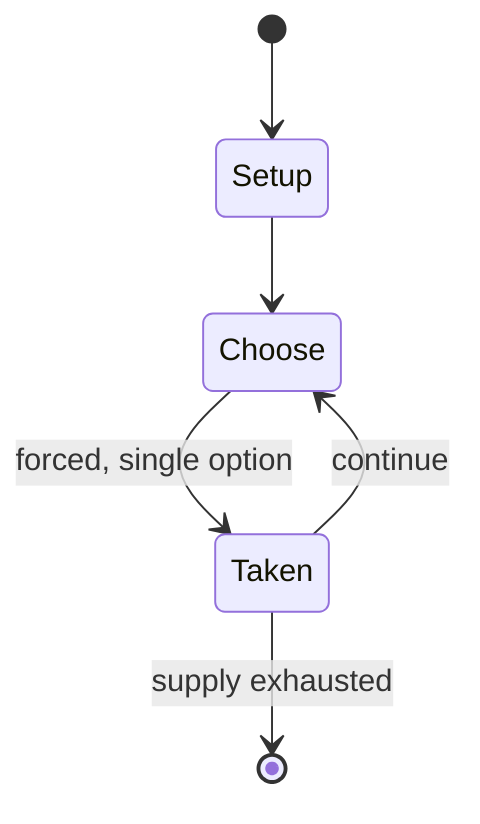

# Wingspan (board game)

`wingspan_board_game` &nbsp; state: **DEEPENED** &nbsp; method: **heuristic**

## Found layer (recorded, not trusted)

| field | value |
| --- | --- |
| wikidata | Q65784798 |
| wikipedia | Wingspan (board game) |
| genres (source) | -- |
| instance of (source) | -- |
| country of origin | -- |

## Declared layer (orders bench work)

| field | value |
| --- | --- |
| year created | 2019 |
| epoch | CONTEMPORARY |
| region | -- |
| media | BOARD |
| players | -- |
| age band | -- |
| exogenous process | -- |
| loss shape | -- |
| live axes | TRADE |
| horizon | -- |
| scoring shape | SET_COLLECTION_CONVEX |
| information | -- |
| interaction | COOPERATIVE |
| turn structure | STRICT_TURN |
| tractability | SAMPLING_ONLY |
| randomness | -- |
| luck factor | 0.35 |
| rules complexity | 2.51 |
| strategic depth | 3.0 |
| novelty | 0.6366 |
| solved status | -- |
| strategies | engine_building, route_optimisation, set_collection, spatial_packing |
| algorithms | -- |

## Object model

```
Episode
  players      : ?
  turn_structure: STRICT_TURN
  horizon       : ?
  scoring       : SET_COLLECTION_CONVEX

Board          -- spatial substrate; cells carry position and occupancy
Piece          -- movable token owned by a player
Offer          -- proposed exchange between two agents
```

## State transition diagram



## Research item -- turn trace

```
# Wingspan (board game) -- simulated turn events
# generated from the DECLARED vector, not from a rulebook.
# structure: exo=None loss=None horizon=None scoring=SET_COLLECTION_CONVEX axes=TRADE

t=0    SETUP        players=2  pot=0  capacity=3
t=1    FORCED       p1 single legal option taken (pot_gain=+1.6)
t=2    TRADE        p1 offers 2:1 exchange to p2
t=3    FORCED       p1 single legal option taken (pot_gain=+1.4)
t=4    TRADE        p1 offers 2:1 exchange to p2
t=5    FORCED       p1 single legal option taken (pot_gain=+0.8)
t=6    FORCED       p1 single legal option taken (pot_gain=+1.8)
t=7    FORCED       p1 single legal option taken (pot_gain=+0.9)
t=8    TRADE        p1 offers 2:1 exchange to p2
t=9    ENDTURN      turn passes to p2
t=10   FORCED       p2 single legal option taken (pot_gain=+0.7)
t=11   FORCED       p2 single legal option taken (pot_gain=+1.4)
t=12   FORCED       p2 single legal option taken (pot_gain=+0.8)
t=13   TRADE        p2 offers 2:1 exchange to p1
t=14   ENDTURN      turn passes to p1
t=15   FORCED       p1 single legal option taken (pot_gain=+1.6)
t=16   TRADE        p1 offers 2:1 exchange to p2
t=17   ENDTURN      turn passes to p2
t=18   FORCED       p2 single legal option taken (pot_gain=+1.4)
t=19   FORCED       p2 single legal option taken (pot_gain=+1.7)
t=20   TRADE        p2 offers 2:1 exchange to p1
t=21   ENDTURN      turn passes to p1
t=22   FORCED       p1 single legal option taken (pot_gain=+1.6)
t=23   TRADE        p1 offers 2:1 exchange to p2
t=24   FORCED       p1 single legal option taken (pot_gain=+1.2)
t=25   FORCED       p1 single legal option taken (pot_gain=+1.4)
t=26   ENDTURN      turn passes to p2

terminal: VARIABLE
```

## Source extract

Wingspan is a board game designed by Elizabeth Hargrave and published by Stonemaier Games in
2019. It is a medium-weight, card-driven, engine-building board game in which players compete to
attract birds to their wildlife preserves. During the game's development process, Hargrave
constructed personal charts of birds observed in Maryland, with statistics sourced from various
biological databases; the special powers of birds were also selected to resemble real-life
characteristics.  Upon its release, Wingspan received critical and commercial acclaim for its
gameplay, accurate thematic elements, and artwork. The game also won numerous awards, including
the prestigious 2019 Kennerspiel des Jahres. Several expansions and a digital edition have been
subsequently published. Wingspan has sold over 2.6 million copies worldwide and has been
translated into 27 languages to date.   == Development == Wingspan was designed by Elizabeth
Hargrave, a health consultant in Silver Spring, amateur birder, and former policy analyst for
NORC at the University of Chicago. The game was inspired by Hargrave's visits to Lake Artemesia
near her home in Maryland. Hargrave stated that she selected the theme bec

<sub>Wikipedia, CC BY-SA. Retained as evidence for the structural
classification above. Every rule inferred from it is HYPOTHESIZED
until audited against a rulebook.</sub>
