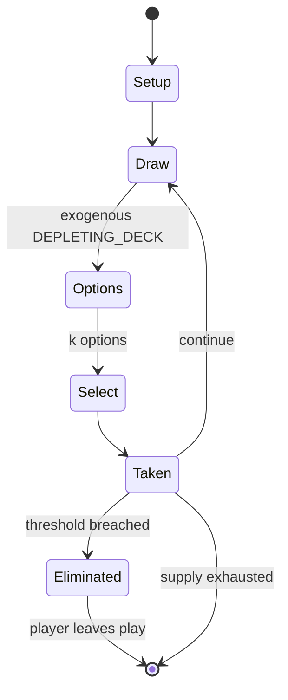

# Wink murder

`wink_murder` &nbsp; state: **DEEPENED** &nbsp; method: **heuristic**

## Found layer (recorded, not trusted)

| field | value |
| --- | --- |
| wikidata | Q1947339 |
| wikipedia | Wink murder |
| genres (source) | -- |
| instance of (source) | -- |
| country of origin | -- |

## Declared layer (orders bench work)

| field | value |
| --- | --- |
| year created | -- |
| epoch | -- |
| region | -- |
| media | CARD, PARTY |
| players | -- |
| age band | CHILD |
| exogenous process | DEPLETING_DECK |
| loss shape | ELIMINATION |
| live axes | SELECT |
| horizon | -- |
| scoring shape | SURVIVAL |
| information | IMPERFECT |
| interaction | SOLITAIRE |
| turn structure | TICK_BASED |
| tractability | EXACT_WITH_CUT |
| randomness | DICE, HIDDEN_INFO |
| luck factor | 0.63 |
| rules complexity | 2.52 |
| strategic depth | 2.54 |
| novelty | 0.9354 |
| solved status | -- |
| strategies | area_control, deduction, opponent_modelling |
| algorithms | -- |

## Object model

```
Episode
  players      : ?
  turn_structure: TICK_BASED
  horizon       : ?
  scoring       : SURVIVAL

Deck           -- ordered multiset, drawn without replacement
Hand           -- private multiset held by one player
DiscardPile    -- public accumulation of spent cards
OptionSet      -- the choices available after an exogenous draw
```

## State transition diagram



## Research item -- clock trace

```
# Wink murder -- simulated clock trace (no turn boundary)
# generated from the DECLARED vector, not from a rulebook.
# structure: exo=DEPLETING_DECK loss=ELIMINATION horizon=None scoring=SURVIVAL axes=SELECT

clk=0.000s  START        agents=4  clock=free running
clk=1.843s  ACTION       a4 acts continuously; no turn boundary crossed
clk=3.166s  CONTEST      a4 and a1 contend for the same resource
clk=4.148s  SCORE        a1 scores (+1)
clk=6.020s  ACTION       a1 acts continuously; no turn boundary crossed
clk=6.482s  CONTEST      a1 and a2 contend for the same resource
clk=9.271s  CONTEST      a2 and a3 contend for the same resource
clk=9.930s  CONTEST      a4 and a1 contend for the same resource
clk=11.405s  ACTION       a2 acts continuously; no turn boundary crossed
clk=12.462s  ACTION       a1 acts continuously; no turn boundary crossed
clk=15.410s  ACTION       a4 acts continuously; no turn boundary crossed
clk=16.584s  SCORE        a2 scores (+2)
clk=18.331s  SCORE        a1 scores (+3)
clk=19.649s  SCORE        a3 scores (+2)
clk=21.678s  STOPPAGE     clock halts; state frozen
clk=22.423s  CONTEST      a4 and a1 contend for the same resource
clk=22.635s  ACTION       a2 acts continuously; no turn boundary crossed
clk=25.096s  CONTEST      a3 and a4 contend for the same resource
clk=27.843s  ACTION       a2 acts continuously; no turn boundary crossed
clk=29.879s  CONTEST      a2 and a3 contend for the same resource
clk=32.315s  ACTION       a4 acts continuously; no turn boundary crossed
clk=32.898s  CONTEST      a2 and a3 contend for the same resource
clk=33.591s  STOPPAGE     clock halts; state frozen
clk=36.408s  SCORE        a1 scores (+3)
clk=36.928s  INFRACTION   a1 commits infraction (count=1)
clk=38.320s  STOPPAGE     clock halts; state frozen
clk=38.992s  CONTEST      a2 and a3 contend for the same resource

note: elapsed time, not move count, is the episode's ordering variable.
```

## Conditions

| kind | threshold | effect | trigger |
| --- | --- | --- | --- |
| BOUNDARY | 6 players | -- | The practical minimum number of players is four, but the spirit of the game is best captured by groups of at least six players or more. |
| ELIMINATE | -- | eliminated | If the accuser is correct, they win the game, otherwise they are eliminated. |
| ELIMINATE | -- | -- | In some variants, a wrongly accused player is also eliminated. |
| TERMINATE | -- | -- | Only when properly accused the murderer must admit to guilt and the game is over, with the loss of the murderer. |
| BOUNDARY | -- | -- | Identities are given out at the beginning with ace of spades as murderer (depending on number of players, there can be multiple murderers), kings are detectives (at least double the number of murderers), all other cards  |

## Source extract

Wink murder is a party game or parlour game in which a secretly selected player is able to
"kill" others by winking at them, while the surviving players try to identify the killer. The
game is also variously known as murder wink, killer, murder in the dark, lonely ghost and killer
killer. The practical minimum number of players is four, but the spirit of the game is best
captured by groups of at least six players or more. The game may be played with all players
seated in a circle, or wandering around many rooms at a social event.   == Gameplay == In each
round of play, one player is secretly assigned the role of "murderer", and one is assigned
detective. The detective is sent to leave, and the murderer is chosen and everyone except the
detective knows who the murderer is. The players stand in a circle and the detective is called
in. The detective stands in the circle and slowly spins, and if someone dies the detective has
to guess the murderer. The detective gets 3 chances, and if the detective guesses wrong, the
innocent person dies. The objective of the murderer is to murder as many people as possible
without being caught.   == Detective == In one variant of the game, sometimes p

<sub>Wikipedia, CC BY-SA. Retained as evidence for the structural
classification above. Every rule inferred from it is HYPOTHESIZED
until audited against a rulebook.</sub>
