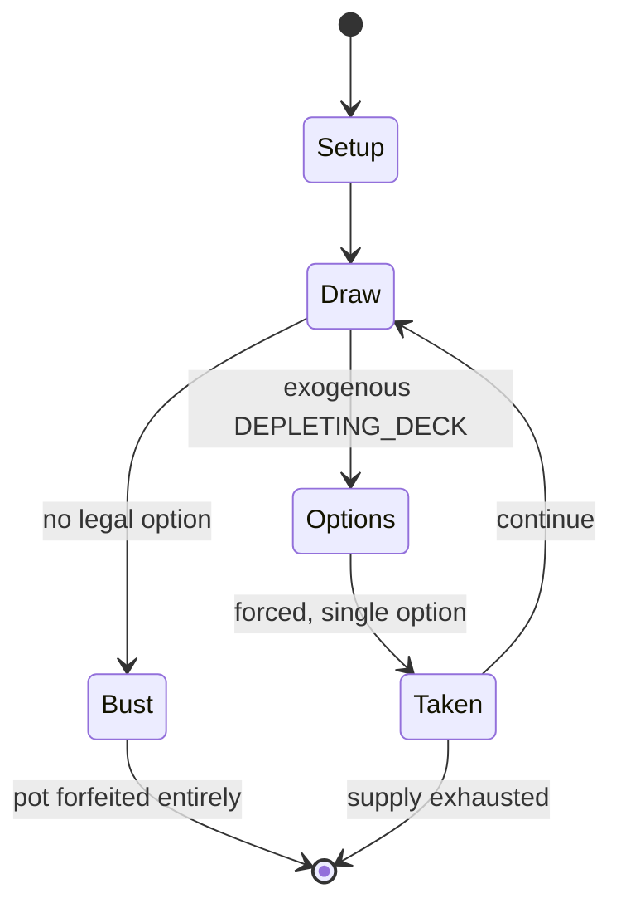

# WIXOSS

*Japanese collectible card game, launched by Tomy in 2014*

`wixoss` &nbsp; state: **DEEPENED** &nbsp; method: **heuristic**

## Found layer (recorded, not trusted)

| field | value |
| --- | --- |
| wikidata | Q17128296 |
| wikipedia | WIXOSS |
| genres (source) | -- |
| instance of (source) | collectible card game, fictional universe |
| country of origin | Japan |

## Declared layer (orders bench work)

| field | value |
| --- | --- |
| year created | 2014 |
| epoch | CONTEMPORARY |
| region | EAST_ASIA |
| media | CARD, COLLECTIBLE |
| players | -- |
| age band | -- |
| exogenous process | DEPLETING_DECK |
| loss shape | TOTAL_RUIN |
| live axes | TRADE |
| horizon | -- |
| scoring shape | -- |
| information | -- |
| interaction | COMPETITIVE |
| turn structure | PHASE_STRUCTURED |
| tractability | EXACT_WITH_CUT |
| randomness | DECK_SHUFFLE |
| luck factor | 0.48 |
| rules complexity | 3.36 |
| strategic depth | 2.0 |
| novelty | 0.7184 |
| solved status | -- |
| strategies | route_optimisation |
| algorithms | -- |

## Object model

```
Episode
  players      : ?
  turn_structure: PHASE_STRUCTURED
  horizon       : ?
  scoring       : ?

Deck           -- ordered multiset, drawn without replacement
Hand           -- private multiset held by one player
DiscardPile    -- public accumulation of spent cards
Offer          -- proposed exchange between two agents
```

## State transition diagram



## Research item -- turn trace

```
# WIXOSS -- simulated turn events
# generated from the DECLARED vector, not from a rulebook.
# structure: exo=DEPLETING_DECK loss=TOTAL_RUIN horizon=None scoring=None axes=TRADE

t=0    SETUP        players=2  pot=0  capacity=8
t=1    DRAW         p1 draw from deck -> outcome #6  (p=0.151)
t=2    FORCED       p1 single legal option taken (pot_gain=+1.5)
t=3    DRAW         p1 draw from deck -> outcome #6  (p=0.294)
t=4    FORCED       p1 single legal option taken (pot_gain=+0.9)
t=5    TRADE        p1 offers 2:1 exchange to p2
t=6    ENDTURN      turn passes to p2
t=7    DRAW         p2 draw from deck -> outcome #5  (p=0.096)
t=8    FORCED       p2 single legal option taken (pot_gain=+1.1)
t=9    DRAW         p2 draw from deck -> outcome #6  (p=0.194)
t=10   DEATH        p2 no legal option -- BUST. pot 3.5 -> 0.0
t=11   NOTE         loss_shape=TOTAL_RUIN: entire pot forfeited

terminal: VARIABLE
```

## Conditions

| kind | threshold | effect | trigger |
| --- | --- | --- | --- |
| BOUNDARY | 40 cards | -- | Main decks can have only 40 cards, being SIGNI (main deck pawns) and Spells of a player's choice, but can hold no more than four of the same-named cards and no more than 20 Life Burst (✱) marked cards, regardless of name |
| ELIMINATE | -- | -- | LRIGs act as the main heroines of player's field and cannot be removed from play. |
| BOUNDARY | -- | -- | Assist LRIGs, which support the main one and the rest of the field through their effects while slightly increasing the SIGNI LIMIT of the Main LRIG. |
| BOUNDARY | -- | -- | SIGNI at levels 2,3,3 would be the SIGNI team composition because they do not count above the limit of 8, nor does a SIGNI team composition of Levels 2,2,1). |

## Source extract

WIXOSS (pronounced whii-kros) is a Japanese gacha strategy Trading Card Game created by Hobby
Japan along with lead game designer Shouta Yasooka, and first published by Takara Tomy in April
2014 in Japan and in November 2021 for English audiences. The game has spawned a multimedia
franchise produced as a collaboration between Takara Tomy, J.C.Staff, and Warner Bros.
Entertainment Japan. The stories in multimedia revolves around the eponymous trading card game
and follows girls known as Selectors who battle against each other in order to have their wishes
granted. An anime television series by J.C.Staff, titled selector infected WIXOSS, aired in
Japan between April and June 2014, with a second season, selector spread WIXOSS, airing between
October and December 2014. A compilation film, titled selector destructed WIXOSS, was released
on February 13, 2016. A sequel anime television series, titled Lostorage incited WIXOSS, aired
from October to December 2016, with its second season, Lostorage conflated WIXOSS, airing from
April to June 2018. Another anime television series, titled WIXOSS Diva(A)Live, aired from
January to March 2021. Several manga spin-offs, a novelization, and a smart

<sub>Wikipedia, CC BY-SA. Retained as evidence for the structural
classification above. Every rule inferred from it is HYPOTHESIZED
until audited against a rulebook.</sub>
