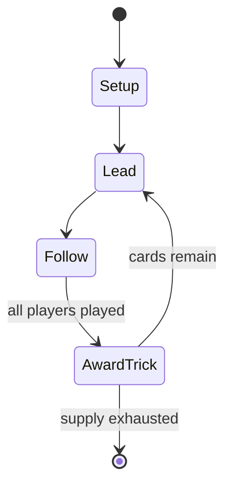

# Wizard

*trick-taking card game*

`wizard` &nbsp; state: **DEEPENED** &nbsp; method: **heuristic**

## Found layer (recorded, not trusted)

| field | value |
| --- | --- |
| wikidata | Q2587022 |
| wikipedia | Wizard (card game) |
| genres (source) | -- |
| instance of (source) | trick-taking game |
| country of origin | Canada |

## Declared layer (orders bench work)

| field | value |
| --- | --- |
| year created | 1984 |
| epoch | DIGITAL |
| region | NORTH_AMERICA |
| media | CARD, TRICK_TAKING |
| players | 3-6 |
| age band | -- |
| exogenous process | DEPLETING_DECK |
| loss shape | -- |
| live axes | BID |
| horizon | VARIABLE |
| scoring shape | SET_COLLECTION_CONVEX |
| information | -- |
| interaction | COMPETITIVE |
| turn structure | TRICK_ROUND |
| tractability | EXACT_WITH_CUT |
| randomness | DECK_DEPLETING |
| luck factor | 0.48 |
| rules complexity | 2.16 |
| strategic depth | 2.25 |
| novelty | 0.7365 |
| solved status | -- |
| strategies | set_collection |
| algorithms | -- |

## Object model

```
Episode
  players      : 3-6
  turn_structure: TRICK_ROUND
  horizon       : VARIABLE
  scoring       : SET_COLLECTION_CONVEX

Deck           -- ordered multiset, drawn without replacement
Hand           -- private multiset held by one player
DiscardPile    -- public accumulation of spent cards
Trick          -- one card per player; a winner is determined
Trump          -- suit that dominates the ordering
Auction        -- priced competition resolving to one winner
```

## State transition diagram



## Research item -- turn trace

```
# Wizard -- simulated turn events
# generated from the DECLARED vector, not from a rulebook.
# structure: exo=DEPLETING_DECK loss=None horizon=VARIABLE scoring=SET_COLLECTION_CONVEX axes=BID

t=0    SETUP        players=3  pot=0  capacity=4
t=1    DRAW         p1 draw from deck -> outcome #2  (p=0.009)
t=2    FORCED       p1 single legal option taken (pot_gain=+1.7)
t=3    ENDTURN      turn passes to p2
t=4    DRAW         p2 draw from deck -> outcome #4  (p=0.269)
t=5    FORCED       p2 single legal option taken (pot_gain=+1.0)
t=6    ENDTURN      turn passes to p3
t=7    DRAW         p3 draw from deck -> outcome #4  (p=0.057)
t=8    FORCED       p3 single legal option taken (pot_gain=+0.6)
t=9    BID          p3 sealed bid of 6 against 2 rivals
t=10   DRAW         p3 draw from deck -> outcome #1  (p=0.141)
t=11   FORCED       p3 single legal option taken (pot_gain=+1.1)
t=12   DRAW         p3 draw from deck -> outcome #6  (p=0.160)
t=13   FORCED       p3 single legal option taken (pot_gain=+0.9)
t=14   DRAW         p3 draw from deck -> outcome #1  (p=0.012)
t=15   FORCED       p3 single legal option taken (pot_gain=+0.7)
t=16   DRAW         p3 draw from deck -> outcome #6  (p=0.108)
t=17   FORCED       p3 single legal option taken (pot_gain=+1.5)
t=18   ENDTURN      turn passes to p1
t=19   DRAW         p1 draw from deck -> outcome #2  (p=0.105)
t=20   FORCED       p1 single legal option taken (pot_gain=+1.4)
t=21   BID          p1 sealed bid of 1 against 2 rivals
t=22   DRAW         p1 draw from deck -> outcome #1  (p=0.056)
t=23   FORCED       p1 single legal option taken (pot_gain=+1.2)
t=24   BID          p1 sealed bid of 5 against 2 rivals
t=25   ENDTURN      turn passes to p2
t=26   DRAW         p2 draw from deck -> outcome #1  (p=0.142)
t=27   FORCED       p2 single legal option taken (pot_gain=+1.0)

terminal: VARIABLE
```

## Conditions

| kind | threshold | effect | trigger |
| --- | --- | --- | --- |
| BOUNDARY | 30 points | -- | Since a correct bid of 1 yields 30 points, and a correct bid of 0 only yields 20, a bid of 1 over time yields more points as long as the player has at least a 42.86% chance of winning the trick. |
| WIN | -- | -- | The player with most points after all rounds have been played is the winner. |
| BOUNDARY | -- | -- | Each nation is invited to send a maximum of two representatives to the annual event. |

## Source extract

Wizard is a trick-taking card game for three to six players designed by Ken Fisher of Toronto,
Ontario in 1984. The game was first printed commercially in June 1986. The game is based on oh
hell. A Wizard deck consists of 60 cards: a regular set of 52 playing cards (replaced with
custom symbols and colours in some editions), 4 Wizards and 4 Jesters. The Jesters have the
lowest value, then the two up to thirteen, then Aces and lastly Wizards as highest in value.
== Gameplay ==  The objective of the game is to bid correctly on the number of tricks that a
player will take in the subsequent round of play. Points are awarded for a correct bid and
subtracted for an incorrect bid. The player with most points after all rounds have been played
is the winner. The game is played in a number of rounds from 10 to 20, depending on the number
of players, and each round consists of three stages: Dealing, Bidding, and Playing. In the first
round every player gets one card. In the subsequent rounds the number of cards is increased by
one until all cards are distributed. That means that three players play 20 rounds, four players
15 rounds, five players 12 rounds and six players 10 rounds. The top c

<sub>Wikipedia, CC BY-SA. Retained as evidence for the structural
classification above. Every rule inferred from it is HYPOTHESIZED
until audited against a rulebook.</sub>
