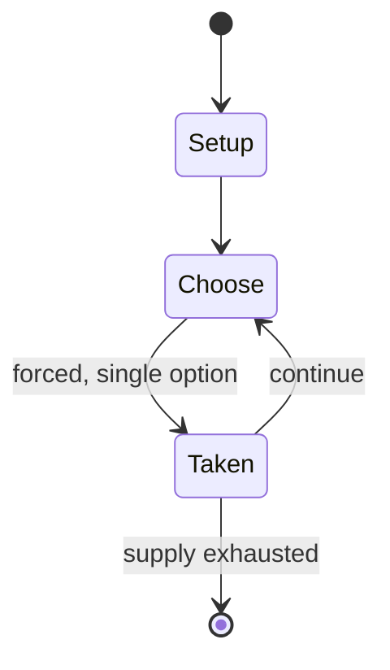

# Wplace

*web-based social art project*

`wplace` &nbsp; state: **DEEPENED** &nbsp; method: **heuristic**

## Found layer (recorded, not trusted)

| field | value |
| --- | --- |
| wikidata | Q135676968 |
| wikipedia | Wplace |
| genres (source) | -- |
| instance of (source) | video game, website |
| country of origin | Brazil |

## Declared layer (orders bench work)

| field | value |
| --- | --- |
| year created | 2025 |
| epoch | CONTEMPORARY |
| region | SOUTH_AMERICA |
| media | VIDEO |
| players | -- |
| age band | -- |
| exogenous process | -- |
| loss shape | -- |
| live axes | - |
| horizon | -- |
| scoring shape | LINEAR_ACCUMULATION |
| information | -- |
| interaction | -- |
| turn structure | -- |
| tractability | SAMPLING_ONLY |
| randomness | -- |
| luck factor | 0.35 |
| rules complexity | 1.8 |
| strategic depth | 2.0 |
| novelty | 0.4924 |
| solved status | -- |
| strategies | -- |
| algorithms | -- |

## Object model

```
Episode
  players      : ?
  turn_structure: ?
  horizon       : ?
  scoring       : LINEAR_ACCUMULATION

WorldState     -- simulation state advanced by the engine
Avatar         -- player-controlled agent
Clock          -- frame or tick counter
```

## State transition diagram



## Research item -- turn trace

```
# Wplace -- simulated turn events
# generated from the DECLARED vector, not from a rulebook.
# structure: exo=None loss=None horizon=None scoring=LINEAR_ACCUMULATION axes=-

t=0    SETUP        players=2  pot=0  capacity=7
t=1    FORCED       p1 single legal option taken (pot_gain=+1.0)
t=2    FORCED       p1 single legal option taken (pot_gain=+1.9)
t=3    FORCED       p1 single legal option taken (pot_gain=+0.8)
t=4    FORCED       p1 single legal option taken (pot_gain=+0.9)
t=5    FORCED       p1 single legal option taken (pot_gain=+0.5)
t=6    ENDTURN      turn passes to p2
t=7    FORCED       p2 single legal option taken (pot_gain=+1.8)
t=8    FORCED       p2 single legal option taken (pot_gain=+1.6)
t=9    ENDTURN      turn passes to p1
t=10   FORCED       p1 single legal option taken (pot_gain=+1.5)
t=11   ENDTURN      turn passes to p2
t=12   FORCED       p2 single legal option taken (pot_gain=+1.9)
t=13   FORCED       p2 single legal option taken (pot_gain=+1.8)
t=14   ENDTURN      turn passes to p1
t=15   FORCED       p1 single legal option taken (pot_gain=+1.8)
t=16   FORCED       p1 single legal option taken (pot_gain=+1.0)
t=17   FORCED       p1 single legal option taken (pot_gain=+0.8)
t=18   FORCED       p1 single legal option taken (pot_gain=+0.9)
t=19   FORCED       p1 single legal option taken (pot_gain=+0.6)
t=20   FORCED       p1 single legal option taken (pot_gain=+1.7)
t=21   ENDTURN      turn passes to p2
t=22   FORCED       p2 single legal option taken (pot_gain=+0.8)
t=23   ENDTURN      turn passes to p1
t=24   FORCED       p1 single legal option taken (pot_gain=+1.7)
t=25   FORCED       p1 single legal option taken (pot_gain=+1.3)
t=26   FORCED       p1 single legal option taken (pot_gain=+1.7)

terminal: VARIABLE
```

## Conditions

| kind | threshold | effect | trigger |
| --- | --- | --- | --- |
| BOUNDARY | 30 seconds | -- | Users begin with a limited pool of 30 pixels they can place and regain one spent pixel every 30 seconds as the maximum pool expands by 2 every time the user levels up by drawing a certain amount of pixels. |
| PENALTY | -- | -- | Due to the very high number of concurrent users, the website has experienced many technical issues that blocked leaderboards and prevented new users from registering, despite allowing already existing users to edit the c |

## Source extract

Wplace is a collaborative pixel art website developed by Brazilian developer Murilo Matsubara
and launched on 21 July 2025, in which users can edit the canvas by changing the color of pixels
on the world map. The website is based on r/place, a collaborative project that was hosted on
Reddit.   == Overview == Inspired by r/place, a recurring collaborative project hosted on
Reddit, Wplace enables individual users to edit an online canvas of a world map by changing any
of the four trillion square pixels available. Users begin with a limited pool of 30 pixels they
can place and regain one spent pixel every 30 seconds as the maximum pool expands by 2 every
time the user levels up by drawing a certain amount of pixels. Those limitations encourage users
to either work slowly, hoping their progress is not ruined, or collaborate with other users,
especially on large-scale projects. The site also features a leaderboard that shows which
country and region host the most pixels. Such rules result in frequent wars between users, where
every author tries to finish their own picture, sometimes destroying previous or neighboring
images. Users, by leveling up and placing pixels, accumulate "droplets

<sub>Wikipedia, CC BY-SA. Retained as evidence for the structural
classification above. Every rule inferred from it is HYPOTHESIZED
until audited against a rulebook.</sub>
