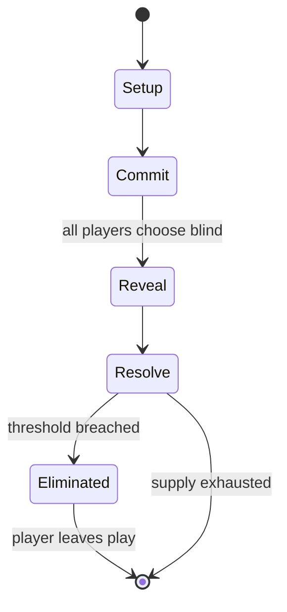

# Xiangqi

`xiangqi` &nbsp; state: **DEEPENED** &nbsp; method: **heuristic**

## Found layer (recorded, not trusted)

| field | value |
| --- | --- |
| wikidata | Q191448 |
| wikipedia | Xiangqi |
| genres (source) | -- |
| instance of (source) | -- |
| country of origin | -- |

## Declared layer (orders bench work)

| field | value |
| --- | --- |
| year created | -- |
| epoch | -- |
| region | -- |
| media | BOARD |
| players | 2 |
| age band | -- |
| exogenous process | NONE |
| loss shape | ELIMINATION |
| live axes | COMMIT_BLIND, ORDER, SPATIAL, TIMING |
| horizon | -- |
| scoring shape | WINNER_TAKE_ALL |
| information | SIMULTANEOUS |
| interaction | COMPETITIVE |
| turn structure | SIMULTANEOUS |
| tractability | SAMPLING_ONLY |
| randomness | SIMULTANEOUS_CHOICE |
| luck factor | 0.05 |
| rules complexity | 3.6 |
| strategic depth | 2.5 |
| novelty | 0.8016 |
| solved status | -- |
| strategies | blocking, sacrifice |
| algorithms | -- |

## Object model

```
Episode
  players      : 2
  turn_structure: SIMULTANEOUS
  horizon       : ?
  scoring       : WINNER_TAKE_ALL

Board          -- spatial substrate; cells carry position and occupancy
Piece          -- movable token owned by a player
SealedChoice   -- irrevocable choice made without observation
Sequence       -- the permutation under the player's control
Placement      -- position subject to geometric legality
Initiative     -- who acts, and when, relative to others
```

## State transition diagram



## Research item -- turn trace

```
# Xiangqi -- simulated turn events
# generated from the DECLARED vector, not from a rulebook.
# structure: exo=NONE loss=ELIMINATION horizon=None scoring=WINNER_TAKE_ALL axes=COMMIT_BLIND,ORDER,SPATIAL,TIMING

t=0    SETUP        players=2  pot=0  capacity=6
t=1    FORCED       p1 single legal option taken (pot_gain=+0.6)
t=2    FORCED       p1 single legal option taken (pot_gain=+1.1)
t=3    ENDTURN      turn passes to p2
t=4    FORCED       p2 single legal option taken (pot_gain=+1.7)
t=5    FORCED       p2 single legal option taken (pot_gain=+1.5)
t=6    SPATIAL      p2 places at (5,3); adjacency legal
t=7    ENDTURN      turn passes to p1
t=8    FORCED       p1 single legal option taken (pot_gain=+1.9)
t=9    FORCED       p1 single legal option taken (pot_gain=+0.7)
t=10   SPATIAL      p1 places at (1,2); adjacency legal
t=11   FORCED       p1 single legal option taken (pot_gain=+1.3)
t=12   FORCED       p1 single legal option taken (pot_gain=+1.3)
t=13   SPATIAL      p1 places at (5,4); adjacency legal
t=14   ENDTURN      turn passes to p2
t=15   FORCED       p2 single legal option taken (pot_gain=+1.6)
t=16   FORCED       p2 single legal option taken (pot_gain=+1.2)
t=17   FORCED       p2 single legal option taken (pot_gain=+1.3)
t=18   FORCED       p2 single legal option taken (pot_gain=+0.7)
t=19   SPATIAL      p2 places at (2,1); adjacency legal
t=20   FORCED       p2 single legal option taken (pot_gain=+0.8)
t=21   FORCED       p2 single legal option taken (pot_gain=+1.7)
t=22   ENDTURN      turn passes to p1
t=23   FORCED       p1 single legal option taken (pot_gain=+0.7)
t=24   FORCED       p1 single legal option taken (pot_gain=+1.2)
t=25   ENDTURN      turn passes to p2
t=26   FORCED       p2 single legal option taken (pot_gain=+1.9)

terminal: VARIABLE
```

## Conditions

| kind | threshold | effect | trigger |
| --- | --- | --- | --- |
| BOUNDARY | -- | -- | General advice for the opening includes rapid development of at least one chariot and putting it on open files and ranks, as it is the most powerful piece with a long attack range. |
| BOUNDARY | -- | -- | Usually, at least one horse should be moved to the middle in order to defend the central soldier; however undefended central soldiers can also become "poisoned pawns" in the early moves, especially if the attacking side  |
| BOUNDARY | -- | -- | Usually, at most a minor piece is sacrificed for positional advantages, or a semi-tactical attack. |

## Source extract

Xiangqi (; Chinese: 象棋; pinyin: xiàngqí), commonly known in the West as Chinese chess, is a
strategy board game for two players. It is the most popular board game in China. Xiangqi is in
the same family of games as shogi, janggi, Western chess, chaturanga, and Indian chess. Besides
China and areas with significant ethnic Chinese communities, this game is also a popular pastime
in Vietnam, where it is known as cờ tướng, literally 'General's chess', in contrast with Western
chess or cờ vua, literally 'King's chess'. The game represents a battle between two armies, with
the primary object being to checkmate the enemy's general (king). Distinctive features of
xiangqi include the cannon (pao), which must jump to capture; a rule prohibiting the generals
from facing each other directly; areas on the board called the river and palace, which restrict
the movement of some pieces but enhance that of others; and the placement of the pieces on the
intersections of the board lines, rather than within the squares.   == Etymology == As 象; xiàng
means "elephant"—the sense in which it is used as the name of one of the pieces in the game—and
棋; qí is a word for "chess" or "board game" which also appe

<sub>Wikipedia, CC BY-SA. Retained as evidence for the structural
classification above. Every rule inferred from it is HYPOTHESIZED
until audited against a rulebook.</sub>
