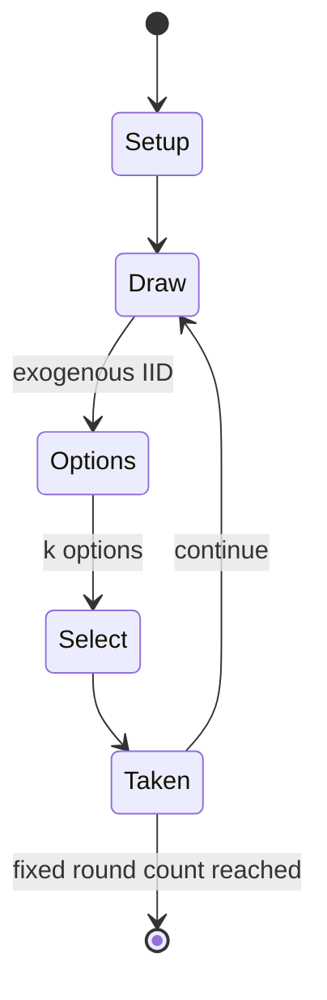

# Yahtzee

`yahtzee` &nbsp; state: **DEEPENED** &nbsp; method: **heuristic**

## Found layer (recorded, not trusted)

| field | value |
| --- | --- |
| wikidata | Q696920 |
| wikipedia | Yahtzee |
| genres (source) | -- |
| instance of (source) | -- |
| country of origin | -- |

## Declared layer (orders bench work)

| field | value |
| --- | --- |
| year created | 1956 |
| epoch | MODERN |
| region | -- |
| media | DICE |
| players | -- |
| age band | -- |
| exogenous process | IID |
| loss shape | -- |
| live axes | SELECT |
| horizon | FIXED |
| scoring shape | SET_COLLECTION_CONVEX |
| information | -- |
| interaction | SOLITAIRE |
| turn structure | -- |
| tractability | EXACT_WITH_CUT |
| randomness | DICE |
| luck factor | 0.58 |
| rules complexity | 2.56 |
| strategic depth | 1.87 |
| novelty | 0.7262 |
| solved status | -- |
| strategies | spatial_packing |
| algorithms | minimax |

## Object model

```
Episode
  players      : ?
  turn_structure: ?
  horizon       : FIXED
  scoring       : SET_COLLECTION_CONVEX

DicePool       -- n dice, each an iid categorical draw
Roll           -- realised outcome of a pool
OptionSet      -- the choices available after an exogenous draw
```

## State transition diagram



## Research item -- turn trace

```
# Yahtzee -- simulated turn events
# generated from the DECLARED vector, not from a rulebook.
# structure: exo=IID loss=None horizon=FIXED scoring=SET_COLLECTION_CONVEX axes=SELECT

t=0    SETUP        players=2  pot=0  capacity=3
t=1    DRAW         p1 roll from d6 pool -> outcome #5  (p=0.002)
t=2    SELECT       p1 2 options; take #1  (pot_gain=+2.6, capacity=-2)
t=3    ENDTURN      turn passes to p2
t=4    DRAW         p2 roll from d6 pool -> outcome #4  (p=0.298)
t=5    SELECT       p2 2 options; take #1  (pot_gain=+2.4, capacity=-2)
t=6    ENDTURN      turn passes to p1
t=7    DRAW         p1 roll from d6 pool -> outcome #3  (p=0.172)
t=8    SELECT       p1 3 options; take #1  (pot_gain=+1.6, capacity=-2)
t=9    DRAW         p1 roll from d6 pool -> outcome #1  (p=0.160)
t=10   SELECT       p1 2 options; take #1  (pot_gain=+1.9, capacity=-1)
t=11   DRAW         p1 roll from d6 pool -> outcome #3  (p=0.258)
t=12   SELECT       p1 4 options; take #3  (pot_gain=+1.7, capacity=-2)
t=13   ENDTURN      turn passes to p2
t=14   DRAW         p2 roll from d6 pool -> outcome #4  (p=0.124)
t=15   SELECT       p2 3 options; take #3  (pot_gain=+1.4, capacity=-0)
t=16   DRAW         p2 roll from d6 pool -> outcome #5  (p=0.069)
t=17   SELECT       p2 1 options; take #1  (pot_gain=+3.3, capacity=-0)
t=18   ENDTURN      turn passes to p1
t=19   DRAW         p1 roll from d6 pool -> outcome #5  (p=0.296)
t=20   SELECT       p1 3 options; take #3  (pot_gain=+2.3, capacity=-1)
t=21   ENDTURN      turn passes to p2
t=22   DRAW         p2 roll from d6 pool -> outcome #4  (p=0.241)
t=23   SELECT       p2 2 options; take #2  (pot_gain=+1.6, capacity=-1)
t=24   DRAW         p2 roll from d6 pool -> outcome #1  (p=0.157)
t=25   SELECT       p2 2 options; take #2  (pot_gain=+2.3, capacity=-0)
t=26   ENDTURN      turn passes to p1

terminal: FIXED
```

## Conditions

| kind | threshold | effect | trigger |
| --- | --- | --- | --- |
| BOUNDARY | -- | -- | The most important predecessor of Yahtzee is the dice game Yacht, which is an English cousin of Generala and dates back to at least 1938. |
| BOUNDARY | -- | -- | The scoring rule for this category means that a player only scores if at least three of the five dice are the same value. |
| BOUNDARY | -- | -- | If a player chooses to score a roll in this category even though they do not have at least three dice of the same value, their score will be 0. |

## Source extract

Yahtzee is a dice game made by Milton Bradley (a company that has since been acquired and
assimilated by Hasbro). It was first marketed under the name of Yahtzee by game entrepreneur
Edwin S. Lowe in 1956. The game is a development of earlier dice games such as Poker Dice, Yacht
and Generala. It is also similar to Yatzy, which is popular in Scandinavia. The objective of the
game is to score points by rolling five dice to make certain combinations. The dice can be
rolled up to three times in a turn to try to make various scoring combinations and dice must
remain in the box. A game consists of thirteen rounds. After each round, the player chooses
which scoring category is to be used for that round. Once a category has been used in the game,
it cannot be used again. The scoring categories have varying point values, some of which are
fixed values and others for which the score depends on the value of the dice. A Yahtzee is five-
of-a-kind and scores 50 points, the highest of any category. The winner is the player who scores
the most points. Yahtzee was marketed by the E.S. Lowe Company from 1956 until 1973. In 1973,
the Milton Bradley Company purchased the E.S. Lowe Company and assumed

<sub>Wikipedia, CC BY-SA. Retained as evidence for the structural
classification above. Every rule inferred from it is HYPOTHESIZED
until audited against a rulebook.</sub>
