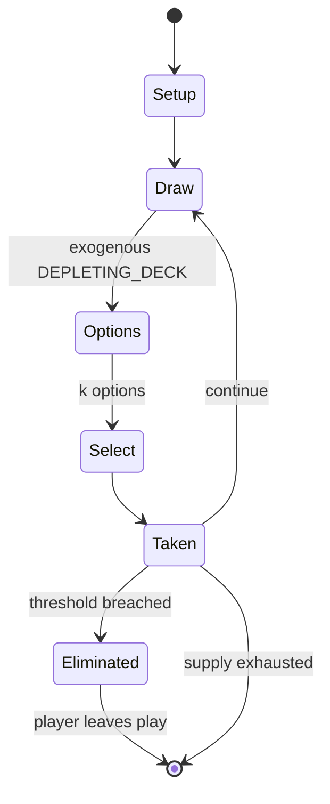

# Yaniv

*Nepali and Israeli card game*

`yaniv` &nbsp; state: **DEEPENED** &nbsp; method: **heuristic**

## Found layer (recorded, not trusted)

| field | value |
| --- | --- |
| wikidata | Q1771350 |
| wikipedia | Yaniv (card game) |
| genres (source) | -- |
| instance of (source) | card game |
| country of origin | Nepal |

## Declared layer (orders bench work)

| field | value |
| --- | --- |
| year created | -- |
| epoch | -- |
| region | SOUTH_ASIA |
| media | CARD |
| players | -- |
| age band | -- |
| exogenous process | DEPLETING_DECK |
| loss shape | ELIMINATION |
| live axes | DISCARD, SELECT |
| horizon | VARIABLE |
| scoring shape | SET_COLLECTION_CONVEX |
| information | -- |
| interaction | SOLITAIRE |
| turn structure | -- |
| tractability | EXACT_WITH_CUT |
| randomness | DECK_SHUFFLE |
| luck factor | 0.48 |
| rules complexity | 2.43 |
| strategic depth | 2.25 |
| novelty | 0.7387 |
| solved status | -- |
| strategies | set_collection |
| algorithms | -- |

## Object model

```
Episode
  players      : ?
  turn_structure: ?
  horizon       : VARIABLE
  scoring       : SET_COLLECTION_CONVEX

Deck           -- ordered multiset, drawn without replacement
Hand           -- private multiset held by one player
DiscardPile    -- public accumulation of spent cards
DiscardChoice  -- what is given up to satisfy a limit
OptionSet      -- the choices available after an exogenous draw
```

## State transition diagram



## Research item -- turn trace

```
# Yaniv -- simulated turn events
# generated from the DECLARED vector, not from a rulebook.
# structure: exo=DEPLETING_DECK loss=ELIMINATION horizon=VARIABLE scoring=SET_COLLECTION_CONVEX axes=DISCARD,SELECT

t=0    SETUP        players=2  pot=0  capacity=4
t=1    DRAW         p1 draw from deck -> outcome #4  (p=0.014)
t=2    SELECT       p1 3 options; take #2  (pot_gain=+3.3, capacity=-0)
t=3    DISCARD      p1 discards to hand limit
t=4    ENDTURN      turn passes to p2
t=5    DRAW         p2 draw from deck -> outcome #1  (p=0.113)
t=6    SELECT       p2 1 options; take #1  (pot_gain=+1.6, capacity=-1)
t=7    DRAW         p2 draw from deck -> outcome #2  (p=0.240)
t=8    SELECT       p2 2 options; take #2  (pot_gain=+0.7, capacity=-1)
t=9    DRAW         p2 draw from deck -> outcome #4  (p=0.005)
t=10   SELECT       p2 4 options; take #1  (pot_gain=+2.9, capacity=-2)
t=11   DISCARD      p2 discards to hand limit
t=12   ENDTURN      turn passes to p1
t=13   DRAW         p1 draw from deck -> outcome #5  (p=0.164)
t=14   SELECT       p1 3 options; take #3  (pot_gain=+1.6, capacity=-1)
t=15   DRAW         p1 draw from deck -> outcome #4  (p=0.002)
t=16   SELECT       p1 1 options; take #1  (pot_gain=+1.8, capacity=-2)
t=17   DRAW         p1 draw from deck -> outcome #3  (p=0.158)
t=18   SELECT       p1 2 options; take #1  (pot_gain=+2.3, capacity=-2)
t=19   DISCARD      p1 discards to hand limit
t=20   DRAW         p1 draw from deck -> outcome #2  (p=0.029)
t=21   SELECT       p1 1 options; take #1  (pot_gain=+3.2, capacity=-0)
t=22   ENDTURN      turn passes to p2
t=23   DRAW         p2 draw from deck -> outcome #4  (p=0.007)
t=24   SELECT       p2 1 options; take #1  (pot_gain=+3.3, capacity=-1)
t=25   DISCARD      p2 discards to hand limit
t=26   DRAW         p2 draw from deck -> outcome #4  (p=0.149)
t=27   SELECT       p2 2 options; take #1  (pot_gain=+2.3, capacity=-1)
t=28   DISCARD      p2 discards to hand limit

terminal: VARIABLE
```

## Conditions

| kind | threshold | effect | trigger |
| --- | --- | --- | --- |
| ELIMINATE | 1 player | eliminated | Variation 2: The game stops as soon as at least one player is eliminated. |
| PENALTY | 0 points | -- | If the player who called "Yaniv!" has the lowest card total, they score 0 points; however, if another player has a total less than or equal to the calling player's total (a situation often called "Asaf"), the calling pla |
| PENALTY | 30 points | -- | If a player calls "Yaniv" instead, they earn an additional penalty of 30 points. |
| ELIMINATE | -- | eliminated | A player is eliminated from the game once their total score exceeds an agreed upon point limit, which is usually set to 200. |
| ELIMINATE | -- | -- | Examples of punishments include immediate elimination from the game, being forced to draw three additional cards, or having to swap cards with the first person who requests a swap. |
| ELIMINATE | -- | eliminated | Instead of playing until all players but one is eliminated, some games may end as soon as a player crosses the point limit. |
| WIN | -- | -- | The player with the fewest points at the end of the game is the winner. |
| WIN | -- | -- | The player with the lowest score wins the round and receives no points for the round. |
| TERMINATE | -- | -- | Each round in the game ends when a player declares "Yaniv!" Each player's score is calculated from their remaining cards. |
| TERMINATE | -- | -- | When a player calls "Yaniv!," the round ends, and all players reveal their card totals. |
| TERMINATE | -- | -- | In this case, the winner is the player with the lowest score when the game ends. |
| PENALTY | -- | -- | If a player calls “Yaniv!” out of turn, a penalty of plus 30 will be added to their total, and the other players will receive a score of 0. |

## Source extract

Yaniv (Hebrew: יניב), also known as Yusuf, Jhyap, Jafar, aa’niv, Minca or Dave, is a card game
popular in Israel. It is a draw and discard game in which players discard before drawing a new
card and attempt to have the lowest value of cards in hand.    == Gameplay == Yaniv is played
with a 54-card deck composed of standard playing cards. The game is divided into multiple
rounds, with a total score tally kept between rounds. The game requires a minimum of two players
but is typically played between a group of two and five players. Up to eight people can
comfortably play yaniv together; however, as the player count increases, the pace of the game
slows. When there are four or more players, some people prefer to use two card decks shuffled
together to avoid running out of cards. Regardless of the number of players, some variants use
multiple decks. Each card in the deck is assigned a value. An ace is worth a single point while
cards two through ten are worth their face value. Face cards (J, Q, K) are worth 10 and jokers
are worth zero points.   === Objective === The objective of the game is to earn the fewest
points in each round. The player with the fewest points at the end of the ga

<sub>Wikipedia, CC BY-SA. Retained as evidence for the structural
classification above. Every rule inferred from it is HYPOTHESIZED
until audited against a rulebook.</sub>
