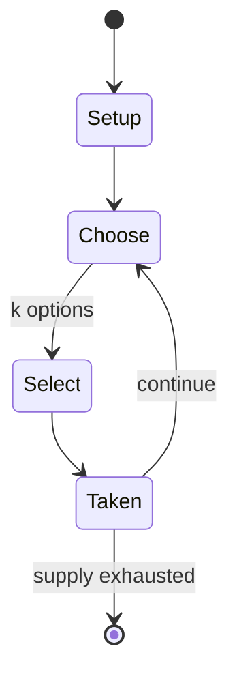

# Yonin shogi

*four-player variant of Japanese chess*

`yonin_shogi` &nbsp; state: **DEEPENED** &nbsp; method: **heuristic**

## Found layer (recorded, not trusted)

| field | value |
| --- | --- |
| wikidata | Q5360041 |
| wikipedia | Yonin shogi |
| genres (source) | -- |
| instance of (source) | shogi variant |
| country of origin | Japan |

## Declared layer (orders bench work)

| field | value |
| --- | --- |
| year created | -- |
| epoch | -- |
| region | EAST_ASIA |
| media | - |
| players | 4 |
| age band | -- |
| exogenous process | -- |
| loss shape | -- |
| live axes | SELECT |
| horizon | -- |
| scoring shape | WINNER_TAKE_ALL |
| information | -- |
| interaction | COMPETITIVE |
| turn structure | -- |
| tractability | SAMPLING_ONLY |
| randomness | -- |
| luck factor | 0.35 |
| rules complexity | 2.07 |
| strategic depth | 2.25 |
| novelty | 0.5571 |
| solved status | -- |
| strategies | set_collection |
| algorithms | -- |

## Object model

```
Episode
  players      : 4
  turn_structure: ?
  horizon       : ?
  scoring       : WINNER_TAKE_ALL

OptionSet      -- the choices available after an exogenous draw
```

## State transition diagram



## Research item -- turn trace

```
# Yonin shogi -- simulated turn events
# generated from the DECLARED vector, not from a rulebook.
# structure: exo=None loss=None horizon=None scoring=WINNER_TAKE_ALL axes=SELECT

t=0    SETUP        players=4  pot=0  capacity=4
t=1    SELECT       p1 3 options; take #1  (pot_gain=+2.1, capacity=-2)
t=2    SELECT       p1 4 options; take #4  (pot_gain=+1.5, capacity=-2)
t=3    SELECT       p1 4 options; take #2  (pot_gain=+2.6, capacity=-2)
t=4    SELECT       p1 2 options; take #1  (pot_gain=+2.9, capacity=-1)
t=5    ENDTURN      turn passes to p2
t=6    SELECT       p2 3 options; take #1  (pot_gain=+0.9, capacity=-1)
t=7    ENDTURN      turn passes to p3
t=8    SELECT       p3 3 options; take #3  (pot_gain=+3.2, capacity=-2)
t=9    ENDTURN      turn passes to p4
t=10   SELECT       p4 1 options; take #1  (pot_gain=+0.8, capacity=-0)
t=11   SELECT       p4 3 options; take #1  (pot_gain=+2.7, capacity=-2)
t=12   SELECT       p4 3 options; take #2  (pot_gain=+1.9, capacity=-2)
t=13   SELECT       p4 4 options; take #2  (pot_gain=+3.4, capacity=-1)
t=14   ENDTURN      turn passes to p1
t=15   SELECT       p1 1 options; take #1  (pot_gain=+3.2, capacity=-0)
t=16   SELECT       p1 4 options; take #3  (pot_gain=+1.3, capacity=-0)
t=17   SELECT       p1 1 options; take #1  (pot_gain=+3.4, capacity=-0)
t=18   SELECT       p1 1 options; take #1  (pot_gain=+1.8, capacity=-0)
t=19   ENDTURN      turn passes to p2
t=20   SELECT       p2 3 options; take #3  (pot_gain=+2.9, capacity=-1)
t=21   ENDTURN      turn passes to p3
t=22   SELECT       p3 4 options; take #2  (pot_gain=+1.0, capacity=-1)
t=23   SELECT       p3 1 options; take #1  (pot_gain=+1.8, capacity=-1)
t=24   SELECT       p3 2 options; take #1  (pot_gain=+1.8, capacity=-0)
t=25   SELECT       p3 3 options; take #1  (pot_gain=+3.0, capacity=-2)
t=26   SELECT       p3 2 options; take #1  (pot_gain=+3.0, capacity=-2)

terminal: VARIABLE
```

## Conditions

| kind | threshold | effect | trigger |
| --- | --- | --- | --- |
| WIN | -- | -- | In a timed game, a bare king can move faster than its opponent, therefore it may attempt to win the game by forcing its opponent to run out of time. |

## Source extract

Yonin shōgi, (四人将棋, ‘four-person chess’), is a four-person variant of shogi (Japanese chess). It
may be played with a dedicated yonin shogi set or with two sets of standard shogi pieces, and is
played on a standard sized shogi board.   == Rules of the game ==   === Objective === The
objective of the game is to capture all of the opponents’ kings as an individual or with the
option of teaming up with one or two fellow players. Fast matches are common.   === Game
equipment === Four players play on a standard 9×9 shogi board, which is commonly colored black
in dedicated yonin shogi sets. Each player has a 9-piece subset of the standard shogi pieces:  1
king 1 rook 2 gold generals 2 silver generals 3 pawns   === Setup === Each side places their
pieces in a triangular arrangement, facing toward the player opposite them, as shown below.  In
the rank nearest the player, The king is placed in the center file; The two gold generals are
placed on either side of the king; The two silver generals are placed next to the gold generals.
The four outside files are left empty.  In the second rank, The rook is placed in the same file
as the king; A pawn is placed on either side of the rook, in front

<sub>Wikipedia, CC BY-SA. Retained as evidence for the structural
classification above. Every rule inferred from it is HYPOTHESIZED
until audited against a rulebook.</sub>
