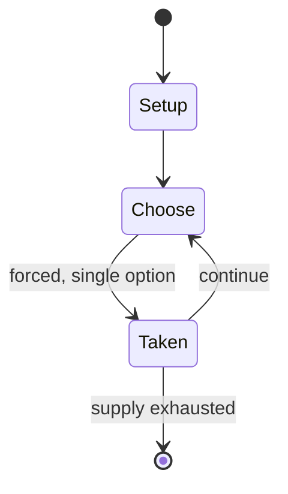

# Yoté

`yot` &nbsp; state: **DEEPENED** &nbsp; method: **heuristic**

## Found layer (recorded, not trusted)

| field | value |
| --- | --- |
| wikidata | Q1061250 |
| wikipedia | Yoté |
| genres (source) | -- |
| instance of (source) | -- |
| country of origin | -- |

## Declared layer (orders bench work)

| field | value |
| --- | --- |
| year created | -- |
| epoch | -- |
| region | -- |
| media | BOARD, GAMBLING |
| players | -- |
| age band | -- |
| exogenous process | -- |
| loss shape | -- |
| live axes | SPATIAL |
| horizon | -- |
| scoring shape | -- |
| information | -- |
| interaction | COMPETITIVE |
| turn structure | STRICT_TURN |
| tractability | SAMPLING_ONLY |
| randomness | -- |
| luck factor | 0.35 |
| rules complexity | 2.45 |
| strategic depth | 2.0 |
| novelty | 0.4915 |
| solved status | -- |
| strategies | -- |
| algorithms | -- |

## Object model

```
Episode
  players      : ?
  turn_structure: STRICT_TURN
  horizon       : ?
  scoring       : ?

Board          -- spatial substrate; cells carry position and occupancy
Piece          -- movable token owned by a player
Placement      -- position subject to geometric legality
```

## State transition diagram



## Research item -- turn trace

```
# Yoté -- simulated turn events
# generated from the DECLARED vector, not from a rulebook.
# structure: exo=None loss=None horizon=None scoring=None axes=SPATIAL

t=0    SETUP        players=2  pot=0  capacity=8
t=1    FORCED       p1 single legal option taken (pot_gain=+0.7)
t=2    SPATIAL      p1 places at (0,3); adjacency legal
t=3    ENDTURN      turn passes to p2
t=4    FORCED       p2 single legal option taken (pot_gain=+0.5)
t=5    FORCED       p2 single legal option taken (pot_gain=+1.5)
t=6    FORCED       p2 single legal option taken (pot_gain=+1.2)
t=7    ENDTURN      turn passes to p1
t=8    FORCED       p1 single legal option taken (pot_gain=+1.0)
t=9    SPATIAL      p1 places at (7,6); adjacency legal
t=10   ENDTURN      turn passes to p2
t=11   FORCED       p2 single legal option taken (pot_gain=+1.2)
t=12   ENDTURN      turn passes to p1
t=13   FORCED       p1 single legal option taken (pot_gain=+1.4)
t=14   FORCED       p1 single legal option taken (pot_gain=+1.7)
t=15   ENDTURN      turn passes to p2
t=16   FORCED       p2 single legal option taken (pot_gain=+1.4)
t=17   SPATIAL      p2 places at (7,0); adjacency legal
t=18   ENDTURN      turn passes to p1
t=19   FORCED       p1 single legal option taken (pot_gain=+1.9)
t=20   FORCED       p1 single legal option taken (pot_gain=+1.6)
t=21   FORCED       p1 single legal option taken (pot_gain=+1.3)
t=22   SPATIAL      p1 places at (7,7); adjacency legal
t=23   FORCED       p1 single legal option taken (pot_gain=+1.1)
t=24   FORCED       p1 single legal option taken (pot_gain=+1.8)
t=25   ENDTURN      turn passes to p2
t=26   FORCED       p2 single legal option taken (pot_gain=+0.6)
t=27   ENDTURN      turn passes to p1

terminal: VARIABLE
```

## Conditions

| kind | threshold | effect | trigger |
| --- | --- | --- | --- |
| WIN | -- | -- | The player who captures all the opponent's pieces is the winner. |
| WIN | -- | -- | If a player to move has no move available, the game ends and the player with the greater number of pieces remaining is the winner. |

## Source extract

Yoté is a traditional strategy board game of West Africa, where it is a popular gambling game
due to its fast pace and surprising turnarounds. A player wins by capturing all opposing pieces.
Yoté is related to the game Choko.   == Rules == The game is played on a 5×6 board, which is
empty at the beginning of the game. Each player has twelve pieces in hand. Players alternate
turns, with White moving first. In a move, a player may either:  Place a piece in hand on any
empty cell of the board. Move one of their pieces already on the board orthogonally to an empty
adjacent cell. Capture an opponent's piece if it is orthogonally adjacent to a player's piece,
by jumping to the empty cell immediately beyond it. The captured piece is removed from the
board, and the capturing player removes another of the opponent's pieces of his choosing from
the board. The player who captures all the opponent's pieces is the winner. The game can end in
a draw if both players are left with three or fewer pieces.   === Optional rules === Yoté is
sometimes played using one or more additional rules:  Captures are never mandatory. Multiple
successive jumps by a piece in a single turn are permitted. After a mul

<sub>Wikipedia, CC BY-SA. Retained as evidence for the structural
classification above. Every rule inferred from it is HYPOTHESIZED
until audited against a rulebook.</sub>
